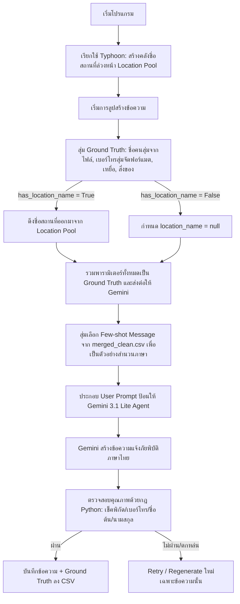

# แผนการสร้างระบบสังเคราะห์ข้อมูลภัยพิบัติด้วย AI Agent (Synthetic NER Dataset Generator Plan - plan_dataset_ner)

เอกสารฉบับนี้กำหนดรายละเอียดและสถาปัตยกรรมของ **Dataset Generator Agent** ซึ่งทำหน้าที่สร้างชุดข้อมูลภัยพิบัติภาษาไทยแบบสังเคราะห์ (Synthetic Dataset) เพื่อใช้ทดสอบและประเมินผลการทำงานของ **NER Agent** (ตามที่กำหนดใน `plan_full_agent.md` และ `plan_experience_04.md`)

วัตถุประสงค์หลักคือการสร้างข้อความแจ้งเหตุภัยพิบัติที่มีความเป็นธรรมชาติ มีความหลากหลายทางบริบท และมีโครงสร้างข้อมูลเฉลย (Ground Truth) ที่แน่นอนเพื่อใช้วัดผลความแม่นยำของระบบสกัดข้อมูล

---

## 1. วัตถุประสงค์หลัก (Core Objectives)

- **สร้างข้อความแจ้งภัยพิบัติภาษาไทยที่เป็นธรรมชาติ**: ใช้โมเดลภาษาขนาดใหญ่ (LLM) ในการเรียบเรียงข้อความโดยเลียนแบบสำนวนภาษา สัญลักษณ์ (Emoji) และความตื่นตระหนกของโพสต์ในโซเชียลมีเดียจริง โดยอิงต้นแบบจาก `dataset/clean/merged_clean.csv`
- **สุ่มข้อมูลติดต่อและเบอร์โทรศัพท์ (Phone Number Diversification)**: รองรับการสุ่มเบอร์โทรศัพท์มือถือของไทยในรูปแบบต่าง ๆ ทั้งแบบมีเบอร์ผู้ประสบภัยและผู้แจ้ง หรือไม่มีเบอร์เลย เพื่อทดสอบความคงเส้นคงวา (Robustness) ของ NER Agent
- **หลีกเลี่ยงการเขียนแบบตรงตัว (Avoid Literal Formatting)**: ห้ามเขียนข้อความแบบตรงไปตรงมา เช่น "บาดเจ็บ 1" หรือ "ต้องการอาหาร 2" แต่ให้เขียนบรรยายอาการ ความเดือดร้อน และสิ่งของที่ต้องการเป็นภาษามนุษย์ทั่วไป
- **บันทึกโครงสร้าง Ground Truth ครบถ้วน**: บันทึกค่าพารามิเตอร์ที่ใช้เป็นตัวตั้งต้นสำหรับการสร้างข้อความ (เช่น จำนวนผู้ประสบภัย เบอร์โทรศัพท์ พิกัด สิ่งของที่ต้องการ) เพื่อใช้เป็นชุดเฉลยจริงในการประเมินโมเดลปลายน้ำ

---

## 2. โครงสร้างและการสุ่มตัวแปร (Randomization & Generation Parameters)

ก่อนเริ่มกระบวนการเขียนข้อความผ่าน LLM ระบบจะใช้ Python สุ่มค่าพารามิเตอร์ต่าง ๆ ขึ้นมาก่อนเพื่อใช้เป็น Ground Truth และเป็น Input ในการสั่งงาน LLM ดังนี้:

### 2.1 ข้อมูลติดต่อ (Contacts)

สุ่มสร้างรายชื่อและเบอร์โทรศัพท์ของ **ผู้ประสบภัย (Victim)** และ **ผู้แจ้งเหตุ (Reporter)**:

*   **ชื่อและชื่อเล่นภาษาไทย (Name Randomization)**: สุ่มรายชื่อมาจากไฟล์ข้อมูลจริงในโฟลเดอร์ `dataset/thai_name/` (รวมรายชื่อจาก `female_names_th.txt` และ `male_names_th.txt` สำหรับชื่อต้น และ `family_names_th.txt` สำหรับนามสกุล) โดยครอบคลุมรูปแบบโครงสร้างประโยคดังนี้:
    *   **กรณีมีคำนำหน้า (With Prefix)**: 50% ของรายชื่อจะถูกเติมคำนำหน้าแบบทางการ (นาย, นาง, นางสาว) หรือคำนำหน้าแบบไม่ทางการ/สรรพนามเครือญาติที่พบทั่วไปในโซเชียลมีเดียภัยพิบัติ (คุณ, พี่, น้อง, ลุง, ป้า, ยาย, ตา, เจ๊, เฮีย, น้า, อา, หมอ)
    *   **กรณีไม่มีคำนำหน้า (Without Prefix)**: 50% ของรายชื่อจะมีเฉพาะชื่อต้นเท่านั้น
    *   **กรณีมีนามสกุล (With Last Name)**: 50% ของรายชื่อจะระบุนามสกุลต่อท้าย (เช่น "สมเกียรติ กองแก้ว", "คุณสมศักดิ์ รักชาติ")
    *   **กรณีไม่มีนามสกุล (Without Last Name)**: 50% ของรายชื่อจะระบุเฉพาะชื่อต้น (เช่น "สมเกียรติ", "คุณสมศักดิ์", "ป้าดา")
*   **หมายเลขโทรศัพท์มือถือไทย**: สุ่มรูปแบบตัวเลข (เช่น `0812345678`, `092-345-6789`, `063 456 7890`)
*   **กรณีการสุ่มโทรศัพท์ (Phone Scenarios)**:
    *   **Scenario A (มีครบ)**: มีทั้งเบอร์ผู้ประสบภัยและผู้แจ้ง
    *   **Scenario B (มีเฉพาะผู้ประสบภัย)**: มีเบอร์ผู้ประสบภัย แต่ไม่มีเบอร์ผู้แจ้ง
    *   **Scenario C (มีเฉพาะผู้แจ้ง)**: มีเบอร์ผู้แจ้ง แต่ไม่มีเบอร์ผู้ประสบภัย
    *   **Scenario D (ไม่มีเลย)**: ไม่มีเบอร์ติดต่อใด ๆ ปรากฏในข้อความเลย

### 2.2 จำนวนผู้ประสบภัย (Victims Count)

สุ่มระดับความเดือดร้อนและจำนวน โดยแบ่งประเภทตามเกณฑ์ของ NER Agent ตั้งแต่ 0 - 10 คน:

- `dead` (เสียชีวิต): สุ่มในช่วง 0 - 10 คน
- `critical` (วิกฤต/ติดค้าง/อันตรายร้ายแรง): สุ่มในช่วง 0 - 10 คน
- `urgent` (บาดเจ็บ/ป่วย/ช่วยเหลือด่วน): สุ่มในช่วง 0 - 10 คน
- `safe` (ปลอดภัยแล้ว/อพยพแล้ว): สุ่มในช่วง 0 - 10 คน
- `child` (เด็ก < 12 ปี): สุ่มในช่วง 0 - 10 คน
- `infant` (ทารก): สุ่มในช่วง 0 - 10 คน

### 2.3 ความต้องการสิ่งของช่วยเหลือ (Items Needed)

สุ่มระดับความต้องการช่วยเหลือ (0 คือไม่ต้องการ, 1 คือต้องการแต่ไม่ระบุจำนวน, หรือจำนวนเฉพาะเจาะจง):

- `firstAid` (ยา/ชุดปฐมพยาบาล): สุ่ม 0 หรือ 1 หรือจำนวนเฉพาะ
- `food` (อาหาร/น้ำดื่ม): สุ่ม 0 หรือ 1 หรือจำนวนเฉพาะ
- `energy` (แบตเตอรี่สำรอง/ไฟฉาย/เครื่องปั่นไฟ): สุ่ม 0 หรือ 1 หรือจำนวนเฉพาะ

### 2.4 พิกัดและสถานที่ (Coordinates & Location)

พิกัดและสถานที่ตั้งจะถูกสุ่มองค์ประกอบประกอบด้วย 3 ส่วนหลัก ได้แก่ ความต้องการให้มีชื่อสถานที่ (`has_location_name`: True/False), ลิงก์แผนที่ (`google_map_url`: URL/null), และพิกัดละติจูด/ลองจิจูด (`lat`/`lng`: float/0.0) โดยสคริปต์สุ่มจะจัดชุดให้เกิดรูปแบบของข้อมูลพิกัดที่แตกต่างกันในข้อความอย่างหลากหลาย (Combinations) ดังนี้:

1. **มีเฉพาะชื่อสถานที่เท่านั้น** - ตั้งค่า `has_location_name: True` ส่วนแผนที่และละติจูด/ลองจิจูดจะเป็น `null` / `0.0`
2. **มีเฉพาะลิงก์ Google Map เท่านั้น** - สุ่มเฉพาะลิงก์แผนที่ (เช่น `https://maps.app.goo.gl/xxxx`) โดยตั้งค่า `has_location_name: False` และพิกัดตัวเลขเป็น `0.0`
3. **มีเฉพาะพิกัดละติจูด/ลองจิจูดเท่านั้น** - สุ่มเฉพาะพิกัดตัวเลขละติจูดและลองจิจูด (เช่น `13.7563, 100.5018`) โดยตั้งค่า `has_location_name: False` และลิงก์แผนที่เป็น `null`
4. **มีชื่อสถานที่ + ลิงก์ Google Map** - ตั้งค่า `has_location_name: True` และสุ่มลิงก์แผนที่
5. **มีชื่อสถานที่ + พิกัดละติจูด/ลองจิจูด** - ตั้งค่า `has_location_name: True` และสุ่มพิกัดตัวเลข
6. **มีลิงก์ Google Map + พิกัดละติจูด/ลองจิจูด** - สุ่มทั้งสองอย่าง โดยตั้งค่า `has_location_name: False`
7. **มีครบทั้ง 3 องค์ประกอบ (ชื่อสถานที่ + ลิงก์ Google Map + พิกัดละติจูด/ลองจิจูด)** - ตั้งค่า `has_location_name: True` และสุ่มลิงก์แผนที่พร้อมพิกัดตัวเลข

**การสุ่มสร้างชื่อสถานที่โดย Location Generator Agent (Typhoon):**
เนื่องจากข้อมูลดิบจริงใน `dataset/clean/merged_clean.csv` ส่วนใหญ่กระจุกตัวอยู่เฉพาะพื้นที่หาดใหญ่ เพื่อให้ชุดข้อมูลมีความหลากหลายทางภูมิศาสตร์และเพื่อการันตีความถูกต้องของเฉลย (Ground Truth) ในตัวประเมิน NER:

- ระบบจะใช้ **Location Generator Agent** ที่ขับเคลื่อนด้วยโมเดล **Typhoon** (เช่น `typhoon-v2.5` ผ่าน OpenRouter) ในการทำหน้าที่คิดค้นชื่อสถานที่จำลองในประเทศไทยขึ้นมาอย่างเป็นธรรมชาติตามจังหวัดภัยพิบัติหลัก ๆ (เช่น เชียงราย, แม่สาย, อุบลราชธานี, แพร่ ฯลฯ)
- หาก `has_location_name` สุ่มได้เป็น `True` สคริปต์จะทำการสั่งงาน Typhoon ให้สร้างชื่อสถานที่ (ถนน, ซอย, หรือแลนด์มาร์ก) ขึ้นมา 1 ชื่อ และนำชื่อนี้มาเป็นตัวแปรนำเข้า `location_name` ไปบันทึกใน Ground Truth ของ CSV และส่งต่อให้ Gemini เขียนเป็นข้อความจริง
- หาก `has_location_name` สุ่มได้เป็น `False` ตัวแปร `location_name` จะถูกกำหนดเป็น `null` และไม่มีการเรียกใช้ Typhoon ในรอบนั้น ๆ

---

## 3. สถาปัตยกรรมการทำงานของ Dataset Generator Agent

ระบบจะทำงานเป็นแบบ **Template-guided Synthetic Generation Pipeline** โดยประยุกต์ใช้แนวคิด **Pre-generated Location Pool** เพื่อลด Latency และป้องกันปัญหา Rate limit ของ Typhoon API โดยมีขั้นตอนการทำงานดังนี้:



### 3.1 การเลือกโมเดลการประมวลผล (Model Configuration)

1. **Location Generator Agent (สำหรับสร้างชื่อสถานที่)**:
   - **โมเดล**: `typhoon-v2.5-30b-a3b-instruct` (เข้าถึงผ่าน OpenRouter หรือ OPN API ของ Typhoon)
   - **การตั้งค่า**: `temperature = 1.0` (เพื่อให้ได้ความหลากหลายทางภูมิศาสตร์และความคิดสร้างสรรค์สูงสุด)
2. **Message Generator Agent (สำหรับเขียนข้อความภัยพิบัติภาษาไทย)**:
   - **โมเดล**: `google/gemini-3.1-flash-lite` (เข้าถึงผ่าน OpenRouter API)
   - **การตั้งค่า**: `temperature = 1.0` (เพื่อให้สร้างข้อความที่มีลีลาภาษาหลากหลายและเป็นธรรมชาติสูงสุด)

---

## 4. โครงสร้างคำสั่งที่ใช้ควบคุมโมเดล (Prompt Design)

คำสั่งระบบจะเขียนขึ้นเพื่อให้โมเดลนำพารามิเตอร์ Ground Truth ไปประพันธ์เป็นข้อความในลักษณะโพสต์โซเชียลมีเดียภาษาไทยที่ดูสมจริงที่สุด

### 4.1 Agent 1: Location Generator Agent (Typhoon)

- **System Instruction**:

  ```markdown
  You are an expert in Thai geography and local landmarks. Your task is to generate one realistic, natural-sounding location name in Thailand for a disaster situation (such as a flooded street, a local temple, a village name, or a sub-district).

  Format instructions:

  - Focus on provinces prone to floods (e.g., Chiang Rai, Chiang Mai, Phrae, Nan, Sukhothai, Ubon Ratchathani).
  - Do NOT generate locations in Hat Yai.
  - Return ONLY the generated location name (street, village, and/or landmark with sub-district/province) in Thai, without any explanation, markdown, or punctuation.

  Example outputs:

  - ซอย 4 เหมืองแดง แม่สาย เชียงราย
  - บ้านห้วยทราย ต.แม่ยาว อ.เมืองเชียงราย
  - ชุมชนท่ากอไผ่ อ.วารินชำราบ อุบลราชธานี
  ```

### 4.2 Agent 2: Message Generator Agent (Gemini 3.1 Lite)

- **System Instruction**:

  ```markdown
  You are a creative writer specializing in disaster emergency communication. Your task is to write realistic, natural-sounding social media posts (tweets or Facebook comments in Thai) requesting help during a flood or other disaster in Thailand.

  You will be given a set of Ground Truth parameters (names, phones, victims count, items needed, location details) and a real message as a style template.

  Your goal is to output the generated Thai message in plain text.

  CRITICAL RULES FOR NATURAL THAI PHRASING:

  1. DO NOT write numbers or counts in a literal, robotic, or template-like way.
     - BAD: "บาดเจ็บสาหัส 1 คน, มีเด็ก 2 คน, ต้องการอาหาร 1"
     - GOOD: "แฟนผมโดนไม้ทับขาหักขยับไม่ได้เลยครับ ในบ้านยังมีลูกสาวเล็กๆ อีกสองคน ตอนนี้หิวกันมาก ของกินหมดเกลี้ยงเลย"
  2. ZERO-COUNT RULE: If a parameter's count is 0, the generated message MUST NOT mention or imply any details related to that parameter.
     - Example: If `dead` is 0, the message must not mention anyone dying. If `child` is 0, the message must not mention children. If `energy` is 0, the message must not ask for power/flashlights.
  3. COORDINATES & MAPS RULE:
     - Location Name: If `location_name` parameter is provided (not null), you MUST integrate that exact location name into the generated message. You can add natural prefixes/suffixes (e.g. "พิกัดซอย...", "ติดอยู่ตรง...") but keep the exact name intact for validation. If `location_name` is null, do NOT mention any location name, landmark, road, or sub-district in the text.
     - Google Map URL: If `google_map_url` is provided (not null), you MUST integrate the Google Map URL into the generated message. If it is null, do NOT include any Google Map URL.
     - Lat/Lng Coordinates: If `lat` and `lng` are provided (not 0.0), you MUST integrate the latitude and longitude coordinate values (e.g. "13.7563, 100.5018" or "พิกัด 20.4272 99.8847") into the message. If they are 0.0, do NOT include any coordinate numbers.
  4. Integrate names and phones naturally:
     - For phone numbers, place them as contacts (e.g., "โทรหาพี่แดงได้เลยครับ 081-xxx-xxxx" or "ติดต่อผู้ประสานงาน 089xxxxxxx").
     - If a phone number is specified as "null" or missing, do NOT put any placeholder or phone number for that person.
     - Separate victim's phone and reporter's phone correctly based on the parameters.
  5. Keep the tone realistic: Use exclamation marks, crying emojis (😭, 🙏, 🚨), local abbreviations, spelling variants typical of social media typing under stress, or polite particles like ครับ/ค่ะ/นะคะ.
  6. The generated message MUST be in Thai and must closely match the situation details represented by the parameters.
  7. VICTIMS CATEGORY GUIDELINES (Aligning with clinical criteria):
     - critical (maps to RED): Describe these victims as trapped (e.g., ติดอยู่บนหลังคา, ดินถล่มทับออกไม่ได้), in severe danger (e.g., น้ำท่วมมิดหัว, กระแสน้ำพัดไป), unresponsive (e.g., หมดสติ, เรียกไม่ตื่น), near-drowning (e.g., จมน้ำ, สำลักน้ำ), or having active severe bleeding (e.g., เลือดไหลพุ่งไม่หยุด).
     - urgent (maps to YELLOW): Describe these victims as injured (e.g., ขาหัก, แขนผิดรูป, กระดูกโผล่), sick (e.g., เป็นไข้สูงซึมมาก, ท้องเสียจนหมดแรง, ทานข้าวไม่ได้อ่อนเพลียมาก), or having moderate difficulty (e.g., หายใจหอบหืด).
     - safe (maps to GREEN): Describe these victims as evacuated, safe, or having minor issues (e.g., แผลถลอกเล็กน้อย) but maybe needing basic food and water.
  8. VICTIMS LIST INSTRUCTIONS:
     You will be given a list of individual victims in `victims_list`. For each victim, integrate their details into the generated text using these rules:
     - Name: If `name` is provided (not null), write that exact name. If it is null, refer to them using a generic relation (e.g. "หลานสาว", "แฟนผม", "คนแถวบ้าน").
     - Age Group, Age, and Disclosure:
       - If `age_group` is "child":
         - If `age_disclosure` is "direct" (and age is not null), specify their exact age (e.g., "อายุ 5 ขวบ", "5 ขวบ").
         - If `age_disclosure` is "indirect" (or age is null), refer to them using child-related terms (e.g., "เด็กเล็ก", "ลูกสาวคนเล็ก", "น้อง") without writing the exact age number.
       - If `age_group` is "adult":
         - If `age` is not null and `age_disclosure` is "direct", specify their exact age (e.g., "อายุ 45 ปี", "วัย 45 ปี").
         - If `age` is null or `age_disclosure` is "indirect", refer to them using adult/elderly words (e.g., "คุณยาย", "ลุงข้างบ้าน", "ผู้ป่วยติดเตียง", "แม่ของฉัน") without writing any age numbers.
     - Triage Color:
       - RED: Describe their condition using one of the "critical" symptoms (trapped, severe danger, unresponsive, near-drowning, severe bleeding).
       - YELLOW: Describe their condition using one of the "urgent" symptoms (fracture, severe pain, high fever, sick).
       - GREEN: Describe them as safe, evacuated, or having minor scrapes but needing basic supplies.
  ```

### 4.3 User Prompt Structure (For Gemini 3.1 Lite)

```json
{
  "style_template": "ขอความช่วยเหลือด่วนค่ะ มีทั้งเด็ก ผู้ใหญ่ ผู้สูงอายุค่ะ ตอนนี้น้ำน่าจะท่วมสูงกว่าในรูปแล้วค่ะ บ้านที่ติดกับร้านKJ modifyค่ะ",
  "parameters": {
    "location": {
      "location_name": "ซอย 4 เหมืองแดง แม่สาย เชียงราย",
      "google_map_url": "https://maps.app.goo.gl/abcd1234ef",
      "lat": 7.0089,
      "lng": 100.4735
    },
    "contact_victim": {
      "name": "ป้าสมศรี",
      "phone": "081-999-8888"
    },
    "contact_reporter": {
      "name": "วิชิต (หลานชาย)",
      "phone": "092-111-2222"
    },
    "victims_list": [
      {
        "name": "ป้าสมศรี",
        "age": null,
        "age_group": "adult",
        "age_disclosure": "indirect",
        "triage_color": "YELLOW"
      },
      {
        "name": "วิชิต (หลานชาย)",
        "age": 28,
        "age_group": "adult",
        "age_disclosure": "direct",
        "triage_color": "GREEN"
      }
    ],
    "victims": {
      "dead": 0,
      "critical": 0,
      "urgent": 1,
      "safe": 1,
      "child": 0,
      "infant": 0
    },
    "items": {
      "firstAid": 1,
      "food": 1,
      "energy": 0
    }
  }
}
```

---

## 5. รูปแบบของข้อมูลที่นำออกและโครงสร้างไฟล์ (Output Schema & Files)

ข้อมูลที่สร้างขึ้นทั้งหมดจะถูกบันทึกลงในไฟล์ CSV ที่ประกอบไปด้วยข้อความสังเคราะห์พร้อมเฉลยอย่างละเอียด เพื่ออำนวยความสะดวกในการเปรียบเทียบในอนาคต

### 5.1 โครงสร้างคอลัมน์ของไฟล์ CSV (`dataset/clean/synthetic_ner_dataset.csv`)

| ชื่อคอลัมน์          | คำอธิบาย                                              | ตัวอย่างข้อมูล                                                                                                                                                                                                                                                 |
| :------------------- | :---------------------------------------------------- | :------------------------------------------------------------------------------------------------------------------------------------------------------------------------------------------------------------------------------------------------------------- |
| `synthetic_id`       | ไอดีรหัสข้อความสังเคราะห์                             | `SYN_NER_001`                                                                                                                                                                                                                                                  |
| `generated_text`     | ข้อความภาษาไทยที่ AI Agent สร้างขึ้นอย่างเป็นธรรมชาติ | _"ช่วยป้าผมด้วยครับ ตอนนี้ป้าสมศรีแกเป็นเบาหวานยาหมดแล้ว อ่อนเพลียมาก พิกัดซอย 7 โชคสมาน 5 หาดใหญ่..."_ |
| `gt_is_help_request` | สถานะการขอความช่วยเหลือเฉลยจริง                       | `True` / `False`                                                                                                                                                                                                                                               |
| `gt_classification_category` | หมวดหมู่การคัดกรองเฉลยจริง                             | `help_request` / `other`                                                                                                                                                                                                                                       |
| `gt_location_name`   | ชื่อสถานที่เฉลยจริง                                   | `ซอย 7 โชคสมาน 5 หาดใหญ่`                                                                                                                                                                                                                                      |
| `gt_google_map_url`  | ลิงก์แผนที่เฉลยจริง (ถ้ามี)                           | `https://maps.app.goo.gl/abcd1234ef`                                                                                                                                                                                                                           |
| `gt_lat`             | ละติจูดเฉลยจริง (ถ้ามี)                               | `7.0089`                                                                                                                                                                                                                                                       |
| `gt_lng`             | ลองจิจูดเฉลยจริง (ถ้ามี)                              | `100.4735`                                                                                                                                                                                                                                                     |
| `gt_victim_name`     | ชื่อผู้ประสบภัยเฉลยจริง                               | `ป้าสมศรี`                                                                                                                                                                                                                                                     |
| `gt_victim_phone`    | เบอร์โทรผู้ประสบภัยเฉลยจริง                           | `081-999-8888`                                                                                                                                                                                                                                                 |
| `gt_reporter_name`   | ชื่อผู้แจ้งเหตุเฉลยจริง                               | `วิชิต`                                                                                                                                                                                                                                                        |
| `gt_reporter_phone`  | เบอร์โทรผู้แจ้งเหตุเฉลยจริง                           | `092-111-2222`                                                                                                                                                                                                                                                 |
| `gt_victims_json`    | ข้อมูลผู้ประสบภัยรายบุคคลเชิงลึกเฉลยจริง (JSON String) | `[{"name": "ป้าสมศรี", "age": null, "age_group": "adult", "age_disclosure": "indirect", "triage_color": "YELLOW"}, ...]`                                                                                                                                         |
| `gt_dead`            | จำนวนผู้เสียชีวิตเฉลยจริง                             | `0`                                                                                                                                                                                                                                                            |
| `gt_critical`        | จำนวนผู้ประสบภัยวิกฤตเฉลยจริง                         | `0`                                                                                                                                                                                                                                                            |
| `gt_urgent`          | จำนวนผู้ประสบภัยช่วยเหลือด่วนเฉลยจริง                 | `1`                                                                                                                                                                                                                                                            |
| `gt_safe`            | จำนวนผู้ปลอดภัยเฉลยจริง                               | `1`                                                                                                                                                                                                                                                            |
| `gt_child`           | จำนวนเด็กเฉลยจริง                                     | `0`                                                                                                                                                                                                                                                            |
| `gt_infant`          | จำนวนทารกเฉลยจริง                                     | `0`                                                                                                                                                                                                                                                            |
| `gt_item_firstaid`   | ความต้องการยาปฐมพยาบาลเฉลยจริง                        | `1`                                                                                                                                                                                                                                                            |
| `gt_item_food`       | ความต้องการอาหารและน้ำเฉลยจริง                        | `1`                                                                                                                                                                                                                                                            |
| `gt_item_energy`     | ความต้องการแหล่งพลังงานเฉลยจริง                       | `0`                                                                                                                                                                                                                                                            |
| `source_template_id` | ไอดีข้อความต้นแบบที่ใช้ใน merged_clean                | `2`                                                                                                                                                                                                                                                            |

---

## 6. แนวทางการตรวจสอบคุณภาพข้อความ (Quality Assurance Strategy)

เพื่อให้มั่นใจว่าข้อมูลที่ได้จาก Agent มีคุณภาพสูงและพร้อมสำหรับการทดสอบ NER Agent โดยประหยัดค่าใช้จ่ายและเวลาในการประมวลผลมากที่สุด ระบบจะ**ไม่ใช้ AI Agent ตัวอื่น (เช่น LLM-as-a-judge) ในการตรวจสอบความถูกต้อง** แต่จะใช้กฎเกณฑ์และสคริปต์ Python ในการเช็คแทน โดยแบ่งออกเป็น 2 ขั้นตอน ดังนี้:

1. **การตรวจสอบด้วยระบบอัตโนมัติ (Automated Validation - Rule-based Python Script)**:
   * **ไม่ใช้ AI ในการตรวจสอบ**: หลีกเลี่ยงการใช้ LLM ในการเช็คซ้ำเพื่อลด Cost และเพิ่มความเร็วของ Pipeline
   * **ตรวจสอบข้อมูลการติดต่อ (String Matching)**: 
     * **เบอร์โทรศัพท์**: เช็คหาชุดตัวเลขแบบไม่มีขีด/เว้นวรรค
     * **รายชื่อบุคคล**: สคริปต์จะตรวจสอบความมีอยู่ของ **ชื่อต้น (First Name)** และ **นามสกุล (Last Name)** (หากค่าที่สุ่มมามีระบุนามสกุล) แยกจากกันเพื่อความยืดหยุ่น โดยจะอนุญาตให้มีการเปลี่ยนแปลงของคำนำหน้าชื่อหรือคำสรรพนาม (Prefix) เช่น "คุณสมชาย", "พี่สมชาย" ได้ เพื่อความเป็นธรรมชาติในการตอบของโมเดล
   * **ตรวจสอบสถานที่และพิกัด**: เช็คว่าชื่อสถานที่ ลิงก์ Google Map หรือตัวเลขพิกัด Lat/Lng ปรากฏอยู่ในข้อความตรงกับค่า Ground Truth ที่สุ่มได้หรือไม่ (ถ้ามี)
   * **ระบบ Retry อัตโนมัติ**: หากสคริปต์ตรวจสอบพบว่ามีข้อมูลไม่ครบถ้วนหรือตกหล่น ระบบจะโยนข้อความนั้นทิ้งแล้วสั่งให้ LLM (Gemini) สร้างใหม่ (Regenerate) ทันที (สูงสุด 3 ครั้ง)
2. **การรีวิวสุ่มตัวอย่างโดยมนุษย์ (Manual Review Verification)**:
   * สุ่มเปิดดูข้อมูล 10-15 ข้อความหลังการรันเพื่อประเมินความเป็นธรรมชาติ ความลื่นไหลของภาษา และตรวจสอบว่าโมเดลไม่ได้สร้างข้อความที่เป็นบล็อกแพทเทิร์นซ้ำซากจำเจ
