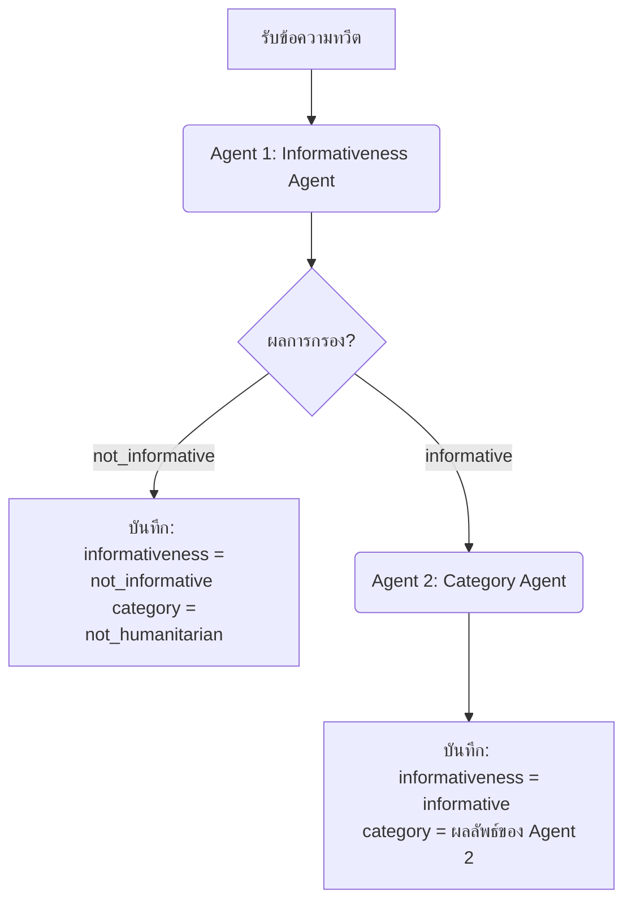

# แผนการทดลองใช้ LLM ในการคัดแยกข้อความแจ้งเตือนภัยพิบัติ (Disaster Alert Labeling Experiment - 03)

เอกสารฉบับนี้กำหนดแผนและแนวทางการทดลองสำหรับ **Experiment 03** ซึ่งเป็นสถาปัตยกรรมแบบ **เอเจนต์สองขั้นตอนแยกจากกัน (2-Agent / 2-Stage Pipeline)** 

จากการทดลองที่ผ่านมาที่เป็นการยุบรวมคลาสในขั้นตอนเดียว (Experiment 01) หรือการดึงข้อมูลพร้อมกัน 2 คีย์ในก้อน JSON เดียว (Experiment 02) ในการทดลองที่ 3 นี้ เราจะทดลองระบบที่จำลองการทำระดับความรับผิดชอบแยกจากกันโดยใช้ **2 Agent** คุยกันแบบลำดับขั้น (Cascade/Sequential Approach) เพื่อวิเคราะห์ประสิทธิภาพที่ก้าวหน้าขึ้น
การทดลองนี้ประเมินเพิ่มเติมที่อุณหภูมิ (Temperature) **0.1, 0.2, 0.3** ควบคู่ไปกับค่าเริ่มต้น **0.0**

---

## 1. วัตถุประสงค์ (Objectives)
- ประเมินประสิทธิภาพการจำแนกข้อความด้วยสถาปัตยกรรมแบบ 2-Stage Pipeline (Agent 1 กรองความเกี่ยวข้อง -> Agent 2 คัดแยกหมวดหมู่ย่อย) ของกลุ่มโมเดล MoE ทั้ง 3 รุ่น (`deepseek/deepseek-v4-flash`, `typhoon-v2.5-30b-a3b-instruct`, `google/gemma-4-26b-a4b-it`)
- เปรียบเทียบผลลัพธ์ประสิทธิภาพระหว่างสถาปัตยกรรมทั้งหมด (1-Layer (Exp 1), 2-Layer Joint (Exp 2), และ 2-Agent Sequential (Exp 3)) บนชุดข้อมูลสุ่ม 500 รายการชุดเดียวกัน
- ตรวจสอบผลลัพธ์ว่า การแยกคิดด้วยระบบ Agent สามารถช่วยลดความคลาดเคลื่อนในการคัดแยกข้อความได้จริงหรือไม่ แม้จะต้องแลกกับจำนวน Request API ที่สูงขึ้นในฝั่งข้อความที่เป็นประโยชน์

---

## 2. แหล่งข้อมูลและการเตรียมข้อมูล (Dataset & Preparation)
- เพื่อให้เปรียบเทียบผลประสิทธิภาพข้ามสถาปัตยกรรมได้อย่างสมบูรณ์ (Apple-to-Apple) การทดลองนี้จะดึงชุดข้อมูลข้อความ **จากไฟล์สุ่ม 500 แถวชุดเดียวกันกับที่ใช้ใน Experiment 01 และ 02** ทุกประการ โดยไม่สุ่มชุดข้อมูลใหม่
- แหล่งข้อความตั้งต้น: ข้อความภาษาอังกฤษดิบจากชุดตัวอย่างเดิม

---

## 3. สถาปัตยกรรมการทำงานของระบบเอเจนต์ (2-Agent Sequential Pipeline)

ขั้นตอนการรันข้อความผ่านท่อประมวลผล (Pipeline) จะแยกออกเป็น 2 ชั้นอย่างเด็ดขาดดังนี้:



### 3.1 บังคับโครงสร้างผลลัพธ์ด้วย Function Calling ราย Agent

#### [Agent 1 Schema]
```python
from pydantic import BaseModel, Field
from typing import Literal

class Agent1InformativenessResult(BaseModel):
    informativeness: Literal["informative", "not_informative"] = Field(
        description="determine if the tweet contains SPECIFIC disaster impact/response evidence, facts, or details"
    )
```

#### [Agent 2 Schema] (เรียกใช้ต่อเมื่อ Agent 1 ตอบว่า "informative" เท่านั้น)
```python
class Agent2CategoryResult(BaseModel):
    category: Literal[
        "affected_individuals",
        "infrastructure_and_utility_damage",
        "injured_or_dead_people",
        "missing_or_found_people",
        "other_relevant_information",
        "rescue_volunteering_or_donation_effort",
        "vehicle_damage"
    ] = Field(description="identify the DOMINANT content (choose only ONE)")
```

---

## 4. การออกแบบคำสั่ง (2-Agent Prompt Design)

การออกแบบ Prompt แยกการทำงานตามบทบาทของ Agent แต่ละตัวอย่างชัดเจนโดยใช้ภาษาอังกฤษ:

### 4.1 เอเจนต์ตัวที่ 1 (Agent 1: Informativeness Filter)

- **System Instruction:**
  ```markdown
  You are an expert humanitarian disaster analyst. Your task is to analyze tweets and determine if they contain specific information about disaster impact or response efforts.
  ```
- **User Prompt:**
  ```markdown
  Tweet: "{tweet_text}"

  CLASSIFICATION CRITERIA:
  Determine if the tweet contains SPECIFIC information:
  - informative: Contains SPECIFIC disaster impact/response evidence, facts, or details (such as reports of damage, injuries, rescue activities, weather updates, donation needs).
  - not_informative: Generic statements, emotions only (prayers, condolences), political arguments, jokes, or completely unrelated content.

  Return classification by calling the specified function.
  ```

### 4.2 เอเจนต์ตัวที่ 2 (Agent 2: Category Classifier)

- **System Instruction:**
  ```markdown
  You are an expert humanitarian disaster analyst. Your task is to classify a disaster-related tweet into the dominant humanitarian category based on objective evidence.
  ```
- **User Prompt:**
  ```markdown
  Tweet: "{tweet_text}"

  CLASSIFICATION CRITERIA:
  Identify the DOMINANT content of this disaster-related tweet. Choose exactly ONE category:
  - affected_individuals: Mentions displaced people, survivors, emotional responses (NOT injured/dead).
  - infrastructure_and_utility_damage: References damaged buildings, roads, bridges, power/water utilities.
  - injured_or_dead_people: Reports injuries, deaths, or specific casualty numbers.
  - missing_or_found_people: Mentions people who are missing, found, or rescued by name or count.
  - other_relevant_information: Weather data, satellite images, warning alerts without specific physical/human impact.
  - rescue_volunteering_or_donation_effort: Mentions donations, rescue missions, aid, volunteers.
  - vehicle_damage: References damaged cars, trucks, ambulances, buses.

  Return classification by calling the specified function.
  ```

---

## 5. แผนการวัดผลเปรียบเทียบและการจัดเก็บข้อมูล
- **ตัวชี้วัดประสิทธิภาพ:** คำนวณหา F1-Score ของระบบ Pipeline (Informativeness F1 และ Category F1) หลังกระบวนการรวมคำตอบจากทั้งสองเอเจนต์
- **การจัดทำรายงานเปรียบเทียบข้ามสถาปัตยกรรม:** รวบรวมและบันทึกตารางเปรียบเทียบผลความถูกต้องระหว่าง 1-Layer (Exp 1), 2-Layer Joint (Exp 2), และ 2-Agent (Exp 3) ไว้ในไฟล์ `exp3_vs_other_comparison.csv`
- **โครงสร้างไฟล์ผลลัพธ์:**
  ```text
  e:/nlp-for-disaster/exp3/results/
  ├── deepseek-v4-flash_results.csv        <- บันทึกประวัติการตัดสินใจของทั้ง Agent 1 และ Agent 2
  ├── typhoon-v2.5_results.csv
  ├── gemma-4_results.csv
  ├── model_comparison_metrics.csv
  ├── exp3_vs_other_comparison.csv         <- ไฟล์ตารางสรุปเปรียบเทียบ 3 สถาปัตยกรรมหลัก
  └── confusion_matrices/
  ```

### 5.1 โครงสร้างของไฟล์ CSV ผลลัพธ์รายโมเดล (Individual Model CSV Schema)
ไฟล์ผลลัพธ์แยกตามรุ่นโมเดล (`deepseek-v4-flash_results.csv`, `typhoon-v2.5_results.csv`, `gemma-4_results.csv`) สำหรับสถาปัตยกรรม 2-Agent Sequential Pipeline จะจัดเก็บประวัติการทำนายของแต่ละ Agent รวมถึงข้อความและเฉลย โดยมีโครงสร้างคอลัมน์ดังนี้:

| ชื่อคอลัมน์ (Column Name) | คำอธิบาย (Description) | ตัวอย่างข้อมูล (Example) |
| :--- | :--- | :--- |
| `tweet_id` | ไอดีข้อความทวีต (ตรงตามชุดข้อมูลต้นฉบับ) | `8.29177E+17` |
| `tweet_text` | ข้อความภาษาอังกฤษดิบที่ส่งให้โมเดลวิเคราะห์ | *“Red Cross is helping people in Houston...”* |
| `true_text_info` | เฉลยจริง: ความเกี่ยวข้องภัยพิบัติ (Ground Truth) | `informative` / `not_informative` |
| `true_text_human` | เฉลยจริง: หมวดหมู่ช่วยเหลือทางมนุษยธรรม (Ground Truth) | `rescue_volunteering_or_donation_effort` / `not_humanitarian` |
| `agent1_predicted_info` | คำทำนายจาก Agent 1: ความเกี่ยวข้องภัยพิบัติ (`informative` / `not_informative`) | `informative` |
| `agent2_predicted_category` | คำทำนายจาก Agent 2: หมวดหมู่ช่วยเหลือ (ทำนายต่อเมื่อ Agent 1 ตอบ `informative` เท่านั้น หากไม่รันจะถูกบันทึกเป็น `null` หรือ `not_humanitarian`) | `rescue_volunteering_or_donation_effort` |
| `final_predicted_info` | คำทำนายสรุปท้ายสุด: ความเกี่ยวข้องภัยพิบัติ (ตรงกับ `agent1_predicted_info`) | `informative` |
| `final_predicted_category` | คำทำนายสรุปท้ายสุด: หมวดหมู่ช่วยเหลือ (ถ้า Agent 1 ตอบ `not_informative` คอลัมน์นี้จะเป็น `not_humanitarian` เสมอ) | `rescue_volunteering_or_donation_effort` |
| `tweet_text_char_count` | จำนวนตัวอักษรของข้อความภาษาอังกฤษ `tweet_text` | `42` |
| `token_in_use` | จำนวน Token ขาเข้าที่ใช้ประมวลผลสะสมในระบบเอเจนต์ | `240` |
| `token_out_use` | จำนวน Token ขาออกที่ใช้ประมวลผลสะสมในระบบเอเจนต์ | `28` |
| `agent1_latency_seconds` | เวลาในการทำงานของ Agent 1 (หน่วยวินาที) | `0.78` |
| `agent2_latency_seconds` | เวลาในการทำงานของ Agent 2 (หน่วยวินาที, `null` หรือ `0` หากไม่ได้รัน) | `0.64` |
| `latency_seconds` | เวลาทำงานทั้งหมดของแถวนั้น (หน่วยวินาที) | `1.42` |
