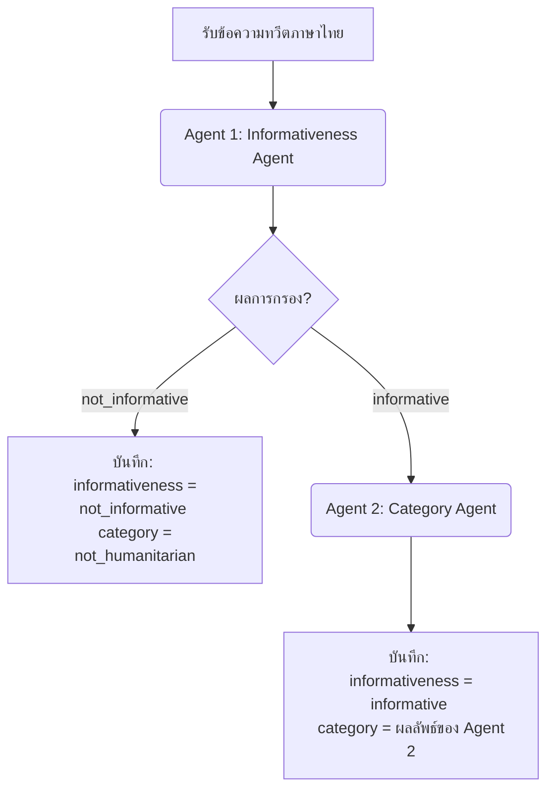

# แผนการทดลองใช้ LLM ในการคัดแยกข้อความแจ้งเตือนภัยพิบัติภาษาไทย (Disaster Alert Labeling Experiment - 03TH)

เอกสารฉบับนี้กำหนดแผนและแนวทางการทดลองสำหรับ **Experiment 03TH** ซึ่งเป็นสถาปัตยกรรมแบบ **เอเจนต์สองขั้นตอนแยกจากกัน (2-Agent / 2-Stage Pipeline)** บนข้อมูล **ภาษาไทย**

การทดลองนี้เป็นการนำชุดข้อมูลที่แปลไทยและแปลงบริบทเป็นประเทศไทยสำเร็จแล้วจำนวน 500 แถวจากไฟล์ [CrisisMMD_Thai_500.csv](file:///e:/nlp-for-disaster/data/CrisisMMD_Thai_500.csv) มาคัดแยกโดยใช้ 2 Agent ทำงานแยกหน้าที่กันเพื่อเปรียบเทียบผลลัพธ์ประสิทธิภาพกับฝั่งภาษาอังกฤษและสถาปัตยกรรมระดับอื่น ๆ

---

## 1. วัตถุประสงค์ (Objectives)
- ประเมินประสิทธิภาพการจำแนกข้อความภาษาไทยด้วยสถาปัตยกรรมแบบ 2-Stage Pipeline (Agent 1 กรองความเกี่ยวข้อง -> Agent 2 คัดแยกหมวดหมู่ย่อย) ของกลุ่มโมเดล MoE ทั้ง 3 รุ่น (`deepseek-v4-flash`, `typhoon-v2.5`, `Gemma 4`)
- เปรียบเทียบผลลัพธ์คะแนนความแม่นยำ F1-Score ระหว่างสถาปัตยกรรม 1-Layer (จาก Exp 01TH), 2-Layer Joint (Exp 02TH), และ 2-Agent Sequential (Exp 03TH) เพื่อค้นหารูปแบบที่ดีที่สุดในการนำไปใช้งานคัดแยกประเภทข้อความภัยพิบัติภาษาไทยจริง

---

## 2. แหล่งข้อมูลและการเตรียมข้อมูล (Dataset & Preparation)
- **แหล่งข้อมูลเข้า (Input Source):** ดึงชุดข้อความภาษาไทยและคำตอบเฉลยโดยตรงจาก **ไฟล์ผลลัพธ์ข้อมูลทดสอบ 500 แถวที่บันทึกสำเร็จมาจาก Experiment 01TH**
- **ความโปร่งใสและถูกต้อง:** **จะไม่มีการสุ่มชุดข้อมูลแปลไทยใหม่ในการทดลองนี้** เพื่อควบคุมตัวแปรในการประเมินประสิทธิภาพแบบรายแถว (Apple-to-Apple Comparison)

---

## 3. สถาปัตยกรรมการทำงานของระบบเอเจนต์ (2-Agent Sequential Pipeline - TH)

กระบวนการส่งข้อความเข้าประมวลผลจะแบ่งแยกหน้าที่ตามโมเดลและ Function Calling อย่างเด็ดขาดเช่นเดียวกับการทดสอบฝั่งอังกฤษ:



### 3.1 บังคับโครงสร้างผลลัพธ์ด้วย Function Calling ราย Agent

#### [Agent 1 Schema]
```python
from pydantic import BaseModel, Field
from typing import Literal

class Agent1InformativenessResultTH(BaseModel):
    informativeness: Literal["informative", "not_informative"] = Field(
        description="determine if the tweet contains SPECIFIC disaster impact/response evidence, facts, or details"
    )
```

#### [Agent 2 Schema] (เรียกใช้ต่อเมื่อ Agent 1 ตอบว่า "informative" เท่านั้น)
```python
class Agent2CategoryResultTH(BaseModel):
    category: Literal[
        "affected_individuals",
        "infrastructure_and_utility_damage",
        "injured_or_dead_people",
        "missing_or_found_people",
        "other_relevant_information",
        "rescue_volunteering_or_donation_effort",
        "vehicle_damage"
    ] = Field(description="identify the DOMINANT content (choose only ONE)")
```

---

## 4. การออกแบบคำสั่ง (2-Agent Prompt Design)

คำสั่งระบบและคำแนะนำสำหรับผู้ใช้งานจะใช้เป็นภาษาอังกฤษเหมือนกับการทดลองดั้งเดิม (Experiment 03) 100% เพื่อควบคุมปัจจัยและวัดผลเชิงเปรียบเทียบข้ามภาษาได้อย่างถูกต้อง:

### 4.1 เอเจนต์ตัวที่ 1 (Agent 1: Informativeness Filter)

- **System Instruction:**
  ```markdown
  You are an expert humanitarian disaster analyst. Your task is to analyze tweets and determine if they contain specific information about disaster impact or response efforts.
  ```
- **User Prompt:**
  ```markdown
  Tweet: "{tweet_text}"

  CLASSIFICATION CRITERIA:
  Determine if the tweet contains SPECIFIC information:
  - informative: Contains SPECIFIC disaster impact/response evidence, facts, or details (such as reports of damage, injuries, rescue activities, weather updates, donation needs).
  - not_informative: Generic statements, emotions only (prayers, condolences), political arguments, jokes, or completely unrelated content.

  Return classification by calling the specified function.
  ```

### 4.2 เอเจนต์ตัวที่ 2 (Agent 2: Category Classifier)

- **System Instruction:**
  ```markdown
  You are an expert humanitarian disaster analyst. Your task is to classify a disaster-related tweet into the dominant humanitarian category based on objective evidence.
  ```
- **User Prompt:**
  ```markdown
  Tweet: "{tweet_text}"

  CLASSIFICATION CRITERIA:
  Identify the DOMINANT content of this disaster-related tweet. Choose exactly ONE category:
  - affected_individuals: Mentions displaced people, survivors, emotional responses (NOT injured/dead).
  - infrastructure_and_utility_damage: References damaged buildings, roads, bridges, power/water utilities.
  - injured_or_dead_people: Reports injuries, deaths, or specific casualty numbers.
  - missing_or_found_people: Mentions people who are missing, found, or rescued by name or count.
  - other_relevant_information: Weather data, satellite images, warning alerts without specific physical/human impact.
  - rescue_volunteering_or_donation_effort: Mentions donations, rescue missions, aid, volunteers.
  - vehicle_damage: References damaged cars, trucks, ambulances, buses.

  Return classification by calling the specified function.
  ```

---

## 5. แผนการวัดผลเปรียบเทียบและการจัดเก็บข้อมูล
- **ตัวชี้วัดประสิทธิภาพ:** คำนวณหา F1-Score ของระบบ Pipeline ภาษาไทย และเขียนสคริปต์เปรียบเทียบประสิทธิภาพระหว่างโครงสร้าง 1-Layer (Exp 01TH), 2-Layer Joint (Exp 02TH), และ 2-Agent (Exp 03TH) ไว้ในตาราง `th_exp3_vs_other_comparison.csv`
- **โครงสร้างไฟล์ผลลัพธ์:**
  ```text
  e:/nlp-for-disaster/exp3_TH/results/
  ├── deepseek-v4-flash_results_th.csv     <- บันทึกประวัติการตัดสินใจของทั้ง Agent 1 และ Agent 2
  ├── typhoon-v2.5_results_th.csv
  ├── gemma-4_results_th.csv
  ├── th_model_comparison_metrics.csv
  ├── th_exp3_vs_other_comparison.csv      <- ไฟล์ตารางสรุปเปรียบเทียบสถาปัตยกรรมภาษาไทย
  └── confusion_matrices/
  ```

### 5.1 โครงสร้างของไฟล์ CSV ผลลัพธ์รายโมเดล (Individual Model CSV Schema - TH)
ไฟล์ผลลัพธ์แยกตามรุ่นโมเดลสำหรับภาษาไทย (`deepseek-v4-flash_results_th.csv`, `typhoon-v2.5_results_th.csv`, `gemma-4_results_th.csv`) สำหรับสถาปัตยกรรม 2-Agent Sequential Pipeline จะจัดเก็บประวัติการทำนายของแต่ละ Agent รวมถึงข้อความแปลภาษาไทยและเฉลย โดยมีโครงสร้างคอลัมน์ดังนี้:

| ชื่อคอลัมน์ (Column Name) | คำอธิบาย (Description) | ตัวอย่างข้อมูล (Example) |
| :--- | :--- | :--- |
| `tweet_id` | ไอดีข้อความทวีต (ตรงตามชุดข้อมูลต้นฉบับ) | `8.29177E+17` |
| `translated_thai` | ข้อความโซเชียลมีเดียภาษาไทยที่แปลแล้วที่ส่งให้โมเดลวิเคราะห์ | *“ขอแรงใจให้เชียงรายด้วยครับ ตอนนี้บ้านผมน้ำท่วมสูงมาก...”* |
| `true_text_info` | เฉลยจริง: ความเกี่ยวข้องภัยพิบัติ (Ground Truth) | `informative` / `not_informative` |
| `true_text_human` | เฉลยจริง: หมวดหมู่ช่วยเหลือทางมนุษยธรรม (Ground Truth) | `rescue_volunteering_or_donation_effort` / `not_humanitarian` |
| `agent1_predicted_info` | คำทำนายจาก Agent 1: ความเกี่ยวข้องภัยพิบัติ (`informative` / `not_informative`) | `informative` |
| `agent2_predicted_category` | คำทำนายจาก Agent 2: หมวดหมู่ช่วยเหลือ (ทำนายต่อเมื่อ Agent 1 ตอบ `informative` เท่านั้น หากไม่รันจะถูกบันทึกเป็น `null` หรือ `not_humanitarian`) | `rescue_volunteering_or_donation_effort` |
| `final_predicted_info` | คำทำนายสรุปท้ายสุด: ความเกี่ยวข้องภัยพิบัติ (ตรงกับ `agent1_predicted_info`) | `informative` |
| `final_predicted_category` | คำทำนายสรุปท้ายสุด: หมวดหมู่ช่วยเหลือ (ถ้า Agent 1 ตอบ `not_informative` คอลัมน์นี้จะเป็น `not_humanitarian` เสมอ) | `rescue_volunteering_or_donation_effort` |
| `tweet_text_char_count` | จำนวนตัวอักษรของข้อความภาษาอังกฤษต้นฉบับ | `42` |
| `translated_thai_char_count` | จำนวนตัวอักษรของข้อความแปลภาษาไทย `translated_thai` | `65` |
| `token_in_use` | จำนวน Token ขาเข้าที่ใช้ประมวลผลสะสมในระบบเอเจนต์ | `270` |
| `token_out_use` | จำนวน Token ขาออกที่ใช้ประมวลผลสะสมในระบบเอเจนต์ | `32` |
