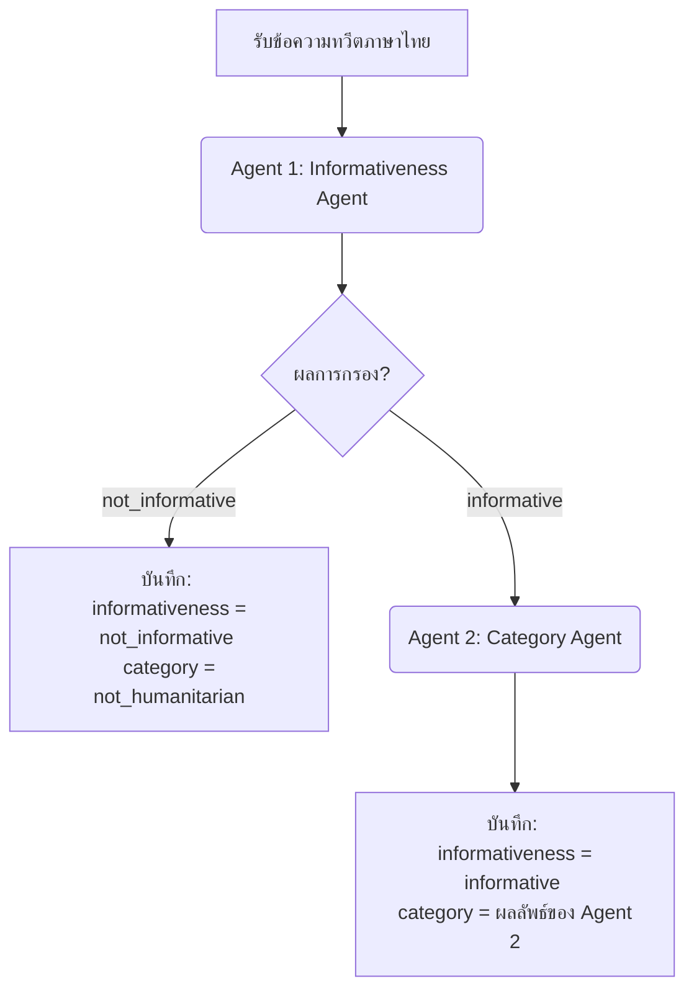

# แผนการทดลองใช้ LLM ในการคัดแยกข้อความแจ้งเตือนภัยพิบัติภาษาไทย (Disaster Alert Labeling Experiment - 03TH)

เอกสารฉบับนี้กำหนดแผนและแนวทางการทดลองสำหรับ **Experiment 03TH** ซึ่งเป็นสถาปัตยกรรมแบบ **เอเจนต์สองขั้นตอนแยกจากกัน (2-Agent / 2-Stage Pipeline)** บนข้อมูล **ภาษาไทย**

การทดลองนี้เป็นการนำชุดข้อมูลที่แปลไทยและแปลงบริบทเป็นประเทศไทยสำเร็จแล้วจำนวน 500 แถวจากไฟล์ [CrisisMMD_Thai_500.csv](file:///e:/nlp-for-disaster/data/CrisisMMD_Thai_500.csv) มาคัดแยกโดยใช้ 2 Agent ทำงานแยกหน้าที่กันเพื่อเปรียบเทียบผลลัพธ์ประสิทธิภาพกับฝั่งภาษาอังกฤษและสถาปัตยกรรมระดับอื่น ๆ

---

## 1. วัตถุประสงค์ (Objectives)
- ประเมินประสิทธิภาพการจำแนกข้อความภาษาไทยด้วยสถาปัตยกรรมแบบ 2-Stage Pipeline (Agent 1 กรองความเกี่ยวข้อง -> Agent 2 คัดแยกหมวดหมู่ย่อย) ของกลุ่มโมเดล MoE ทั้ง 3 รุ่น (`deepseek-v4-flash`, `typhoon-v2.5`, `Gemma 4`)
- เปรียบเทียบผลลัพธ์คะแนนความแม่นยำ F1-Score ระหว่างสถาปัตยกรรม 1-Layer (จาก Exp 01TH), 2-Layer Joint (Exp 02TH), และ 2-Agent Sequential (Exp 03TH) เพื่อค้นหารูปแบบที่ดีที่สุดในการนำไปใช้งานคัดแยกประเภทข้อความภัยพิบัติภาษาไทยจริง

---

## 2. แหล่งข้อมูลและการเตรียมข้อมูล (Dataset & Preparation)
- **แหล่งข้อมูลเข้า (Input Source):** ดึงชุดข้อความภาษาไทยและคำตอบเฉลยโดยตรงจาก **ไฟล์ผลลัพธ์ข้อมูลทดสอบ 500 แถวที่บันทึกสำเร็จมาจาก Experiment 01TH**
- **ความโปร่งใสและถูกต้อง:** **จะไม่มีการสุ่มชุดข้อมูลแปลไทยใหม่ในการทดลองนี้** เพื่อควบคุมตัวแปรในการประเมินประสิทธิภาพแบบรายแถว (Apple-to-Apple Comparison)

---

## 3. สถาปัตยกรรมการทำงานของระบบเอเจนต์ (2-Agent Sequential Pipeline - TH)

กระบวนการส่งข้อความเข้าประมวลผลจะแบ่งแยกหน้าที่ตามโมเดลและ Function Calling อย่างเด็ดขาดเช่นเดียวกับการทดสอบฝั่งอังกฤษ:



### 3.1 บังคับโครงสร้างผลลัพธ์ด้วย Function Calling ราย Agent

#### [Agent 1 Schema]
```python
from pydantic import BaseModel, Field
from typing import Literal

class Agent1InformativenessResultTH(BaseModel):
    informativeness: Literal["informative", "not_informative"] = Field(
        description="determine if the tweet contains SPECIFIC disaster impact/response evidence, facts, or details"
    )
```

#### [Agent 2 Schema] (เรียกใช้ต่อเมื่อ Agent 1 ตอบว่า "informative" เท่านั้น)
```python
class Agent2CategoryResultTH(BaseModel):
    category: Literal[
        "affected_individuals",
        "infrastructure_and_utility_damage",
        "injured_or_dead_people",
        "missing_or_found_people",
        "other_relevant_information",
        "rescue_volunteering_or_donation_effort",
        "vehicle_damage"
    ] = Field(description="identify the DOMINANT content (choose only ONE)")
```

---

## 4. การออกแบบคำสั่ง (2-Agent Prompt Design) - นำ Prompt Concept จาก 03E มาปรับใช้

ระบบ Pipeline สองขั้นตอน (Sequential Cascade Pipeline) จะแบ่งหน้าที่การตัดสินใจออกเป็น 2 เอเจนต์ โดยคำสั่งระบบและคำสั่งสำหรับผู้ใช้งานยังคงใช้ภาษาอังกฤษเป็นหลัก แต่ปรับปรุงเนื้อความและ Signal Words รวมถึงตัวอย่าง Edge Cases ให้เข้ากับบริบทภาษาไทย เพื่อให้โมเดลจำแนกผลได้อย่างละเอียดและรวดเร็ว:

### 4.1 เอเจนต์ตัวที่ 1 (Agent 1: Informativeness Filter)

- **System Instruction:**
  ```markdown
  You are a disaster information gatekeeper. Your ONLY job is to decide whether a tweet contains specific, factual information about a disaster — not to classify its content.

  BIAS RULE: When in doubt, lean toward 'informative'. Only classify as 'not_informative' when the tweet is CLEARLY emotional-only, political, or unrelated. It is worse to miss real disaster information than to pass through a borderline case.
  ```
- **User Prompt:**
  ```markdown
  Tweet: "{tweet_text}"

  Does this tweet contain SPECIFIC, FACTUAL information about a disaster event?

  informative — Mark as informative if the tweet contains ANY of:
    - Specific numbers: casualty counts, displaced persons, missing people, damage estimates
    - Named locations with concrete disaster impact described
    - Factual descriptions of physical destruction (infrastructure, buildings, vehicles, utilities)
    - Reports of rescue, aid, or emergency response operations with details
    - Measurable data: wind speed, magnitude, flood levels, temperature extremes
    - Weather forecasts, warnings, storm tracks, magnitude reports, or direct discussion referencing a specific disaster (e.g., "ส่งกำลังใจให้ผู้ประสบภัยน้ำท่วมเชียงราย #น้ำท่วมเชียงราย" contains the Chiang Rai flood keyword).

  not_informative — ONLY mark as not_informative if the tweet contains EXCLUSIVELY:
    - Pure emotional expression (prayers, sympathy, fear, grief) with NO specific disaster references or details (e.g., "ขอส่งกำลังใจให้ทุกคนปลอดภัย").
    - Political argument or blame with NO specific disaster impact described.
    - Jokes, obvious sarcasm, or clear misinformation.
    - Completely off-topic content unrelated to the disaster.

  Call the function 'filter_informativeness' with your decision.
  ```

### 4.2 เอเจนต์ตัวที่ 2 (Agent 2: Category Classifier)

- **System Instruction:**
  ```markdown
  You are a disaster content categorizer. The tweet you receive has already been confirmed as containing specific disaster information. Your job is to identify its PRIMARY humanitarian content category.

  CORE PRINCIPLE: Choose the MOST SPECIFIC category that fits the tweet's dominant subject. Use 'other_relevant_information' only as a last resort when no other category applies.
  ```
- **User Prompt:**
  ```markdown
  Tweet: "{tweet_text}"

  This tweet has been confirmed as informative about a disaster. Classify it into the SINGLE most dominant humanitarian category using this priority order:

  1. injured_or_dead_people (CHECK FIRST)
     Deaths, fatalities, injuries, casualty counts, hospitalized persons
     Thai signal words: เสียชีวิต, ตาย, เสียชีวิตแล้ว, ผู้เสียชีวิต, พบร่าง, พบศพ, ยอดเสียชีวิต, บาดเจ็บ, ได้รับบาดเจ็บ, เจ็บ, เจ็บสาหัส, บาดเจ็บสาหัส, ส่งโรงพยาบาล, ส่งรพ., รักษาตัวที่โรงพยาบาล, กู้ชีพพบร่าง
     ⚠ Takes priority over affected_individuals and infrastructure damage if any death or injury is mentioned.

  2. missing_or_found_people
     Specific individuals unaccounted for, active search for named/counted persons, confirmed rescues of specific people
     Thai signal words: สูญหาย, หายตัว, หาย, สูญหายไป, ตามหา, ค้นหา, ค้นหาผู้สูญหาย, พบตัวแล้ว, เจอแล้ว, พบตัว, ช่วยชีวิตได้แล้ว, ช่วยเหลือได้แล้ว, รอดชีวิต, ปลอดภัยแล้ว, ติดต่อไม่ได้, ยังไม่พบตัว, ขาดการติดต่อ
     ⚠ About SPECIFIC INDIVIDUALS — not general rescue team deployment.

  3. affected_individuals
     Displacement and evacuation WITHOUT reported deaths/injuries
     Thai signal words: อพยพ, ถูกอพยพ, หนีน้ำ, พลัดถิ่น, ไร้ที่อยู่อาศัย, ไร้บ้าน, ศูนย์อพยพ, สถานที่พักพิง, จุดพักพิง, ติดอยู่, ติดค้าง, ออกไม่ได้, ผู้รอดชีวิต, ผู้ประสบภัย, ชาวบ้านเดือดร้อน, บ้านน้ำท่วม
     ⚠ Only use when NO deaths or injuries are mentioned.

  4. infrastructure_and_utility_damage
     Damage to built environment structures (not vehicles)
     Thai signal words: ถล่ม, ทรุดตัว, พังทลาย, ยุบตัว, พังเสียหาย, ได้รับความเสียหาย, เสียหาย, พัง, ไฟดับ, น้ำประปาไม่ไหล, ไม่มีไฟฟ้า, สัญญาณขาดหาย, น้ำท่วม, ถนนถูกน้ำท่วม, ท่วมถนน, น้ำท่วมขัง, ถนนขาด, ถนนพัง, สะพานขาด, สะพานพัง, เส้นทางชำรุด, เสาไฟล้ม, อาคารถล่ม
     ⚠ Do NOT use when vehicles are the primary subject.

  5. vehicle_damage
     Vehicles as the MAIN focus of the damage reported
     Thai signal words: รถจมน้ำ, รถยนต์จมน้ำ, รถพัง, รถยนต์เสียหาย, รถได้รับความเสียหาย, เรือล่ม, เรือพัง, เรืออับปาง, เรือจม, รถไหลไปกับน้ำ, รถโดนพัดไป, รถคว่ำ, รถบรรทุกคว่ำ
     ⚠ Only when vehicles are the PRIMARY topic, not a side mention.

  6. rescue_volunteering_or_donation_effort
     Organized emergency response, humanitarian aid, volunteer mobilization, emergency helpline sharing, relief distribution
     Thai signal words: บริจาค, เปิดรับบริจาค, เงินบริจาค, สมทบทุน, ระดมทุน, ร่วมบริจาค, จิตอาสา, อาสาสมัคร, อาสา, ถุงยังชีพ, ข้าวกล่อง, แจกของ, ความช่วยเหลือ, สิ่งของช่วยเหลือ, แจกจ่ายสิ่งของ, หน่วยกู้ภัย, ทีมกู้ภัย, กู้ภัย, กู้ชีพ, ลงพื้นที่ช่วยเหลือ
     ⚠ About COLLECTIVE ORGANIZED EFFORTS — not rescue of individual named persons.

  7. other_relevant_information (USE LAST RESORT ONLY)
     Factual but fits none of the above: weather tracking, earthquake magnitude, storm path, satellite images, official warnings without impact details, general news/opinions/expressions of solidarity that mention a specific disaster.
     ⚠ If any specific category above fits, use that instead.

  EDGE-CASE RESOLUTION RULES:
  - "ศูนย์อพยพวัดศรีทรายมูลกำลังแจกข้าวกล่องและน้ำดื่ม" -> Classify as 'rescue_volunteering_or_donation_effort' (describes relief distribution).
  - "สะพานขาด รถสัญจรไม่ได้ที่แม่สาย" -> Classify as 'infrastructure_and_utility_damage' (structural damage is primary).

  Call the function 'classify_category' with your decision.
  ```

---

## 5. แผนการวัดผลเปรียบเทียบและการจัดเก็บข้อมูล
- **ตัวชี้วัดประสิทธิภาพ:** คำนวณหา F1-Score ของระบบ Pipeline ภาษาไทย และเขียนสคริปต์เปรียบเทียบประสิทธิภาพระหว่างโครงสร้าง 1-Layer (Exp 01TH), 2-Layer Joint (Exp 02TH), และ 2-Agent (Exp 03TH) ไว้ในตาราง `th_exp3_vs_other_comparison.csv`
- **โครงสร้างไฟล์ผลลัพธ์:**
  ```text
  e:/nlp-for-disaster/exp3_TH/results/
  ├── deepseek-v4-flash_results_th.csv     <- บันทึกประวัติการตัดสินใจของทั้ง Agent 1 และ Agent 2
  ├── typhoon-v2.5_results_th.csv
  ├── gemma-4_results_th.csv
  ├── th_model_comparison_metrics.csv
  ├── th_exp3_vs_other_comparison.csv      <- ไฟล์ตารางสรุปเปรียบเทียบสถาปัตยกรรมภาษาไทย
  └── confusion_matrices/
  ```

### 5.1 โครงสร้างของไฟล์ CSV ผลลัพธ์รายโมเดล (Individual Model CSV Schema - TH)
ไฟล์ผลลัพธ์แยกตามรุ่นโมเดลสำหรับภาษาไทย (`deepseek-v4-flash_results_th.csv`, `typhoon-v2.5_results_th.csv`, `gemma-4_results_th.csv`) สำหรับสถาปัตยกรรม 2-Agent Sequential Pipeline จะจัดเก็บประวัติการทำนายของแต่ละ Agent รวมถึงข้อความแปลภาษาไทยและเฉลย โดยมีโครงสร้างคอลัมน์ดังนี้:

| ชื่อคอลัมน์ (Column Name) | คำอธิบาย (Description) | ตัวอย่างข้อมูล (Example) |
| :--- | :--- | :--- |
| `tweet_id` | ไอดีข้อความทวีต (ตรงตามชุดข้อมูลต้นฉบับ) | `8.29177E+17` |
| `translated_thai` | ข้อความโซเชียลมีเดียภาษาไทยที่แปลแล้วที่ส่งให้โมเดลวิเคราะห์ | *“ขอแรงใจให้เชียงรายด้วยครับ ตอนนี้บ้านผมน้ำท่วมสูงมาก...”* |
| `true_text_info` | เฉลยจริง: ความเกี่ยวข้องภัยพิบัติ (Ground Truth) | `informative` / `not_informative` |
| `true_text_human` | เฉลยจริง: หมวดหมู่ช่วยเหลือทางมนุษยธรรม (Ground Truth) | `rescue_volunteering_or_donation_effort` / `not_humanitarian` |
| `agent1_predicted_info` | คำทำนายจาก Agent 1: ความเกี่ยวข้องภัยพิบัติ (`informative` / `not_informative`) | `informative` |
| `agent2_predicted_category` | คำทำนายจาก Agent 2: หมวดหมู่ช่วยเหลือ (ทำนายต่อเมื่อ Agent 1 ตอบ `informative` เท่านั้น หากไม่รันจะถูกบันทึกเป็น `null` หรือ `not_humanitarian`) | `rescue_volunteering_or_donation_effort` |
| `final_predicted_info` | คำทำนายสรุปท้ายสุด: ความเกี่ยวข้องภัยพิบัติ (ตรงกับ `agent1_predicted_info`) | `informative` |
| `final_predicted_category` | คำทำนายสรุปท้ายสุด: หมวดหมู่ช่วยเหลือ (ถ้า Agent 1 ตอบ `not_informative` คอลัมน์นี้จะเป็น `not_humanitarian` เสมอ) | `rescue_volunteering_or_donation_effort` |
| `tweet_text_char_count` | จำนวนตัวอักษรของข้อความภาษาอังกฤษต้นฉบับ | `42` |
| `translated_thai_char_count` | จำนวนตัวอักษรของข้อความแปลภาษาไทย `translated_thai` | `65` |
| `token_in_use` | จำนวน Token ขาเข้าที่ใช้ประมวลผลสะสมในระบบเอเจนต์ | `270` |
| `token_out_use` | จำนวน Token ขาออกที่ใช้ประมวลผลสะสมในระบบเอเจนต์ | `32` |
