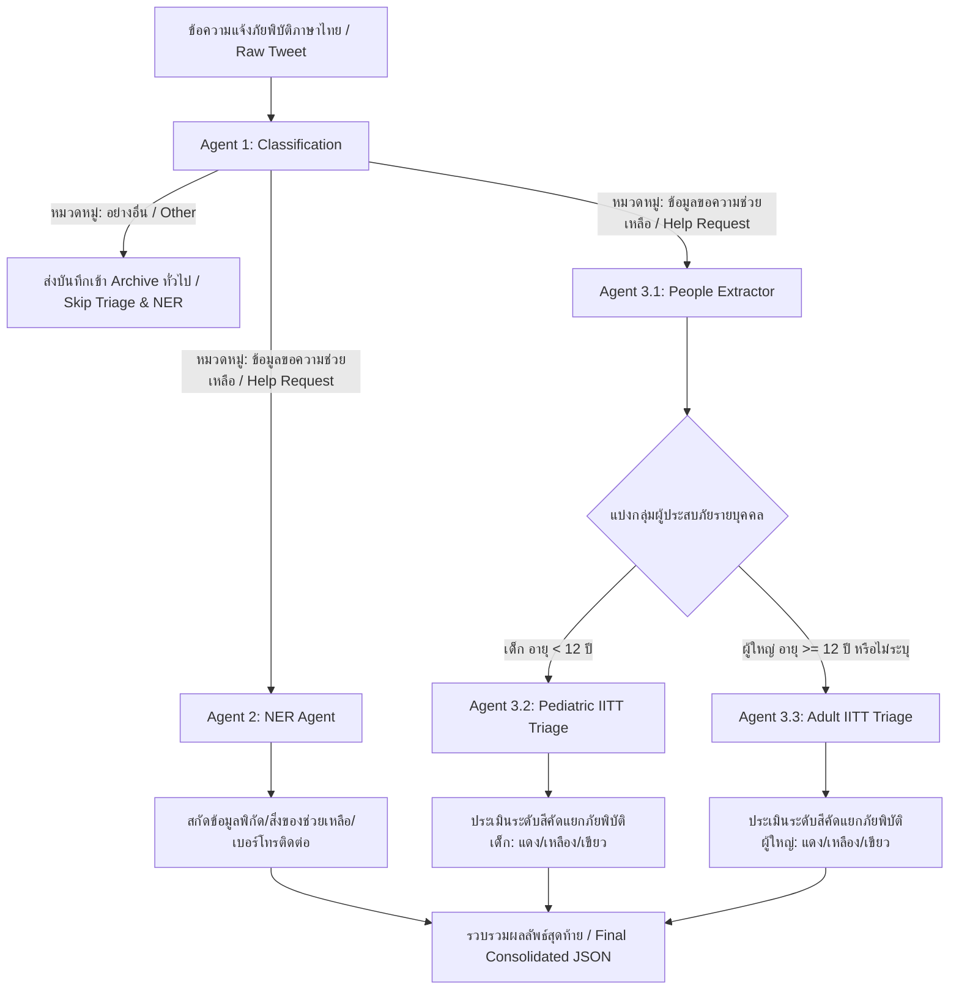

# แผนการจัดสร้างระบบประมวลผลภัยพิบัติ Multi-Agent (Disaster Processing Multi-Agent Pipeline - plan_full_agent)

เอกสารฉบับนี้กำหนดแผนสถาปัตยกรรมและการทดลองสำหรับระบบ **Multi-Agent Pipeline** ในการวิเคราะห์ข้อความแจ้งเตือนภัยพิบัติภาษาไทย โดยผสมผสานขั้นตอนการครองกรองข้อมูลหลัก การสกัด Named Entity Recognition (NER) และระบบประเมินความฉุกเฉินทางการแพทย์และการกู้ภัยด้วยเครื่องมือคัดแยกสี **IITT (Interagency Integrated Triage Tool)**

การทดลองนี้มีวัตถุประสงค์เพื่อยกระดับความแม่นยำ (Accuracy) และประสิทธิภาพการทำงาน (Performance) ควบคู่กัน โดยจะประเมินผลการจัดสรรงานให้เหมาะสมกับโมเดลแต่ละรุ่น (Model Specialization)

---

## 1. วัตถุประสงค์ (Objectives)
- **สถาปัตยกรรมระบบขั้นสูง**: ออกแบบการทำงานประสานกันของ 3 Agent หลัก และ 3 Agent ย่อย เพื่อรับมือกับความซับซ้อนของข้อความแจ้งเหตุภัยพิบัติภาษาไทย
- **ประยุกต์ใช้มาตรฐานสากล**: นำเครื่องมือ **IITT (Interagency Integrated Triage Tool)** มาใช้ประเมินความเร่งด่วนของผู้ประสบภัย โดยคัดแยกตามกลุ่มอายุ (เด็ก < 12 ปี และ ผู้ใหญ่ >= 12 ปี)
- **ค้นหาโมเดลที่เหมาะสมที่สุด (Model Specialization)**:
  - ทำการทดสอบประสิทธิภาพของแต่ละเอเจนต์แบบแยกส่วน (Individual Testing) ด้วยโมเดลทั้ง 3 รุ่น (`deepseek-v4-flash`, `typhoon-v2.5`, `Gemma 4`) เพื่อระบุว่ารุ่นใดเหมาะสมกับงานย่อยประเภทใดที่สุด
  - ทำการทดสอบแบบโมเดลเดียวกันทำงานทั้งระบบ (Homogeneous Pipeline) เปรียบเทียบกับแบบจัดสรรโมเดลแยกตามความเหมาะสมของงาน (Heterogeneous Pipeline) เพื่อหาจุดสมดุลที่ดีที่สุดระหว่างความแม่นยำ เวลาในการประมวลผล และปริมาณการใช้ Token

---

## 2. สถาปัตยกรรมระบบ Multi-Agent (Pipeline Architecture)

ระบบจะประมวลผลข้อความดิบภาษาไทยผ่านกระบวนการทำงานดังต่อไปนี้:



### รายละเอียดการทำงานของแต่ละเอเจนต์ (Agent Details):
1. **Agent 1: Classification Agent (การคัดกรองข้อมูลเข้า)**
   - ทำหน้าที่คัดแยกข้อความว่าเกี่ยวข้องกับ **"ข้อมูลขอความช่วยเหลือ" (Help Request)** เช่น ต้องการอพยพ ขออาหาร/น้ำ ต้องการคนช่วยออกจากพื้นที่ หรือเป็น **"อย่างอื่น" (Other)** เช่น รายงานสภาพอากาศทั่วไป ข่าวภัยพิบัติ การประชาสัมพันธ์ หรือข้อความส่งกำลังใจ
   - หากข้อความจัดอยู่ในกลุ่ม "อย่างอื่น" ระบบจะข้ามขั้นตอน NER และ Triage ทันทีเพื่อประหยัด Token และทรัพยากร
2. **Agent 2: NER Agent (การสกัดข้อมูลสถานการณ์)**
   - ทำหน้าที่สกัด Named Entity ตามแบบของ Experiment 04 เพื่อสกัดรายละเอียดเพิ่มเติม สถานที่เกิดเหตุ เบอร์โทรติดต่อผู้ประสบภัย/ผู้รายงานภัย และจำนวนหรือความต้องการสิ่งของช่วยเหลือ (อาหาร ยา แหล่งพลังงาน)
3. **Agent 3: IITT Triage Agent (การจัดกลุ่มความรุนแรงทางการแพทย์และการกู้ภัย)**
   - ประกอบไปด้วยเอเจนต์ย่อย 3 ตัว ทำงานร่วมกันแบบลำดับ (Sequential):
     - **Sub-agent 3.1: People Extractor**: สแกนหาตัวบุคคลในข้อความ สกัดชื่อ อายุ (ถ้ามีคำระบุว่า "เด็ก" หรือใช้สรรพนามเด็ก ให้ระบุอายุ < 12 โดยกำหนดค่าเริ่มต้นเป็น 11 หรือใส่ flag เป็น child) และอาการหรือสถานะความเดือดร้อน (ต้องดึงคำพูดที่เป็นข้อเท็จจริงในข้อความออกมาตรง ๆ ห้ามแต่งอาการหรือประเมินล่วงหน้า)
     - **Sub-agent 3.2: Pediatric IITT Triage (<12 ปี)**: นำรายชื่ออาการของเด็กที่สกัดได้จาก 3.1 มาประเมินระดับสีความรุนแรงตามเกณฑ์ IITT Pediatric (แดง, เหลือง, เขียว)
     - **Sub-agent 3.3: Adult IITT Triage (>=12 ปี)**: นำรายชื่ออาการของผู้ใหญ่หรือผู้ที่ไม่ระบุอายุที่สกัดได้จาก 3.1 มาประเมินระดับสีความรุนแรงตามเกณฑ์ IITT Adult (แดง, เหลือง, เขียว)

---

## 3. โครงสร้างและรูปแบบข้อมูลนำออก (Pydantic / JSON Schemas)

การจำกัดรูปแบบผลลัพธ์ผ่าน API จะใช้โครงสร้าง Pydantic Class เพื่อการันตีความเข้ากันได้ของ JSON เสมอ:

### 3.1 Agent 1: Classification Schema
```python
from pydantic import BaseModel, Field
from typing import Literal

class ClassificationResult(BaseModel):
    is_help_request: bool = Field(description="True if the tweet represents a direct request for rescue, evacuation, medical aid, or immediate basic supplies. False otherwise.")
    category: Literal["help_request", "other"] = Field(description="Classify as 'help_request' for emergency/relief calls, or 'other' for general updates, weather, wishes, news, and spam.")
```

### 3.2 Agent 2: NER Schema
```python
from pydantic import BaseModel, Field
from typing import List, Optional

class ContactDetail(BaseModel):
    name: Optional[str] = Field(description="Full name or first name if found, otherwise null")
    nickname: Optional[str] = Field(description="Nickname if found, otherwise null")
    phone: Optional[str] = Field(description="Phone number found in the tweet, otherwise null")

class VictimsCount(BaseModel):
    dead: int = Field(default=0, description="Number of dead people explicitly reported")
    critical: int = Field(default=0, description="Number of people trapped, missing, in severe danger or severely injured")
    urgent: int = Field(default=0, description="Number of injured or sick people needing prompt assistance")
    safe: int = Field(default=0, description="Number of people reported safe/evacuated")
    child: int = Field(default=0, description="Number of children affected")
    infant: int = Field(default=0, description="Number of infants affected")

class ItemsCount(BaseModel):
    firstAid: int = Field(default=0, description="Quantity/Need of first-aid kits or medicine (1 if needed but quantity not specified)")
    food: int = Field(default=0, description="Quantity/Need of food/drinking water (1 if needed but quantity not specified)")
    energy: int = Field(default=0, description="Quantity/Need of flashlights, powerbanks, candles, or backup power (1 if needed but quantity not specified)")

class CoordinatesDetail(BaseModel):
    name: Optional[str] = Field(description="Specific location name, landmark, road, or sub-district name mentioned in the tweet")
    google_map_url: Optional[str] = Field(default=None)
    lat: float = Field(default=0.0)
    lng: float = Field(default=0.0)

class NERResult(BaseModel):
    message_more_detail: str = Field(description="Brief summary of the disaster incident details in Thai")
    contact_victim: List[ContactDetail]
    contact_reporter: List[ContactDetail]
    victims: VictimsCount
    items: ItemsCount
    coordinates: CoordinatesDetail
```

### 3.3 Agent 3.1: People Extractor Schema
```python
from pydantic import BaseModel, Field
from typing import List, Optional, Literal

class PersonExtracted(BaseModel):
    name: Optional[str] = Field(description="Name or nickname of the person, or 'ไม่ระบุชื่อ' (Unknown) if not mentioned")
    age: Optional[int] = Field(description="Age in years. If the text mentions 'เด็ก' (child) and no age is given, set to 11. If not mentioned and cannot be estimated, set to null.")
    age_group: Literal["child", "adult", "unknown"] = Field(description="Identify age group: 'child' (<12 years old), 'adult' (>=12 years old), or 'unknown' if there is no clue.")
    symptoms_literal: str = Field(description="Extract verbatim symptoms, injuries, or hazardous conditions of this person in Thai. Do NOT summarize or add medical terms.")

class PeopleExtractionResult(BaseModel):
    people: List[PersonExtracted] = Field(description="List of all individuals identified in the request for help. If no specific individuals are named, create generic entries to capture described victims.")
```

### 3.4 Agent 3.2 & 3.3: IITT Triage Schema
```python
class TriageResult(BaseModel):
    reasoning: str = Field(description="Explain step-by-step in Thai why this color code was chosen based on the extracted symptoms and IITT clinical criteria.")
    triage_color: Literal["RED", "YELLOW", "GREEN"] = Field(description="The triage color code determined from the clinical criteria: RED (Immediate emergency), YELLOW (Urgent priority), GREEN (Non-urgent)")
```

---

## 4. การออกแบบคำสั่งสำหรับโมเดล (Prompt Design Template) - นำ Prompt Concept จาก 01TH มาปรับใช้

คำสั่งระบบและคำแนะนำจะถูกเขียนขึ้นเป็น **ภาษาอังกฤษ** เพื่อรองรับการทำงานของโมเดล MoE ได้อย่างเสถียรที่สุด แต่ทำการฝัง **ภาษาไทยสัญญาณ (Thai Signal Words)** และ **Edge Cases ตัวอย่างภาษาไทย** เข้าไปในคำสั่ง

### 4.1 Agent 1: Classification Prompt
```markdown
[System Instruction]
You are a disaster emergency dispatcher. Your task is to classify social media posts (tweets) in Thai to filter out emergency help requests that require urgent rescue or medical dispatch.

[User Prompt Template]
Tweet: "{text}"

Classify the tweet into exactly ONE category based on the rules below:

CATEGORIES:
1. help_request: Direct calls for rescue, requests to evacuate trapped people, urgent medical aid requests, missing person search requests, or direct requests for emergency food/water.
   - Thai signal words: ช่วยด้วย, ขอความช่วยเหลือ, ติดอยู่, ติดเกาะ, น้ำท่วมสูงมาก, ขออพยพ, ยานอนป่วย, คนแก่ติดอยู่, ท่วมมิดหัว, ต้องการกู้ภัย, ส่งเรือมารับหน่อย, ขอน้ำของประทังชีวิต
2. other: General situation updates, weather reports, warning alerts, official announcements, wishing/praying messages, donation campaigns (raising money/volunteers), or generic spam/news.
   - Thai signal words: อัพเดทน้ำท่วม, พยากรณ์อากาศ, เตือนภัย, ระวังภัย, ประกาศเตือน, ร่วมบริจาคเงินได้ที่, เปิดรับบริจาค, ส่งกำลังใจ, ขอให้ทุกคนปลอดภัย, รายงานสถานการณ์

EDGE-CASE RESOLUTION RULES:
- "ขอรับบริจาคถุงยังชีพไปแจกที่แม่สาย" -> Classify as other. (It's a relief/donation campaign, not a direct emergency victim requesting help).
- "ติดอยู่ในบ้านน้ำท่วมถึงอกพิกัดเกาะทราย ซอย 4 ช่วยด้วยค่ะ" -> Classify as help_request. (Direct victim call).
- "ขอส่งกำลังใจให้เชียงรายรอดพ้นวิกฤตนี้ไปได้โดยเร็ว" -> Classify as other. (Wishes/praying, no emergency dispatch needed).

Call the function 'classify_disaster' with your decision.
```

### 4.2 Agent 2: NER Prompt (เช่นเดียวกับ Exp 04)
```markdown
[System Instruction]
You are a disaster response information analyst. Your task is to analyze social media posts (tweets) or alerts about disasters in Thailand and extract key named entities.

[User Prompt Template]
Tweet: "{text}"

Analyze the tweet and extract information according to the definitions and rules below.

(รายละเอียดฟิลด์ message_more_detail, contact_victim, contact_reporter, victims count, items, coordinates จะอ้างอิงจากแผนการทดลอง 04)

Call the function 'extract_information' with the extracted details.
```

### 4.3 Agent 3.1: People Extractor Prompt
```markdown
[System Instruction]
You are an emergency medical intake specialist. Your task is to extract information about individuals who need rescue or medical attention from Thai social media alerts.

[User Prompt Template]
Tweet: "{text}"

Analyze the tweet and extract every individual mentioned as needing help. Follow these rules carefully:

1. Identify names/nicknames if present. If no name is mentioned, set name to "ไม่ระบุชื่อ".
2. Determine age.
   - If the text mentions "เด็ก", "น้อง" (referring to a child), "ลูกเล็ก", "ทารก" without a specific age, set age to 11 and age_group to "child".
   - If the text mentions "คนแก่", "ยาย", "ตา", "อาม่า", "อากง", "คุณยาย", "ผู้ป่วยติดเตียง" without a specific age, set age_group to "adult" and age to null.
   - If no age clues are present, set age to null and age_group to "unknown".
3. Extract `symptoms_literal` strictly from the text. This field must represent the actual condition or injury described (e.g. "ขาหัก", "เป็นไข้สูง", "ไม่มีอาหารกินมา 3 วัน", "น้ำท่วมสูงออกไม่ได้", "นอนติดเตียง", "ไฟช็อต"). Do NOT paraphrase, summarize, or translate this field into medical jargon. Maintain the exact Thai wording.

EDGE-CASE RULES:
- "ยายป่วยติดเตียงกับหลานชายเด็กเล็ก 1 คน ติดอยู่ในบ้าน ซอย 5" -> Extract two individuals:
  1. name: "ไม่ระบุชื่อ" (ยาย), age: null, age_group: "adult", symptoms_literal: "ป่วยติดเตียง, ติดอยู่ในบ้าน"
  2. name: "ไม่ระบุชื่อ" (หลานชายเด็กเล็ก), age: 11, age_group: "child", symptoms_literal: "ติดอยู่ในบ้าน"
- "ช่วยน้องน้ำหอม อายุ 8 ขวบ เป็นไข้ตัวร้อนจมน้ำด้วยค่ะ" -> Extract:
  - name: "น้องน้ำหอม", age: 8, age_group: "child", symptoms_literal: "เป็นไข้ตัวร้อนจมน้ำ"

Call the function 'extract_people' with the extracted details.
```

### 4.4 Agent 3.2: Pediatric IITT Triage Prompt (<12 ปี)
```markdown
[System Instruction]
You are a pediatric emergency triage specialist. Your task is to determine the triage priority level of a child under 12 based on the Interagency Integrated Triage Tool (IITT) guidelines.

[User Prompt Template]
Victim Details (Child < 12):
- Name: {name}
- Age: {age}
- Extracted Symptoms/Condition: {symptoms_literal}

Assign a triage color (RED, YELLOW, or GREEN) based on the following pediatric IITT criteria:

1. RED (Emergency - Immediate resuscitation / life support needed):
   - Unresponsive, floppy, or in a coma (หมดสติ, ไม่รู้สึกตัว, ปลุกไม่ตื่น, ตัวอ่อนปุย)
   - Severe respiratory distress, gasping, or central cyanosis (หายใจไม่ค่อยออก, หายใจเหนื่อยมาก, ปากเขียว, หายใจเฮือก, ตัวเขียว)
   - Active severe bleeding (เลือดออกไหลไม่หยุด, แผลฉีกขาดฉกรรจ์เลือดไหลพุ่ง)
   - Continuous convulsions/seizing (กำลังชัก, เกร็ง, ชักต่อเนื่อง)
   - Severe environmental exposure leading to shock or near-drowning (จมน้ำ, สำลักน้ำ, ตัวเย็นเจี๊ยบ, ช็อก)

2. YELLOW (Priority - Needs prompt medical care, can wait briefly):
   - Wheezing, stridor, or moderate breathing difficulty without red criteria (หายใจครืดคราด, หายใจหอบ, หายใจมีเสียงหวีด)
   - Inability to feed or drink, or persistent vomiting/diarrhea (ทานอาหารไม่ได้, ดื่มน้ำไม่ได้, อาเจียนตลอดเวลา, ท้องเสียรุนแรง, อ่อนเพลียมาก)
   - High fever with extreme lethargy (ตัวร้อนจัด, ไข้สูงซึมมาก)
   - Suspected fracture or visible acute limb deformity (กระดูกหัก, แขนพัง, ขาบิดเบี้ยว, ล้มหัวกระแทก)
   - Severe pain (เจ็บปวดทรมานมาก, ร้องไห้ไม่ยอมหยุดจากความเจ็บปวด)

3. GREEN (Non-urgent - Minor issues, can wait safely):
   - Minor cuts, scrapes, or mild local pain (แผลถลอก, มีแผลเล็กน้อย, เจ็บนิดหน่อย)
   - Cough or cold with normal breathing and normal alertness (เป็นหวัด, ไอเล็กน้อย, คุยได้รู้เรื่อง)
   - Alert, active, and able to interact normally (ตื่นดี, วิ่งเล่นได้, ทานข้าวได้)

CRITICAL DECISION RULE:
If symptoms are ambiguous or multiple categories apply, select the highest acuity level (RED > YELLOW > GREEN) to ensure child safety.

Call the function 'triage_pediatric' with your decision.
```

### 4.5 Agent 3.3: Adult IITT Triage Prompt (>=12 ปี หรือไม่ระบุ)
```markdown
[System Instruction]
You are an adult emergency triage specialist. Your task is to determine the triage priority level of an adult or individual of unknown age based on the Interagency Integrated Triage Tool (IITT) guidelines.

[User Prompt Template]
Victim Details (Adult/Unknown >= 12):
- Name: {name}
- Age: {age}
- Extracted Symptoms/Condition: {symptoms_literal}

Assign a triage color (RED, YELLOW, or GREEN) based on the following adult IITT criteria:

1. RED (Emergency - Immediate resuscitation / life-saving intervention needed):
   - Unresponsive or severely altered mental status (หมดสติ, ไม่รู้สึกตัว, ปลุกไม่ตื่น, เรียกไม่ตอบสนอง)
   - Severe respiratory distress, cannot speak full sentences, or cyanosis (หายใจลำบากมาก, หายใจเหนื่อยพูดไม่ได้เป็นประโยค, ปากเขียว, ขาดอากาศหายใจ)
   - Active uncontrollable bleeding (เลือดออกพุ่ง, เลือดไหลนองไม่หยุด)
   - Shock signs: weak/rapid pulse, cold sweaty skin (ชีพจรเบาเร็ว, ช็อก, ตัวเย็นเหงื่อออกมาก)
   - High-risk trauma: amputation, severe crush injury, chemical exposure, or active convulsions (แขนขาด, ขาขาด, โดนทับรุนแรง, ชักเกร็ง)

2. YELLOW (Priority - Urgent condition, needs prompt evaluation):
   - Moderate difficulty breathing, wheezing without red criteria (หายใจเหนื่อยหอบหืด, แน่นหน้าอกแต่ยังพูดได้)
   - Chest pain or severe abdominal pain (เจ็บหน้าอกรุนแรง, ปวดท้องรุนแรง)
   - Focal neurological deficits like acute weakness/numbness (แขนขาอ่อนแรงครึ่งซีก, ปากเบี้ยว, พูดไม่ชัด)
   - Persistent vomiting/diarrhea with severe dehydration (อาเจียนรุนแรง, ท้องเสียจนหมดแรง, ขาดน้ำรุนแรง)
   - Open fracture, joint dislocation, or limb deformity (กระดูกโผล่, ข้อเคลื่อน, ขาผิดรูป)
   - Time-sensitive wounds: animal bites, deep wounds, chemical burns (หมากัด, แผลลึก, ไฟลวกผิวหนัง)

3. GREEN (Non-urgent - Minor or chronic issues, can wait safely):
   - Minor wounds, sprains, or abrasions (แผลถลอกเล็กน้อย, ข้อเท้าแพลง, มีแผลเล็กน้อย)
   - Mild pain, normal breathing (ปวดเล็กน้อย, หายใจปกติ)
   - Fully alert, walking wounded, stable vital status (คุยรู้เรื่อง, เดินได้เอง, อาการคงที่)

CRITICAL DECISION RULE:
If symptoms are ambiguous or multiple categories apply, select the highest acuity level (RED > YELLOW > GREEN) to protect the patient.

Call the function 'triage_adult' with your decision.
```

---

## 5. การตั้งค่า API และการเชื่อมต่อโมเดล (API Configuration & Model Connection)

การเชื่อมต่อโมเดลทุกตัวจะทำผ่านการเรียก API ภายนอก (External API Call) ทั้งหมดผ่าน OpenAI-compatible client SDK เพื่อหลีกเลี่ยงข้อจำกัดด้านทรัพยากรของเครื่องทดสอบ โดยไม่มีการติดตั้งหรือเรียกใช้งานโมเดลแบบ Localhost:

1. **Gemma 4** (เข้าถึงผ่าน OpenRouter API):
   - **โมเดลคีย์:** `google/gemma-4-26b-a4b-it`
   - **Endpoint:** `https://openrouter.ai/api/v1`
   - **คีย์เข้าใช้งาน:** `os.environ.get("OPENROUTER_API_KEY")`

2. **deepseek-v4-flash** (เข้าถึงผ่าน OpenRouter API):
   - **โมเดลคีย์:** `deepseek/deepseek-v4-flash`
   - **Endpoint:** `https://openrouter.ai/api/v1`
   - **คีย์เข้าใช้งาน:** `os.environ.get("OPENROUTER_API_KEY")`

3. **typhoon-v2.5** (เข้าถึงผ่าน Typhoon API):
   - **โมเดลคีย์:** `typhoon-v2.5-30b-a3b-instruct`
   - **Endpoint:** `https://api.opn.ai/v1`
   - **คีย์เข้าใช้งาน:** `os.environ.get("TYPHOON_API_KEY")`

---

## 6. แผนการประเมินและเปรียบเทียบโมเดล (Evaluation & Testing Strategy)

การทดลองนี้ต้องการค้นหาและเปรียบเทียบความคุ้มค่าและประสิทธิภาพของรูปแบบ Pipeline 2 แบบ:
1. **Homogeneous Pipeline**: ใช้โมเดลเดียวกันรันตั้งแต่ต้นจนจบ (ทดสอบ 3 รอบแยกตามโมเดล: `Gemma 4`, `deepseek-v4-flash`, `typhoon-v2.5`)
2. **Heterogeneous Pipeline**: นำผลลัพธ์ประสิทธิภาพรายเอเจนต์ใน Phase 1 มาจัดสรรโมเดลแยกตามหน้าที่ที่ดีที่สุด เช่น:
   - Agent 1 (Classification) -> ใช้โมเดลที่แยกแยะได้รวดเร็วและราคาถูกที่สุด
   - Agent 2 (NER) -> ใช้โมเดลที่สกัดโครงสร้างได้ครบถ้วน
   - Agent 3.1, 3.2, 3.3 (Triage) -> ใช้โมเดลที่มีตรรกะทางการแพทย์และความเข้าใจภาษาไทยสูงที่สุด

### ขั้นตอนการทดสอบ (Testing Phases):

#### Phase 1: การประเมินผลแยกรายเอเจนต์ (Individual Agent Evaluation)
นำข้อมูลทดสอบที่ได้รับการเตรียมเฉลยจริง (Ground Truth) ไปรันผ่านเอเจนต์แต่ละตัวแยกกันโดยอิสระ ด้วยโมเดลทั้ง 3 รุ่น เพื่อหาประสิทธิภาพเดี่ยว:
- **ข้อมูลการทดสอบ**: ชุดข้อมูลภัยพิบัติภาษาไทยที่คัดเลือกมาอย่างดี 200-500 รายการ ซึ่งประกอบไปด้วยข้อความที่มีสัดส่วนต้องการความช่วยเหลือ (ช่วยเหลือทางการแพทย์, กู้ภัย, ขอสิ่งของ) และข้อความประเภทอื่น ๆ
- **ตัวชี้วัดประสิทธิภาพแยกรายเอเจนต์ (Metrics)**:
  - **Agent 1 (Classification)**:
    - Confusion Matrix (True Help vs True Other)
    - Precision, Recall, และ F1-Score ของคลาส `help_request` (เน้นป้องกัน False Negative: ข้อความช่วยเหลือต้องไม่หลุดไปกลุ่ม Other)
  - **Agent 2 (NER)**:
    - F1-Score ของการสกัดฟิลด์ข้อมูลสำคัญ (เช่น ชื่อคนติดต่อ, เบอร์โทรศัพท์, จำนวนผู้ประสบภัย, ชนิดของสิ่งของช่วยเหลือ)
  - **Agent 3.1 (People Extractor)**:
    - อัตราความแม่นยำในการจับคู่จำนวนบุคคลจริงในข้อความ (Exact Count Match Rate)
    - ความถูกต้องของการคัดกรองกลุ่มอายุ (Age Group Classification Accuracy)
  - **Agent 3.2 & 3.3 (Triage)**:
    - F1-Score สำหรับการระบุระดับความฉุกเฉินรายบุคคล (Red, Yellow, Green) เทียบกับเฉลยของแพทย์กู้ชีพ

#### Phase 2: การประเมินผลแบบโมเดลเดียวกันทั้งระบบ (Homogeneous Pipeline Evaluation)
- ดำเนินการรัน Pipeline แบบทำงานต่อเนื่องกัน (End-to-End) โดยใช้โมเดลเดียวกันทุกขั้นตอน
- บันทึกตัวชี้วัดภาพรวม:
  - **ความแม่นยำรวมปลายน้ำ (End-to-End Accuracy)**: สัดส่วนผู้ประสบภัยที่ได้รับการคัดแยกสี IITT ได้ถูกต้องตรงตามเฉลยจริงทั้งหมด
  - **ระยะเวลาการทำงานเฉลี่ย (Average Latency)**: วินาทีต่อการประมวลผลหนึ่งข้อความ (End-to-End)
  - **ปริมาณการประหยัด Token (Token Cost Efficiency)**: จำนวน Input/Output Token เฉลี่ยต่อหนึ่งข้อความภัยพิบัติที่ส่งเข้ามา

#### Phase 3: การประเมินผลแบบผสมโมเดล (Heterogeneous Pipeline Evaluation)
- ประกอบระบบ Pipeline โดยใช้ตัวเลือกโมเดลที่ดีที่สุดจากการวิเคราะห์ Phase 1 (เช่น Agent 1 ใช้ `deepseek-v4-flash`, Agent 2 ใช้ `Gemma 4`, Agent 3 ใช้ `typhoon-v2.5` - สมมติฐานเบื้องต้น)
- วัดผลลัพธ์เพื่อพิสูจน์สมมติฐานว่า **การแยกโมเดลตามความเชี่ยวชาญจะช่วยเพิ่มประสิทธิภาพด้านความแม่นยำได้ดีขึ้น ในขณะที่ลดค่าใช้จ่าย Token และเวลาทำงานเมื่อเทียบกับการใช้โมเดลประสิทธิภาพสูงเพียงโมเดลเดียวทั้งระบบ**

---

## 7. โครงสร้างของไฟล์ผลลัพธ์ที่จัดเก็บ (Output Files & Directory Structure)

ผลลัพธ์การรันและสรุปผลเปรียบเทียบของการทดลอง Multi-Agent จะถูกบันทึกไว้ในพิกัดดังนี้:

```text
exp_full_agent/results/
├── individual_agent_evaluation/              <- บันทึกผลการรันแยกโมเดลรายเอเจนต์ (Phase 1)
│   ├── agent1_classification_comparison.csv
│   ├── agent2_ner_comparison.csv
│   ├── agent3_1_people_extractor_comparison.csv
│   ├── agent3_2_pediatric_triage_comparison.csv
│   └── agent3_3_adult_triage_comparison.csv
├── homogeneous_pipeline/                     <- บันทึกผลการรันทั้งระบบแบบโมเดลเดียวจบ (Phase 2)
│   ├── gemma-4_full_pipeline_results.csv
│   ├── deepseek-v4-flash_full_pipeline_results.csv
│   └── typhoon-v2.5_full_pipeline_results.csv
├── heterogeneous_pipeline/                    <- บันทึกผลการรันผสมโมเดล (Phase 3)
│   └── optimized_hetero_pipeline_results.csv
├── pipeline_comparison_metrics.csv            <- สรุปเปรียบเทียบ F1-Score, Latency, Cost ของทุกรูปแบบ
└── pipeline_performance_charts.png            <- กราฟเปรียบเทียบจุดคุ้มทุน (Cost vs Accuracy vs Latency)
```
