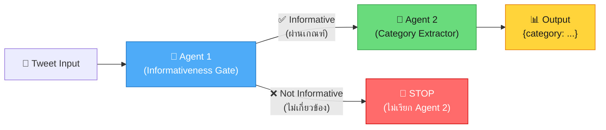
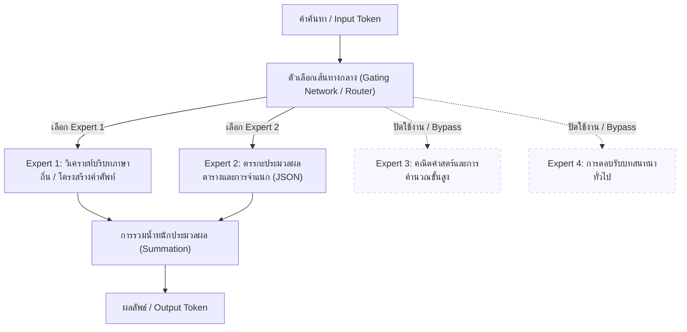

# การวิจัย: การวิเคราะห์เปรียบเทียบสถาปัตยกรรมการสั่งการแบบ Zero-Shot และ Ensemble บนโมเดลภาษาขนาดใหญ่ประเภท Mixture-of-Experts เพื่อคัดแยกประเภทข้อมูลภัยพิบัติ
(A Comparative Study on Zero-Shot Prompting Architectures and Ensemble Mechanisms using MoE LLMs for Social Media Crisis Classification)

---

## 1. บทนำและวัตถุประสงค์ (Introduction & Research Objectives)

ในสถานการณ์ภัยพิบัติทางธรรมชาติ ข้อมูลบนสื่อสังคมออนไลน์ (Social Media) เช่น ทวิตเตอร์ (X) เป็นแหล่งข้อมูลเรียลไทม์ที่มีคุณค่าสูงสำหรับทีมกู้ภัยและหน่วยงานบรรเทาสาธารณภัย อย่างไรก็ตาม ปริมาณข้อมูลที่มหาศาลและความกำกวมของภาษามนุษย์ทำให้การประมวลผลด้วยมนุษย์เป็นไปได้ยาก โครงการวิจัยนี้จึงมุ่งศึกษาการประยุกต์ใช้โมเดลภาษาขนาดใหญ่ (Large Language Models: LLMs) บนสถาปัตยกรรม **Mixture-of-Experts (MoE)** ในการประมวลผลภาษาธรรมชาติ (NLP) เพื่อจำแนกความเกี่ยวข้องของข้อความภัยพิบัติ (**Informativeness Detection**) และจัดหมวดหมู่ความต้องการช่วยเหลือทางมนุษยธรรม (**Humanitarian Category Classification**) ตามมาตรฐานสากล

วัตถุประสงค์หลักของการศึกษานี้ประกอบด้วย:
1. **การวิเคราะห์เปรียบเทียบสถาปัตยกรรมการสั่งการ 3 รูปแบบ (Prompting Architectures)**:
   * **Single-Layer Flat Classification (Exp 01)**: การตัดสินใจจำแนกประเภทในขั้นตอนเดียว (Flat Classification) โดยจำแนกทั้งความเกี่ยวข้องและหมวดหมู่ช่วยเหลือพร้อมกัน
   * **Two-Layer Joint Classification (Exp 02)**: การจำแนกแบบสองมิติควบคู่กัน (Joint) ผ่าน API Call เดียว และส่งผลลัพธ์กลับมาในรูปแบบโครงสร้างข้อมูล (JSON Schema)
   * **Two-Stage Sequential Classification (Exp 03)**: การจำแนกแบบลำดับขั้นโดยใช้เอเจนต์คู่ (Two-Agent Pipeline) เอเจนต์ตัวแรกทำหน้าที่คัดกรองข่าวสาร (Informativeness Gate) หากผ่านเกณฑ์จึงส่งต่อให้เอเจนต์ตัวที่สองทำการจัดหมวดหมู่ช่วยเหลือ (Category Extractor)
2. **การศึกษาและการลดอคติจากการจำกัดคำสั่งเชิงลบ (Strictness Bias Mitigation)**:
   * วิเคราะห์ผลกระทบของคำสั่งห้ามเชิงลบ (Negative Constraints) หรือเกณฑ์ที่เข้มงวดเกินไป (Strictness Bias) ที่ทำให้เกิดคอขวดสะสมในความสามารถในการจำแนกของโมเดล (ลดประสิทธิภาพ F1-score) และหาแนวทางแก้ไขผ่านการปรับแต่งคำสั่งเชิงบวก (Optimized Prompts)
3. **การทดสอบความสามารถในการรวมกลุ่มโหวตเสียงส่วนใหญ่ (Ensemble Voting Analysis)**:
   * ศึกษาความเป็นไปได้ ประสิทธิภาพ และความคุ้มค่าของการทำ Ensemble Voting (โหวตเสียงส่วนใหญ่ 2 ใน 3) ระหว่างโมเดล MoE ต่างค่าย เพื่อเพิ่มความเสถียรและลดความผันแปรของระบบ
4. **การประยุกต์ใช้เพื่อสร้างระบบสกัดข้อมูลภัยพิบัติภาษาไทยที่ใช้งานได้จริง (Experiment 04)**:
   * พัฒนาระบบสกัดข้อมูลระดับความรุนแรง (Severity level) และระบุหน่วยงาน/บุคคลที่เกี่ยวข้อง (Named Entity Recognition: NER) บนภาษาไทยท้องถิ่น

---

## 2. โครงสร้างสถาปัตยกรรมการทดลอง (Experiment Matrix)

การวิจัยแบ่งโครงสร้างการเปรียบเทียบออกเป็นแมทริกซ์การทดลองดังต่อไปนี้ โดยใช้สัญลักษณ์ **E** ต่อท้ายชื่อการทดลองเพื่อหมายถึง **Enhanced** (ปรับปรุง Prompt) และ **F** หมายถึง **Few-Shot**:

### 🏗️ สถาปัตยกรรมหลัก 3 รูปแบบ (Core Architecture Definitions)

| สัญลักษณ์ | ชื่อเต็ม | คำอธิบาย |
| :---: | :--- | :--- |
| **Flat** | Prompt use 1 Step, 1 Layer | ใช้ Prompt เดียว API Call เดียว ให้โมเดลจำแนก Informativeness และ Category พร้อมกันในขั้นตอนเดียว |
| **Joint** | Prompt use 2 Step, 1 Layer | ใช้ Prompt เดียว API Call เดียว แต่ให้โมเดลส่งคืน JSON 2 คีย์พร้อมกัน (2 งานใน 1 ชั้น) |
| **Seq** | 2 Agent Layer | แบ่งการทำงานออกเป็น 2 เอเจนต์อิสระ (2 API Calls ต่อ 1 ทวีต): Agent 1 กรองความเกี่ยวข้อง → Agent 2 จัดหมวดหมู่ |

### 📋 ตารางแมทริกซ์การทดลอง (Full Experiment Matrix)

| การทดลอง (Experiment) | สถาปัตยกรรม (Architecture) | รูปแบบคำสั่ง (Prompt Version) | รายละเอียดทางเทคนิค / วัตถุประสงค์ |
| :--- | :--- | :--- | :--- |
| **Exp 1 (Original)** | Flat — 1 Step, 1 Layer | V1 (Original Biased) | รัน Zero-shot ขั้นตอนเดียว (ใช้คำสั่งดั้งเดิมดัดแปลงมาจากเปเปอร์ต้นแบบ [1]) |
| **Exp 1E (Optimized)** | Flat — 1 Step, 1 Layer | V2 (Optimized) | ถอดคำสั่งเชิงลบและ Negative Constraints ออก (ลด Strictness Bias) |
| **Exp 1F (Few-Shot)** | Flat — 1 Step, 1 Layer | V2-1 (Few-Shot) | ใช้ Prompt V2 ร่วมกับการใส่ตัวอย่าง Few-shot 6 เหตุการณ์ |
| **Exp 1E-COT** | Flat — 1 Step, 1 Layer | V2 + Short Reasoning | เพิ่ม Field `short_reasoning` ใน Schema ให้โมเดลอธิบายก่อนตอบ |
| **Exp 2 (Original)** | Joint — 2 Step, 1 Layer | V1 (Original Biased) | เรียกใช้ API ดึง JSON 2 คีย์ควบคู่กัน (ใช้เกณฑ์ข้อจำกัดจากเปเปอร์ต้นแบบ [1]) |
| **Exp 2E (Optimized)** | Joint — 2 Step, 1 Layer | V2 (Optimized) | ปรับปรุงคำสั่ง แยกแยะขอบเขตหมวดหมู่ด้วยเกณฑ์เชิงบวก |
| **Exp 2F (Few-Shot)** | Joint — 2 Step, 1 Layer | V2-1 (Few-Shot) | เพิ่มการจัดโครงสร้างคู่อธิบายระดับความเกี่ยวข้องและหมวดหมู่ย่อยเป็นตัวอย่าง |
| **Exp 2E-COT** | Joint — 2 Step, 1 Layer | V2 + Short Reasoning | เพิ่ม Field `short_reasoning` ใน Schema ให้โมเดลอธิบายก่อนตอบ |
| **Exp 3 (Original)** | Seq — 2 Agent Layer | V1 (Original Biased) | Agent 1 กรอง ➡️ Agent 2 แยกหมวดหมู่ (สถาปัตยกรรมดั้งเดิมตามเปเปอร์ต้นแบบ [1]) |
| **Exp 3E (Optimized)** | Seq — 2 Agent Layer | V2 (Optimized) | ผ่อนปรนคำสั่งกรองข่าวสารของ Agent 1 ให้มีความครอบคลุมขึ้น |
| **Exp 3F (Few-Shot)** | Seq — 2 Agent Layer | V2-1 (Few-Shot) | เพิ่มตัวอย่างสำหรับสอนการตัดสินใจของทั้งสองเอเจนต์แยกกัน |
| **Exp 3E-COT** | Seq — 2 Agent Layer | V2 + Short Reasoning | เพิ่ม Field `short_reasoning` ใน Schema ของทั้ง Agent 1 และ Agent 2 |
| **Exp 1TH–3TH** | Thai Localization | Thai Translated Prompt | การเทียบเคียงประสิทธิภาพบนข้อความภาษาไทยที่แปลตามบริบทท้องถิ่น |
| **Exp 4 (NER & Severity)** | Thai NER & Severity | Structured JSON extraction | ระบบปลายทางประมวลผลข้อมูลกู้ภัยภาษาไทย สกัด Entity และระดับความรุนแรง |

---

### 🔍 รายละเอียดสถาปัตยกรรมแต่ละรูปแบบ (Architecture Details)

#### 🏗️ Flat — Prompt use 1 Step, 1 Layer

สถาปัตยกรรมที่เรียบง่ายที่สุด ใช้ **API Call เดียว** ส่ง Prompt พร้อม Schema ที่บังคับให้โมเดลตอบทั้ง `is_informative` และ `category` ในคราวเดียวกัน โมเดลจะ "คิด" ทั้งสองงานใน Layer เดียวกัน ข้อดีคือรวดเร็วและประหยัดโทเค็น แต่ข้อจำกัดคืองานทั้งสองต้องแชร์ Attention Budget ร่วมกัน

```
[Tweet Input] ──▶ [Single Prompt + JSON Schema]
                          │
                          ▼
               {is_informative: ...,
                category: ...}
```

---

#### 🔗 Joint — Prompt use 2 Step, 1 Layer

แม้จะใช้ **API Call เดียว** เหมือน Flat แต่ Prompt ถูกออกแบบให้โมเดลแยกกระบวนการคิดออกเป็น 2 ขั้นตอนภายใน Schema เดียวกัน โดยโมเดลต้องกำหนด `informativeness_label` ก่อน แล้วจึงประเมิน `category` ในฟิลด์ถัดไป สร้าง "ลำดับตรรกะ" แบบนุ่มนวลภายใน JSON Output

```
[Tweet Input] ──▶ [Joint Prompt + JSON Schema (2 keys)]
                          │
                    ┌─────┴──────┐
                    ▼            ▼
             Step 1:          Step 2:
          is_informative  ──▶  category
             (กรอง)           (จำแนก)
```

---

#### ⛓️ Seq — 2 Agent Layer (Two-Agent Sequential Pipeline)

สถาปัตยกรรมที่ซับซ้อนที่สุด แบ่งการทำงานออกเป็น **2 เอเจนต์อิสระ** แต่ละตัวใช้ Prompt และ Schema ของตัวเอง ต้องทำ **2 API Calls** ต่อ 1 ทวีต Agent 1 ทำหน้าที่เป็น **Informativeness Gate** (ประตูกรอง) — หากวินิจฉัยว่าทวีตไม่เกี่ยวกับภัยพิบัติ จะหยุดทันทีโดยไม่เรียก Agent 2 ประหยัดทรัพยากร แต่เกิดความเสี่ยง **Error Propagation** หาก Agent 1 ตัดสินพลาด



> **หมายเหตุ Error Propagation**: เนื่องจาก Agent 1 และ Agent 2 ทำงานเป็นสายพาน ความผิดพลาดของ Agent 1 จะส่งผ่านไปยัง Agent 2 ทันที (False Negative → ข้อมูลสำคัญถูกทิ้ง / False Positive → ข้อมูลขยะเข้าสู่ Agent 2) นี่คือสาเหตุที่ Prompt V2-1 นำ **Aggressive Bias Rule** มาใช้ใน Agent 1 เพื่อลดโอกาส False Negative

---

## 3. โมเดลและสถาปัตยกรรม Mixture-of-Experts (Tested MoE Models)

การประเมินเน้นทดสอบกับโมเดลภาษาขนาดใหญ่ที่ใช้สถาปัตยกรรม **Mixture-of-Experts (MoE)** ซึ่งช่วยลดการคำนวณลงโดยเปิดใช้งานพารามิเตอร์เฉพาะส่วน (Sparse Activation) ในระดับ Token:

1. **deepseek-v4-flash** (`deepseek-v4-flash` เข้าถึงผ่าน OpenRouter API) [11]
   * **สถาปัตยกรรม**: พัฒนาขึ้นบนโครงสร้าง **DeepSeekMoE** มีพารามิเตอร์ทั้งหมด **284 พันล้านพารามิเตอร์ (284B)** โดยมีพารามิเตอร์เปิดใช้งานขณะประมวลผลจริงเพียง **13 พันล้านพารามิเตอร์ (13B) ต่อโทเค็น** [11]
   * **จุดเด่น**: ใช้กลไกการบีบอัด Context พิเศษอย่าง Compressed Sparse Attention (CSA), Heavily Compressed Attention (HCA) และการจำกัด residual ด้วย Manifold-Constrained Hyper-Connections (mHC) ทำให้รองรับ Context Window สูงสุดถึง 1 ล้านโทเค็น พร้อมมีความแม่นยำสูงในระดับโครงสร้าง JSON Schema [11]
2. **typhoon-v2.5** (`typhoon-v2.5-30b-a3b-instruct` เข้าถึงผ่าน Typhoon API) [12]
   * **สถาปัตยกรรม**: พัฒนาขึ้นจากฐานโครงสร้าง **Qwen2.5-30B-A3B** มีพารามิเตอร์ทั้งหมด **30 พันล้านพารามิเตอร์ (30B)** โดยมีพารามิเตอร์เปิดใช้งานจริงเพียง **3 พันล้านพารามิเตอร์ (3B)** ต่อคำสั่งหรือการคิด (A3B: Active 3 Billion) [12]
   * **จุดเด่น**: รองรับ Context Window สูงสุด 256k โทเค็น ได้รับการจูนโครงสร้างภาษาและการจัดเรียงโทเค็นให้รองรับภาษาไทยควบคู่กับภาษาอังกฤษในระดับสูง พร้อมโครงสร้าง Function Calling ที่ดีเยี่ยม [12]
3. **gemma-4** (`gemma-4-26b-a4b-it` เข้าถึงผ่าน OpenRouter API) [13]
   * **สถาปัตยกรรม**: พัฒนาและเผยแพร่โดย Google DeepMind มีพารามิเตอร์รวมทั้งหมด **26 พันล้านพารามิเตอร์ (26B)** โดยเปิดใช้งานขณะประมวลผลจริงเพียง **4 พันล้านพารามิเตอร์ (4B)** ต่อ forward pass (A4B: Active 4 Billion) [13]
   * **จุดเด่น**: รองรับ Context Window สูงสุด 256k โทเค็น โดดเด่นด้านความเข้าใจงานทั่วไปและการปฏิบัติตามคำสั่งที่ซับซ้อน มีโหมดความคิด "thinking mode" ที่ช่วยวิเคราะห์เป็นลำดับขั้นก่อนส่งคืนคำตอบ [13]

### 💡 พลวัตการจัดสรรทรัพยากรระดับ Token (Sparse Activation)

การเลือกใช้ MoE ช่วยตัดปัจจัยแทรกซ้อน (Confounding Variables) ด้านสถาปัตยกรรมของโครงสร้างโมเดล ในระดับการประมวลผล ข้อมูลอินพุตจะผ่านตัวจัดเส้นทาง (Gating Network) เพื่อส่งโทเค็นไปยังผู้เชี่ยวชาญเฉพาะทาง (Experts) เช่น ด้านการวิเคราะห์ตารางคำนวณ หรือความรู้ด้านโครงสร้างภาษาท้องถิ่น ทำให้การตอบกลับรวดเร็วและคุ้มค่าราคาโทเค็นมากกว่าโมเดลแบบหนาแน่น (Dense Models) ขนาดเท่ากัน



---

## 4. แหล่งข้อมูลและการเตรียมข้อมูล (Dataset)

* **ชุดข้อมูลทดสอบ**:
  * **ภาษาอังกฤษ**: สุ่มตัวอย่างแบบกระจายสม่ำเสมอ (Stratified Random Sampling) จำนวน 500 รายการจาก **CrisisMMD** (ชุดข้อมูลภัยพิบัติสากลปี 2017 ครอบคลุมพายุเฮอริเคน แผ่นดินไหว และไฟป่า) เข้าถึงได้จากหน้าเว็บโครงการ [CrisisMMD Website](https://crisisnlp.qcri.org/crisismmd.html) โดยอ้างอิงรูปแบบการเก็บข้อมูลและทดสอบจากบทความวิชาการของ Ofli et al. (2020) [10]
  * **ภาษาไทย**: คัดเลือกและสุ่มตัวอย่างจำนวน 1,000 รายการ (โดยกรองเฉพาะทวีตที่ความยาว >= 70 ตัวอักษร และเลือกเฉพาะข้อมูลที่ประเภทของข้อความและประเภทของรูปภาพตรงกัน `text_human == image_human` เพื่อรักษาบริบทพหุสัมผัสระดับสูง และหักลบรายชื่อทวีต 500 รายการในชุดภาษาอังกฤษดั้งเดิมออก)
* **กลยุทธ์การแปล (Translation Strategy)**:
  * **English Dataset (`dataset_sample_500.csv`)**: ทวีตภาษาอังกฤษดั้งเดิมจำนวน 500 รายการ
  * **Thai Dataset (`CrisisMMD_Thai_1000.csv`)**: แปลงความหมายของข้อความเป็นภาษาไทยจำนวน 1,000 รายการ โดยใช้สำนวนโซเชียลมีเดียธรรมชาติและหลีกเลี่ยงภาษาหนังสือทางการ เพื่อทดสอบประสิทธิภาพการทำงานข้ามภาษา (Cross-Lingual Capability) และความสอดคล้องเชิงความหมาย (Semantic Preservation)
* **การกระจายสัดส่วนข้อมูลจำแนกตามหมวดหมู่ (Data Category Distribution)**:
  เปรียบเทียบสัดส่วนและจำนวนรายการของหมวดหมู่ข้อมูลภัยพิบัติระหว่างชุดข้อมูลภาษาอังกฤษและชุดข้อมูลภาษาไทย:

  | หมวดหมู่ความช่วยเหลือย่อย (Category) | CrisisMMD English (`dataset_sample_500.csv`) | CrisisMMD Thai (`CrisisMMD_Thai_1000.csv`) |
  | :--- | :---: | :---: |
  | **other_relevant_information** (ข้อมูลสำคัญอื่นๆ ที่เกี่ยวข้อง) | 152 (30.4%) | 304 (30.4%) |
  | **not_humanitarian** (ข้อมูลทั่วไปที่ไม่เกี่ยวข้องกับบรรเทาสาธารณภัย) | 125 (25.0%) | 250 (25.0%) |
  | **rescue_volunteering_or_donation_effort** (การกู้ภัย อาสาสมัคร หรือการบริจาค) | 95 (19.0%) | 190 (19.0%) |
  | **infrastructure_and_utility_damage** (ความเสียหายของโครงสร้างพื้นฐานและสาธารณูปโภค) | 45 (9.0%) | 90 (9.0%) |
  | **affected_individuals** (ผู้ได้รับผลกระทบ) | 26 (5.2%) | 52 (5.2%) |
  | **injured_or_dead_people** (ผู้ได้รับบาดเจ็บหรือเสียชีวิต) | 26 (5.2%) | 52 (5.2%) |
  | **vehicle_damage** (ความเสียหายของยานพาหนะ) | 16 (3.2%) | 32 (3.2%) |
  | **missing_or_found_people** (บุคคลสูญหายหรือพบตัวแล้ว) | 15 (3.0%) | 30 (3.0%) |
  | **รวมทั้งหมด (Total)** | **500 (100.0%)** | **1,000 (100.0%)** |

  *หมายเหตุ:* ชุดข้อมูลภาษาไทย `CrisisMMD_Thai_1000.csv` มีสัดส่วนประเภทข้อมูลที่เหมือนกับชุดข้อมูลภาษาอังกฤษแบบ Stratified Balance เพื่อให้การประเมินผลเปรียบเทียบเชิงประสิทธิภาพข้ามภาษามีความเที่ยงตรงทางวิทยาศาสตร์

---

## 5. ผลการทดลองเชิงลึกและการวิเคราะห์ทางวิชาการ (Research Findings)

ผ่านกระบวนการวิจัยและพัฒนา Prompt Engineering ทำให้ค้นพบวิวัฒนาการที่ส่งผลกระทบต่อประสิทธิภาพการจำแนกดังนี้:

### 1️⃣ วิกฤตการณ์ข้อจำกัดเชิงลบในเวอร์ชัน V1 (Strictness Bias Bottleneck)
* **ข้อพบหลัก**: ใน Prompt เวอร์ชัน V1 ผู้วิจัยได้นำโครงสร้างคำสั่งดั้งเดิมที่มาจากเปเปอร์งานวิจัยต้นแบบ Zero-Shot (Schwarz et al., 2026) [1] ซึ่งมีการใส่เงื่อนไขเชิงห้าม (Negative Constraints) อย่างหนักแน่น (เช่นคำว่า "MUST NOT", "NEVER") เพื่อป้องกันไม่ให้ข้อมูลขยะผ่านเข้าไปในหมวดหมู่กู้ภัย
* **ผลกระทบเชิงระบบ**: การศึกษาอิทธิพลของ Negative Constraints ใน Prompt ในแง่การทำงานของ Attention Mechanism ของ Transformer [8, 9] ชี้ให้เห็นว่าคำปฏิเสธมักดึงดูดความสนใจของโมเดลให้มุ่งประมวลผลโทเค็นข้อห้ามนั้นมากขึ้น (Attention Capturing) ส่งผลลัพธ์เป็นอคติเชิงตึงตัวเชิงลบ (Strictness Bias) ที่รบกวน Attention weights ในสถาปัตยกรรม **Two-Layer Joint (Exp 2)** ทำให้ความแม่นยำ F1 Category ของทุกโมเดลดิ่งลงอย่างน่าตกใจอยู่ที่ระดับ **`0.39 - 0.47`** โดยเฉพาะ Typhoon-v2.5 ที่มีผลการตัดสินใจอ่อนไหวสูงเมื่อพบกฎเชิงซ้อน

### 2️⃣ การปรับปรุงในเวอร์ชัน V2: การกำหนดนิยามเชิงบวก (Optimized Prompts)
* **ข้อพบหลัก**: ผู้วิจัยแก้ปัญหาโดยถอดข้อจำกัดปฏิเสธที่ก้ำกวมออกทั้งหมด (Cognitive Release) และหันมาใช้นิยามเกณฑ์พิจารณาเชิงบวก (Positive Attributes) พร้อมตัวอย่างขอบเขตที่ชัดเจนแทน
* **ผลกระทบเชิงระบบ**: การออกแบบที่อิงเกณฑ์เชิงบวกนี้สอดคล้องกับระเบียบวิธี Prompt Engineering ที่มีประสิทธิภาพ [7] ช่วยให้โมเดลสามารถ Focus ไปที่ความสัมพันธ์ของคำศัพท์ได้อย่างอิสระ ส่งผลให้ประสิทธิภาพของทุกสถาปัตยกรรมกระโดดขึ้นอย่างมีนัยสำคัญ โดยเฉพาะในระบบ **Two-Layer Joint (Exp 2E)** ที่ส่งผลให้ Typhoon-v2.5 ปลดล็อกประสิทธิภาพขึ้นมาเพิ่มขึ้นกว่า **+23%** ขยับขึ้นไปแตะค่าสูงสุดที่ **`0.6493`** ซึ่งเป็น F1 Category ที่ดีที่สุดในการรันโมเดลเดี่ยว

### 3️⃣ สถาปัตยกรรม V2-1 (V3 Hierarchy): การแก้ไขคอขวดสะสมความผิดพลาด (Error Propagation)
* **ข้อพบหลัก**: ในสถาปัตยกรรมแบบสองขั้นตอน (Sequential Agent - Exp 3) หาก Agent 1 (Informativeness) กรองผิดพลาด จะส่งผลให้ข้อขัดข้องตกทอดไปยัง Agent 2 ทันที (Error Propagation)
* **การแก้ไข**: การทำงานแบบเป็นสายพานนี้มีความเสี่ยงต่อความผิดพลาดสะสมสะท้อนปัญหาที่พบในโครงสร้างแบบ Sequential Prompting [7] ผู้วิจัยจึงได้นำกฎ **Critical Decision Hierarchy** (จัดลำดับสิทธิ์ในการเลือกคลาสกรณีข้อมูลคลุมเครือ) และ **Aggressive Bias Rule** ใน Agent 1 (ให้ปล่อยผ่านข้อมูลภัยพิบัติไปก่อนแม้จะเป็นแค่การแจ้งข่าวทั่วไป หรือส่งกำลังใจ) เข้ามาควบคุมการทำงาน
* **ผลกระทบเชิงระบบ**: ส่งผลดีให้โมเดล **gemma-4** ในระบบ Sequential (Exp 3E) ขยับขีดความแม่นยำขึ้นจาก `0.5854` (V2) ไปเป็น **`0.6430` (V2-1) (+5.76%)** ซึ่งแสดงให้เห็นว่าการจัดการลำดับขั้นทางตรรกะ [4] สามารถลดผลกระทบของการส่งผ่านความผิดพลาดสะสมได้อย่างมีนัยสำคัญ

### 4️⃣ รายงานการวิเคราะห์การทำกลุ่มโหวตในเวอร์ชัน V3 (Ensemble Voting 2/3)
ผู้วิจัยทำการรวมกลุ่มทำนายผ่านการโหวตเอาเสียงส่วนใหญ่ 2 ใน 3 (Majority Vote) จากทั้ง 3 โมเดล สอดคล้องกับหลักการ Self-Consistency [5] และได้รับข้อสรุปเชิงประจักษ์ดังนี้:
* **ข้อดี (Synergy & Stability)**: การทำ Ensemble เหมาะมากในการกรองความเกี่ยวข้องภัยพิบัติ (Informativeness) โดยรักษาความเสถียรของคะแนนให้อยู่ในระดับสูงนิ่งที่ **`0.895 - 0.904`** เสมอ นอกจากนี้ในกลุ่ม **Exp 3E (Sequential)** โหวตกลุ่มช่วยเพิ่มคะแนน Category F1 ของ Ensemble แซงหน้าโมเดลเดี่ยวที่ดีที่สุดได้ (ขึ้นมาอยู่ที่ **`0.5930`** จากที่ gemma-4 ได้เดี่ยวที่ `0.5870` ที่อุณหภูมิ 0.3)
* **ข้อจำกัดเชิงเทคนิค**:
  1. **Expert Drag-down Effect**: ในการทดลองที่ความสามารถของโมเดลมีความแตกต่างกันมาก เช่น ใน **Exp 2E (Joint)** ที่ Typhoon-v2.5 ทำคะแนนโดดเด่นเดี่ยวสูงถึง `0.6493` การทำ Ensemble Voting กลับไปดึงคะแนนของระบบร่วงลงเหลือเพียง **`0.6282` (-2.11%)** เนื่องจากโมเดลที่อ่อนกว่าอีก 2 ตัว (DeepSeek และ Gemma) ชนะการโหวตแบบเสียงข้างมาก ทำให้ตอบผิด
  2. **Prompt Correlation Bias**: เนื่องจากการรัน Ensemble ทั้งสามโมเดลใช้ตัว Prompt เดียวกัน ตรรกะและกระบวนการรับรู้จึงถูกตีกรอบเหมือนกัน ส่งผลให้มีรูปแบบข้อผิดพลาดที่เหมือนกัน (Correlated Errors) ทำให้ผลโหวตข้างมากสุดท้ายก็ตอบผิดอยู่ดี
  3. **Extremely Severe Token Overheads**: ค่าธรรมเนียมโทเค็นพุ่งสูงขึ้นเป็น 3 เท่าตัว (เนื่องจากต้องยิง API ไปยัง 3 โมเดลพร้อมกัน) ส่งผลให้การใช้งานจริงไม่คุ้มค่าทางเศรษฐศาสตร์เมื่อเทียบกับประสิทธิภาพ F1 ที่เพิ่มขึ้นเพียงเล็กน้อย (<1%)

### 5️⃣ การทดสอบเปรียบเทียบกับโมเดลการเรียนรู้แบบมีผู้สอน (Supervised Baseline Comparison)
เพื่อศึกษาความแตกต่างเชิงโครงสร้างอย่างถ่องแท้ ผู้วิจัยได้นำผลลัพธ์จากวิธีการประเมินแบบ Zero-Shot/Few-Shot ของระบบ MoE LLMs ของเรา ไปทำการทดสอบเปรียบเทียบกับโมเดลจำแนกประเภทข้อความภัยพิบัติที่ผ่านการฝึกฝนด้วยมนุษย์แบบมีผู้สอน (Fully Supervised Fine-tuning) บนข้อความล้วน (Text-only) จากรายงานวิจัยของ Ofli et al. (2020) [10] ซึ่งใช้โมเดล BERT-base และ CNN บนชุดข้อมูล CrisisMMD [2]:

* **ตารางเปรียบเทียบประสิทธิภาพ (Supervised vs. Zero-Shot MoE LLM):**

| รูปแบบโมเดล / การทดลอง (Model / Experiment) | รูปแบบการเรียนรู้ (Learning Style) | Informativeness F1 | Category F1 (Humanitarian) |
| :--- | :--- | :---: | :---: |
| **BERT-base (Text-only)** [10] | Supervised (Fine-tuned) | 0.8120 - 0.8420 | **0.7686 - 0.7830** |
| **CNN Baseline (Text-only)** [10] | Supervised (Fine-tuned) | 0.7910 | 0.6900 - 0.7240 |
| **Typhoon-v2.5 (Exp 2E - V2)** *(งานวิจัยนี้)* | **Zero-Shot** Joint | **0.9070** 🚀 | 0.6493 |
| **Gemma-4 (Exp 3E - V2-1)** *(งานวิจัยนี้)* | **Few-Shot** Sequential Agent | 0.8199 | 0.6430 |
| **Ensemble Vote 2/3 (Exp 1E)** *(งานวิจัยนี้)* | **Zero-Shot** Ensemble Flat | 0.8966 | 0.6354 |

* **บทวิเคราะห์ผลลัพธ์เปรียบเทียบเชิงลึก**:
  1. **ความโดดเด่นในงานจำแนกความเกี่ยวข้อง (Informativeness F1)**: ระบบ Zero-shot MoE LLMs ของเรา (โดยเฉพาะ Typhoon-v2.5 ใน Exp 2E) ทำ F1-score สูงถึง **`0.9070`** ซึ่งเอาชนะโมเดลที่ผ่านการ Fine-tuned อย่าง BERT-base ที่ทำได้ดีที่สุด **`0.8420`** ไปถึง **+6.5%** อย่างมีนัยสำคัญ สิ่งนี้ยืนยันว่าการประมวลผลด้วยโมเดล MoE ขนาดใหญ่ที่มีฐานความรู้รอบตัวกว้างขวาง [3] สามารถคัดกรองขยะหรือสกัดว่าข่าวใดเกี่ยวข้องกับภัยพิบัติได้ดีกว่าโมเดลขนาดเล็กที่เทรนแบบเจาะจง
  2. **ความท้าทายในงานจำแนกหมวดหมู่กู้ภัยย่อย (Category F1)**: คะแนนสูงสุดของ MoE LLMs ในงานนี้อยู่ที่ **`0.6493`** ซึ่งยังคงตามหลัง BERT-base แบบ Supervised (`0.7686`) อยู่ประมาณ **-11.9%** ปรากฏการณ์นี้เกิดขึ้นเนื่องจากสัญวิทยาและเกณฑ์การจำแนกหมวดหมู่ช่วยเหลือ (เช่น Affected Individuals vs. Rescue/Volunteering) ใน CrisisMMD มีสไตล์การระบุเฉพาะตัวและมีความคิดเห็นของมนุษย์เข้ามาเกี่ยวข้องสูง (Subjective Annotation Criteria) [2, 10] ส่งผลให้โมเดลที่รันแบบ Zero-shot/Few-shot โดยไม่มีการเปลี่ยนค่าน้ำหนักพารามิเตอร์ภายใน (No Parameter Updates) พลาดโอกาสในการจำขอบเขตการตัดสินใจ (Decision Boundaries) เฉพาะตัวของชุดข้อมูลนี้ [7]
  3. **การนำไปใช้เชิงปฏิบัติ (Economic & Deployment Trade-offs)**: แม้โมเดล Supervised (BERT-base) จะมี Category F1 ที่สูงกว่า แต่การใช้งานจำเป็นต้องเก็บข้อมูลและจ้างแรงงานคนมาป้ายกำกับ (Manual Annotation) หลายพันแถวเพื่อทำความสะอาดและเทรนโมเดล [2] ในขณะที่แนวทาง Zero-shot MoE LLM ของเราสามารถเปิดใช้งานได้ทันที (Training-free) ในช่วงเกิดวิกฤตภัยพิบัติใหม่ที่ไม่เคยมีประวัติข้อมูลมาก่อน [1]

---

## 6. ตารางเปรียบเทียบผลลัพธ์ประสิทธิภาพ (Experimental Metrics)

### 6.1 ผลการทดลองบนชุดข้อมูลภาษาอังกฤษ (English Dataset - 500 Tweets)

#### 🔴 คะแนนเปรียบเทียบ Category F1-Score ครบทุกเวอร์ชันและทุกอุณหภูมิ (โมเดลเดี่ยว)

> **คำอธิบายสถาปัตยกรรม**: **Flat** = 1 Step 1 Layer (API Call เดียว จำแนกพร้อมกัน) | **Joint** = 2 Step 1 Layer (API Call เดียว JSON 2 คีย์) | **Seq** = 2 Agent Layer (2 API Calls: Agent 1 กรอง → Agent 2 จำแนก)

##### 1. โมเดล: deepseek-v4-flash
| สถาปัตยกรรม (Architecture) | Temp | V1 (Original Biased) | V2 (Optimized) | V2-1 (Few-Shot) | COT (Short Reasoning) | ผลลัพธ์พัฒนาการ (V1 ➡️ COT) |
|---|:---:|:---:|:---:|:---:|:---:|:---:|
| **Flat** (Exp 1, 1E, 1F) | 0.0 | 0.5631 | 0.6192 | 0.6109 | 0.6014 | **+3.83%** |
| | 0.1 | 0.5506 | 0.5915 | 0.6096 | 0.5989 | **+4.83%** |
| | 0.2 | 0.5624 | 0.6002 | 0.6000 | 0.5884 | **+2.60%** |
| | 0.3 | 0.5587 | 0.6042 | 0.6139 | 0.5860 | **+2.73%** |
| **Joint** (Exp 2, 2E, 2F) | 0.0 | 0.4714 | 0.6081 | 0.6223 | **0.6432** | **+17.18%** 🔥 |
| | 0.1 | 0.4868 | 0.6065 | 0.6145 | 0.6019 | **+11.51%** |
| | 0.2 | 0.4900 | 0.6018 | 0.6224 | 0.6084 | **+11.84%** |
| | 0.3 | 0.4675 | 0.6096 | 0.6173 | **0.6404** | **+17.29%** 🔥 |
| **Seq** (Exp 3, 3E, 3F) | 0.0 | 0.5571 | 0.5609 | 0.6093 | 0.5958 | **+3.87%** |
| | 0.1 | 0.5139 | 0.5772 | 0.6070 | **0.6143** | **+10.04%** 🚀 |
| | 0.2 | 0.5737 | 0.5676 | 0.5982 | **0.6050** | **+3.13%** |
| | 0.3 | 0.5612 | 0.5752 | 0.5991 | **0.6096** | **+4.84%** |

##### 2. โมเดล: gemma-4
| สถาปัตยกรรม (Architecture) | Temp | V1 (Original Biased) | V2 (Optimized) | V2-1 (Few-Shot) | COT (Short Reasoning) | ผลลัพธ์พัฒนาการ (V1 ➡️ COT) |
|---|:---:|:---:|:---:|:---:|:---:|:---:|
| **Flat** (Exp 1, 1E, 1F) | 0.0 | 0.5379 | 0.6234 | **0.6394** | 0.6238 | **+10.15%** 🚀 |
| | 0.1 | 0.5316 | 0.6228 | **0.6280** | 0.6207 | **+8.91%** |
| | 0.2 | 0.5453 | 0.6265 | 0.6262 | **0.6289** | **+8.36%** |
| | 0.3 | 0.5345 | 0.6276 | **0.6271** | 0.6123 | **+7.78%** |
| **Joint** (Exp 2, 2E, 2F) | 0.0 | 0.4167 | 0.6036 | 0.6150 | 0.6054 | **+18.87%** 🔥 |
| | 0.1 | 0.4256 | 0.6043 | 0.6098 | 0.6099 | **+18.43%** 🔥 |
| | 0.2 | 0.4213 | 0.5967 | 0.6139 | 0.6107 | **+18.94%** 🔥 |
| | 0.3 | 0.4143 | 0.6011 | 0.6104 | 0.6080 | **+19.37%** 🔥 |
| **Seq** (Exp 3E) | 0.0 | 0.5780 | 0.5854 | 0.6360 | **0.6380** | **+6.00%** |
| | 0.1 | 0.5774 | 0.5783 | 0.6430 | **0.6465** | **+6.91%** 🚀 *(Overall Peak F1)* |
| | 0.2 | 0.5792 | 0.5738 | **0.6419** | 0.6376 | **+5.84%** |
| | 0.3 | 0.5725 | 0.5870 | **0.6427** | 0.6382 | **+6.57%** |

##### 3. โมเดล: typhoon-v2.5
| สถาปัตยกรรม (Architecture) | Temp | V1 (Original Biased) | V2 (Optimized) | V2-1 (Few-Shot) | COT (Short Reasoning) | ผลลัพธ์พัฒนาการ (V1 ➡️ COT) |
|---|:---:|:---:|:---:|:---:|:---:|:---:|
| **Flat** (Exp 1, 1E, 1F) | 0.0 | 0.5749 | 0.6125 | 0.5910 | **0.6166** | **+4.17%** |
| | 0.1 | 0.5658 | 0.6197 | 0.5922 | **0.6246** | **+5.88%** 🚀 *(Best Typhoon Flat)* |
| | 0.2 | 0.5628 | 0.6195 | 0.5835 | **0.6165** | **+5.37%** |
| | 0.3 | 0.5717 | 0.6201 | 0.5933 | 0.5810 | **+0.93%** |
| **Joint** (Exp 2, 2E, 2F) | 0.0 | 0.3985 | **0.6376** | 0.6300 | 0.6117 | **+21.32%** 🔥 |
| | 0.1 | 0.4068 | **0.6420** | 0.6221 | 0.6132 | **+20.64%** 🔥 |
| | 0.2 | 0.4155 | **0.6493** | 0.6195 | 0.6165 | **+20.10%** 🔥 *(V2 Peak)* |
| | 0.3 | 0.4156 | **0.6480** | 0.6249 | 0.6246 | **+20.90%** 🔥 |
| **Seq** (Exp 3, 3E, 3F) | 0.0 | 0.5600 | 0.5679 | 0.5914 | **0.5944** | **+3.44%** |
| | 0.1 | 0.5634 | 0.5681 | **0.6006** | 0.5899 | **+2.65%** |
| | 0.2 | 0.5645 | 0.5562 | **0.5952** | 0.5768 | **+1.23%** |
| | 0.3 | 0.5607 | 0.5714 | **0.6063** | 0.5994 | **+3.87%** |

---

#### 🗳️ ตารางเปรียบเทียบผลลัพธ์ประสิทธิภาพ โมเดลเดี่ยว vs. Ensemble Voting (2/3 Majority Vote)

ตารางด้านล่างเปรียบเทียบค่า **Category F1-score** และ **Informativeness F1-score** ของโมเดลเดี่ยวทั้งสามกับผลลัพธ์ที่ได้จากการโหวตร่วมกันในเวอร์ชันปรับปรุง (Exp E) ครบทุกระดับอุณหภูมิ:

##### 📊 1. กลุ่ม Flat Architecture (Exp 1E)
| Temp | deepseek-v4-flash | typhoon-v2.5 | gemma-4 | 🗳️ Ensemble (Vote 2/3) | ผลต่างเทียบตัวดีสุด (Diff vs. Best) |
|---|:---:|:---:|:---:|:---:|:---:|
| **0.0** | 0.6192 | 0.6125 | 0.6234 | **0.6260** | **+0.0026** (vs gemma) |
| **0.1** | 0.5915 | 0.6197 | 0.6228 | **0.6274** | **+0.0046** (vs gemma) |
| **0.2** | 0.6002 | 0.6195 | 0.6265 | **0.6354** | **+0.0089** (vs gemma) 🚀 |
| **0.3** | 0.6042 | 0.6201 | 0.6276 | **0.6290** | **+0.0014** (vs gemma) |

##### 📊 2. กลุ่ม Two-Layer Joint Architecture (Exp 2E)
| Temp | deepseek-v4-flash | typhoon-v2.5 | gemma-4 | 🗳️ Ensemble (Vote 2/3) | ผลต่างเทียบตัวดีสุด (Diff vs. Best) |
|---|:---:|:---:|:---:|:---:|:---:|
| **0.0** | 0.6081 | 0.6376 | 0.6036 | **0.6246** | **-0.0130** (vs typhoon) ⚠️ |
| **0.1** | 0.6065 | 0.6420 | 0.6043 | **0.6203** | **-0.0217** (vs typhoon) ⚠️ |
| **0.2** | 0.6018 | 0.6493 | 0.5967 | **0.6282** | **-0.0211** (vs typhoon) ⚠️ *(Expert Drag-down)* |
| **0.3** | 0.6096 | 0.6480 | 0.6011 | **0.6286** | **-0.0194** (vs typhoon) ⚠️ |

##### 📊 3. กลุ่ม Sequential 2-Agent Architecture (Exp 3E)
| Temp | deepseek-v4-flash | typhoon-v2.5 | gemma-4 | 🗳️ Ensemble (Vote 2/3) | ผลต่างเทียบตัวดีสุด (Diff vs. Best) |
|---|:---:|:---:|:---:|:---:|:---:|
| **0.0** | 0.5609 | 0.5679 | 0.5854 | **0.5718** | **-0.0136** (vs gemma) ⚠️ |
| **0.1** | 0.5772 | 0.5681 | 0.5783 | **0.5921** | **+0.0137** (vs gemma) 🚀 |
| **0.2** | 0.5676 | 0.5562 | 0.5738 | **0.5771** | **+0.0033** (vs gemma) |
| **0.3** | 0.5752 | 0.5714 | 0.5870 | **0.5930** | **+0.0060** (vs gemma) |

---

#### 🪙 ตารางเปรียบเทียบปริมาณการใช้งานโทเค็นเฉลี่ยต่อข้อความ (Token Usage per Tweet)

เพื่อประเมินความคุ้มค่าเชิงเศรษฐศาสตร์ (Cost-Efficiency) และภาระของระบบ (Runtime Overhead) ตารางด้านล่างแสดงจำนวนโทเค็นเฉลี่ยที่ประมวลผลต่อหนึ่งข้อความทวีต (Tokens/Tweet) ซึ่งคำนวณจากการหารจำนวนโทเค็นรวมสะสมด้วยขนาดชุดข้อมูลทดสอบ 500 รายการ แยกตามระดับอุณหภูมิและเวอร์ชันของ Prompt:

##### 1. กลุ่ม Flat Architecture (Exp 1E vs. Exp 1)
การลดทอนกฎข้อห้ามที่กำกวม (Strictness Bias) ในเวอร์ชัน V2 ช่วยลดความยาวของ Prompt ส่งผลให้ปริมาณโทเค็นลดลงเกือบครึ่งหนึ่ง (~40% - 48%) เมื่อเทียบกับเวอร์ชัน V1:
| Model | Temp | V1 (Original Biased / Old Prompt) | V2 (Optimized) | V2-1 (V3 Hierarchy) | ผลต่างสุทธิ (V1 ➡️ V2-1) |
|---|:---:|:---:|:---:|:---:|:---:|
| **deepseek-v4-flash** | 0.0 | 1,404 | 805 | 1,169 | **-16.74%** |
| | 0.1 | 1,407 | 800 | 1,169 | **-16.95%** |
| | 0.2 | 1,412 | 798 | 1,169 | **-17.21%** |
| | 0.3 | 1,412 | 798 | 1,169 | **-17.23%** |
| **typhoon-v2.5** | 0.0 | 1,236 | 648 | 988 | **-20.05%** |
| | 0.1 | 1,236 | 648 | 988 | **-20.05%** |
| | 0.2 | 1,236 | 648 | 988 | **-20.05%** |
| | 0.3 | 1,236 | 648 | 988 | **-20.05%** |
| **gemma-4** | 0.0 | 1,161 | 599 | 957 | **-17.53%** |
| | 0.1 | 1,162 | 599 | 958 | **-17.53%** |
| | 0.2 | 1,162 | 600 | 958 | **-17.59%** |
| | 0.3 | 1,164 | 602 | 959 | **-17.64%** |

##### 2. กลุ่ม Two-Layer Joint Architecture (Exp 2E vs. Exp 2)
การปรับปรุงเป็น V2 Joint ช่วยประหยัดโทเค็นเนื่องจากโครงสร้างคำสั่งกระชับขึ้น ขณะที่เวอร์ชัน V2-1 ขยับโทเค็นสูงขึ้น (+12% ถึง +18%) เนื่องจากมีการเพิ่มเงื่อนไขควบคุมที่ซับซ้อนในฝั่ง Prompt Input เช่น **Critical Decision Hierarchy** และ **Edge-Case Resolution Rules** เพื่อเพิ่มความแม่นยำในการคัดแยก:
| Model | Temp | V1 (Original Biased / Old Prompt) | V2 (Optimized) | V2-1 (V3 Hierarchy) | ผลต่างสุทธิ (V1 ➡️ V2-1) |
|---|:---:|:---:|:---:|:---:|:---:|
| **deepseek-v4-flash** | 0.0 | 1,253 | 1,052 | 1,409 | **+12.45%** ⚠️ |
| | 0.1 | 1,253 | 1,052 | 1,409 | **+12.47%** ⚠️ |
| | 0.2 | 1,252 | 1,052 | 1,408 | **+12.42%** ⚠️ |
| | 0.3 | 1,257 | 1,051 | 1,408 | **+12.00%** ⚠️ |
| **typhoon-v2.5** | 0.0 | 1,085 | 891 | 1,222 | **+12.67%** ⚠️ |
| | 0.1 | 1,085 | 891 | 1,222 | **+12.66%** ⚠️ |
| | 0.2 | 1,085 | 891 | 1,222 | **+12.67%** ⚠️ |
| | 0.3 | 1,085 | 891 | 1,222 | **+12.67%** ⚠️ |
| **gemma-4** | 0.0 | 1,006 | 841 | 1,191 | **+18.40%** ⚠️ |
| | 0.1 | 1,007 | 844 | 1,192 | **+18.37%** ⚠️ |
| | 0.2 | 1,008 | 843 | 1,191 | **+18.12%** ⚠️ |
| | 0.3 | 1,009 | 844 | 1,191 | **+18.05%** ⚠️ |

##### 3. กลุ่ม Sequential 2-Agent Architecture (Exp 3E vs. Exp 3)
ในสถาปัตยกรรมแบบสองขั้นตอน เวอร์ชัน V2-1 มีการส่งผ่านข้อมูลที่ต้องเพิ่มคำอธิบายของกฎข้อบังคับและลำดับความสำคัญใน Prompt Input ของทั้งสองเอเจนต์ ส่งผลให้เกิดปริมาณโทเค็นสะสมฝั่ง Input ขยายตัวขึ้นอย่างชัดเจน (+12% ถึง +31%):
| Model | Temp | V1 (Original Biased / Old Prompt) | V2 (Optimized) | V2-1 (V3 Hierarchy) | ผลต่างสุทธิ (V1 ➡️ V2-1) |
|---|:---:|:---:|:---:|:---:|:---:|
| **deepseek-v4-flash** | 0.0 | 1,354 | 1,338 | 1,550 | **+14.43%** ⚠️ |
| | 0.1 | 1,373 | 1,354 | 1,550 | **+12.85%** ⚠️ |
| | 0.2 | 1,386 | 1,340 | 1,560 | **+12.60%** ⚠️ |
| | 0.3 | 1,342 | 1,337 | 1,558 | **+16.12%** ⚠️ |
| **typhoon-v2.5** | 0.0 | 1,103 | 1,108 | 1,253 | **+13.60%** ⚠️ |
| | 0.1 | 1,110 | 1,106 | 1,257 | **+13.25%** ⚠️ |
| | 0.2 | 1,107 | 1,105 | 1,242 | **+12.27%** ⚠️ |
| | 0.3 | 1,108 | 1,113 | 1,255 | **+13.25%** ⚠️ |
| **gemma-4** | 0.0 | 942 | 938 | 1,235 | **+31.15%** ⚠️ |
| | 0.1 | 946 | 946 | 1,242 | **+31.31%** ⚠️ |
| | 0.2 | 943 | 937 | 1,242 | **+31.65%** ⚠️ |
| | 0.3 | 937 | 938 | 1,228 | **+31.06%** ⚠️ |

---

#### 🧠 ตารางเปรียบเทียบผลลัพธ์ COT (Short Reasoning) เทียบกับ V2-1 Zero-Shot

การทดลองรอบนี้นำเทคนิค **Chain-of-Thought แบบย่อ (Short Reasoning)** มาบังคับฝังในโครงสร้าง Function Calling Schema ผ่านฟิลด์ `short_reasoning` (บังคับให้โมเดลเขียนเบาะแสอธิบาย **1-2 ประโยค** ก่อนส่งคำตอบ) เปรียบเทียบกับผลการรัน Zero-Shot แบบ V2-1 เดิม เพื่อทดสอบว่าการเพิ่ม Reasoning ขั้นต้นในช่องทาง Output จะช่วยยกระดับความแม่นยำได้หรือไม่ โดยไม่กระทบ Token Budget มากนัก:

##### 🔵 ตาราง Informativeness F1 เปรียบเทียบทุกเวอร์ชัน (V1 → V2 → V2-1 → COT)

ตาราง Informativeness F1 แสดงความสามารถของแต่ละโมเดลและสถาปัตยกรรมในการแยกแยะทวีตที่มีข้อมูลเกี่ยวกับภัยพิบัติจริง (Informative) ออกจากทวีตที่ไม่เกี่ยวข้อง (Not Informative) เปรียบเทียบกับโมเดลที่ผ่านการฝึกฝนแบบมีผู้สอน (Supervised Baselines) จาก Ofli et al. (2020) [10]:

###### 🏗️ Flat Architecture (Exp 1E)
| Model | Temp | V1 | V2 | V2-1 | COT | Δ (V1→COT) |
|:---|:---:|:---:|:---:|:---:|:---:|:---:|
| **deepseek-v4-flash** | 0.0 | 0.8029 | 0.8875 | 0.8830 | 0.8706 | **+0.0677** |
| | 0.1 | 0.7876 | 0.8809 | 0.8813 | 0.8514 | **+0.0638** |
| | 0.2 | 0.7994 | 0.8773 | 0.8816 | 0.8421 | **+0.0427** |
| | 0.3 | 0.7970 | 0.8772 | 0.8864 | 0.8488 | **+0.0518** |
| **typhoon-v2.5** | 0.0 | 0.7875 | 0.8972 | 0.8923 | 0.8905 | **+0.1030** 🚀 |
| | 0.1 | 0.7803 | 0.9013 | 0.8934 | 0.8889 | **+0.1086** 🚀 |
| | 0.2 | 0.7809 | 0.8965 | 0.8913 | 0.8894 | **+0.1085** 🚀 |
| | 0.3 | 0.7857 | 0.8978 | 0.8923 | 0.8755 | **+0.0898** |
| **gemma-4** | 0.0 | 0.7068 | 0.8936 | 0.8768 | 0.8537 | **+0.1469** 🚀 |
| | 0.1 | 0.7055 | 0.8958 | 0.8768 | 0.8505 | **+0.1450** 🚀 |
| | 0.2 | 0.7118 | 0.8949 | 0.8782 | 0.8660 | **+0.1542** 🚀 |
| | 0.3 | 0.7097 | 0.8958 | 0.8750 | 0.8556 | **+0.1459** 🚀 |
| *(📚 Supervised Baseline — Text-only)* | — | — | — | — | — | — |
| **BERT-base** [10] | — | 0.8120–0.8420 | — | — | — | *Fine-tuned* |
| **CNN** [10] | — | 0.7910 | — | — | — | *Fine-tuned* |

###### 🔗 Two-Layer Joint Architecture (Exp 2E)
| Model | Temp | V1 | V2 | V2-1 | COT | Δ (V1→COT) |
|:---|:---:|:---:|:---:|:---:|:---:|:---:|
| **deepseek-v4-flash** | 0.0 | 0.6599 | 0.8881 | 0.8971 | 0.8943 | **+0.2344** 🔥 |
| | 0.1 | 0.6745 | 0.8919 | 0.8999 | 0.8797 | **+0.2052** 🔥 |
| | 0.2 | 0.6689 | 0.8908 | 0.8958 | 0.8897 | **+0.2208** 🔥 |
| | 0.3 | 0.6611 | 0.8971 | 0.8949 | 0.8934 | **+0.2323** 🔥 |
| **typhoon-v2.5** | 0.0 | 0.5720 | 0.9023 | 0.9015 | 0.8979 | **+0.3259** 🔥 |
| | 0.1 | 0.5746 | 0.9004 | 0.8993 | 0.9009 | **+0.3263** 🔥 |
| | 0.2 | 0.5824 | 0.9070 | 0.9017 | 0.8943 | **+0.3119** 🔥 |
| | 0.3 | 0.5798 | 0.9020 | 0.9031 | 0.9031 | **+0.3233** 🔥 |
| **gemma-4** | 0.0 | 0.5506 | 0.8977 | 0.8996 | 0.8975 | **+0.3469** 🔥 |
| | 0.1 | 0.5533 | 0.9014 | 0.8986 | 0.8986 | **+0.3453** 🔥 |
| | 0.2 | 0.5406 | 0.8977 | 0.8996 | 0.8972 | **+0.3566** 🔥 |
| | 0.3 | 0.5431 | 0.8990 | 0.8986 | 0.8986 | **+0.3555** 🔥 |
| *(📚 Supervised Baseline — Text-only)* | — | — | — | — | — | — |
| **BERT-base** [10] | — | 0.8120–0.8420 | — | — | — | *Fine-tuned* |
| **CNN** [10] | — | 0.7910 | — | — | — | *Fine-tuned* |

###### ⛓️ Sequential 2-Agent Architecture (Exp 3E)
| Model | Temp | V1 | V2 | V2-1 | COT | Δ (V1→COT) |
|:---|:---:|:---:|:---:|:---:|:---:|:---:|
| **deepseek-v4-flash** | 0.0 | 0.8354 | 0.8247 | 0.8722 | 0.8668 | **+0.0314** |
| | 0.1 | 0.8243 | 0.8405 | 0.8696 | 0.8863 | **+0.0620** |
| | 0.2 | 0.8602 | 0.8347 | 0.8717 | 0.8791 | **+0.0189** |
| | 0.3 | 0.8308 | 0.8343 | 0.8702 | 0.8817 | **+0.0509** |
| **typhoon-v2.5** | 0.0 | 0.8235 | 0.8285 | 0.8509 | **0.8949** | **+0.0714** 🚀 |
| | 0.1 | 0.8273 | 0.8296 | 0.8514 | **0.8886** | **+0.0613** 🚀 |
| | 0.2 | 0.8324 | 0.8224 | 0.8470 | **0.8902** | **+0.0578** 🚀 |
| | 0.3 | 0.8312 | 0.8278 | 0.8525 | **0.8960** | **+0.0648** 🚀 |
| **gemma-4** | 0.0 | 0.8143 | 0.8188 | **0.9032** | 0.9014 | **+0.0871** 🚀 |
| | 0.1 | 0.8165 | 0.8199 | **0.9023** | 0.9027 | **+0.0862** 🚀 |
| | 0.2 | 0.8148 | 0.8143 | **0.9048** | 0.8995 | **+0.0847** 🚀 |
| | 0.3 | 0.8126 | 0.8171 | **0.9002** | 0.9011 | **+0.0885** 🚀 |
| *(📚 Supervised Baseline — Text-only)* | — | — | — | — | — | — |
| **BERT-base** [10] | — | 0.8120–0.8420 | — | — | — | *Fine-tuned* |
| **CNN** [10] | — | 0.7910 | — | — | — | *Fine-tuned* |

> **หมายเหตุ Supervised Baseline**: ค่าจาก Ofli et al. (2020) [10] ไม่แยกรายงานตาม Architecture หรือ Temp จึงแสดงซ้ำในทุกตาราง ช่วง `0.8120–0.8420` ครอบคลุมผลจากหลายชุดข้อมูลย่อยของ CrisisMMD [2]

> **บทสรุป Informativeness F1**: ระบบ MoE LLMs ของเราในเวอร์ชัน V2 และ V2-1 **เอาชนะ BERT-base Supervised ได้** ด้วย Informativeness F1 สูงสุดถึง `0.9070` (Typhoon Joint V2) เทียบกับ BERT-base ที่ `0.8120–0.8420` [10] ก้าวกระโดดใน V1 → V2 เกิดจากการแก้ปัญหา Strictness Bias ในคำสั่งกรองข่าวสาร และ V2-1 แก้คอขวด Sequential ด้วย Bias Rule ใน Agent 1 COT มีผลบวกต่อ Typhoon-v2.5 ใน Sequential (+0.04) ก้าวกระโดดครั้งใหญ่ที่สุดเกิดขึ้นใน **V2 (Optimized)** ซึ่งแก้ปัญหา Strictness Bias ในคำสั่งฝั่งกรองข่าวสาร และ **V2-1** ที่แก้ปัญหาคอขวด Error Propagation ใน Sequential โดยการเพิ่ม Bias Rule ใน Agent 1 COT มีผลบวกต่อ Sequential ของ Typhoon-v2.5 อย่างชัดเจน (+0.04) แต่ผลรวมโดยทั่วไปแทบไม่ต่างจาก V2-1

---

##### 🔴 ตาราง Category F1 เปรียบเทียบทุกเวอร์ชัน (V1 → V2 → V2-1 → COT)

ตาราง Category F1 แสดงความสามารถในการจัดหมวดหมู่ประเภทความช่วยเหลือด้านมนุษยธรรมที่ถูกต้อง (เช่น Affected Individuals, Rescue, Infrastructure Damage) ซึ่งเป็นงานที่ซับซ้อนและท้าทายที่สุดในระบบ:

###### 🏗️ Flat Architecture (Exp 1E)
| Model | Temp | V1 | V2 | V2-1 | COT | Δ (V1→COT) |
|:---|:---:|:---:|:---:|:---:|:---:|:---:|
| **deepseek-v4-flash** | 0.0 | 0.5631 | 0.6192 | 0.6109 | 0.6014 | **+0.0383** |
| | 0.1 | 0.5506 | 0.5915 | 0.6096 | 0.5989 | **+0.0483** |
| | 0.2 | 0.5624 | 0.6002 | 0.6000 | 0.5884 | **+0.0260** |
| | 0.3 | 0.5587 | 0.6042 | 0.6139 | 0.5860 | **+0.0273** |
| **typhoon-v2.5** | 0.0 | 0.5749 | **0.6125** | 0.5910 | **0.6166** | **+0.0417** |
| | 0.1 | 0.5658 | **0.6197** | 0.5922 | **0.6246** | **+0.0588** 🚀 *(Best Typhoon Flat)* |
| | 0.2 | 0.5628 | **0.6195** | 0.5835 | **0.6165** | **+0.0537** 🚀 |
| | 0.3 | 0.5717 | **0.6201** | 0.5933 | 0.5810 | **+0.0093** |
| **gemma-4** | 0.0 | 0.5379 | 0.6234 | **0.6394** | 0.6238 | **+0.1015** 🚀 |
| | 0.1 | 0.5316 | 0.6228 | **0.6280** | 0.6207 | **+0.0891** |
| | 0.2 | 0.5453 | 0.6265 | 0.6262 | **0.6289** | **+0.0836** |
| | 0.3 | 0.5345 | 0.6276 | **0.6271** | 0.6123 | **+0.0778** |
| *(📚 Supervised Baseline — Text-only)* | — | — | — | — | — | — |
| **BERT-base** [10] | — | 0.7686–0.7830 | — | — | — | *Fine-tuned* |
| **CNN** [10] | — | 0.6900–0.7240 | — | — | — | *Fine-tuned* |

###### 🔗 Two-Layer Joint Architecture (Exp 2E)
| Model | Temp | V1 | V2 | V2-1 | COT | Δ (V1→COT) |
|:---|:---:|:---:|:---:|:---:|:---:|:---:|
| **deepseek-v4-flash** | 0.0 | 0.4714 | 0.6081 | 0.6223 | **0.6432** | **+0.1718** 🔥 *(Best DeepSeek)* |
| | 0.1 | 0.4868 | 0.6065 | 0.6145 | 0.6019 | **+0.1151** |
| | 0.2 | 0.4900 | 0.6018 | 0.6224 | 0.6084 | **+0.1184** |
| | 0.3 | 0.4675 | 0.6096 | 0.6173 | **0.6404** | **+0.1729** 🔥 |
| **typhoon-v2.5** | 0.0 | 0.3985 | **0.6376** | 0.6300 | 0.6117 | **+0.2132** 🔥 |
| | 0.1 | 0.4068 | **0.6420** | 0.6221 | 0.6132 | **+0.2064** 🔥 |
| | 0.2 | 0.4155 | **0.6493** | 0.6195 | 0.6165 | **+0.2010** 🔥 |
| | 0.3 | 0.4156 | **0.6480** | 0.6249 | 0.6246 | **+0.2090** 🔥 |
| **gemma-4** | 0.0 | 0.4167 | 0.6036 | 0.6150 | 0.6054 | **+0.1887** 🔥 |
| | 0.1 | 0.4256 | 0.6043 | 0.6098 | 0.6099 | **+0.1843** 🔥 |
| | 0.2 | 0.4213 | 0.5967 | 0.6139 | 0.6107 | **+0.1894** 🔥 |
| | 0.3 | 0.4143 | 0.6011 | 0.6104 | 0.6080 | **+0.1937** 🔥 |
| *(📚 Supervised Baseline — Text-only)* | — | — | — | — | — | — |
| **BERT-base** [10] | — | 0.7686–0.7830 | — | — | — | *Fine-tuned* |
| **CNN** [10] | — | 0.6900–0.7240 | — | — | — | *Fine-tuned* |

###### ⛓️ Sequential 2-Agent Architecture (Exp 3E)
| Model | Temp | V1 | V2 | V2-1 | COT | Δ (V1→COT) |
|:---|:---:|:---:|:---:|:---:|:---:|:---:|
| **deepseek-v4-flash** | 0.0 | 0.5571 | 0.5609 | 0.6093 | 0.5958 | **+0.0387** |
| | 0.1 | 0.5139 | 0.5772 | 0.6070 | **0.6143** | **+0.1004** 🚀 |
| | 0.2 | 0.5737 | 0.5676 | 0.5982 | **0.6050** | **+0.0313** |
| | 0.3 | 0.5612 | 0.5752 | 0.5991 | **0.6096** | **+0.0484** |
| **typhoon-v2.5** | 0.0 | 0.5600 | 0.5679 | 0.5914 | **0.5944** | **+0.0344** |
| | 0.1 | 0.5634 | 0.5681 | **0.6006** | 0.5899 | **+0.0265** |
| | 0.2 | 0.5645 | 0.5562 | **0.5952** | 0.5768 | **+0.0123** |
| | 0.3 | 0.5607 | 0.5714 | **0.6063** | 0.5994 | **+0.0387** |
| **gemma-4** | 0.0 | 0.5780 | 0.5854 | 0.6360 | **0.6380** | **+0.0600** 🚀 |
| | 0.1 | 0.5774 | 0.5783 | 0.6430 | **0.6465** | **+0.0691** 🚀 *(Overall Peak F1)* |
| | 0.2 | 0.5792 | 0.5738 | **0.6419** | 0.6376 | **+0.0584** |
| | 0.3 | 0.5725 | 0.5870 | **0.6427** | 0.6382 | **+0.0657** |
| *(📚 Supervised Baseline — Text-only)* | — | — | — | — | — | — |
| **BERT-base** [10] | — | 0.7686–0.7830 | — | — | — | *Fine-tuned* |
| **CNN** [10] | — | 0.6900–0.7240 | — | — | — | *Fine-tuned* |

> **หมายเหตุ Supervised Baseline**: ค่า Category F1 ของ BERT-base และ CNN จาก Ofli et al. (2020) [10] ไม่แยกรายงานตาม Architecture หรือ Temp จึงแสดงซ้ำในทุกตาราง ช่วง `0.7686–0.7830` (BERT-base) และ `0.6900–0.7240` (CNN) ครอบคลุมผลจากชุดข้อมูลย่อยหลายชุดโดยใช้ข้อความเป็นอินพุตเท่านั้น (Text-only Fine-tuning) [10]

> **บทสรุป Category F1**: พัฒนาการที่ยิ่งใหญ่ที่สุดเกิดขึ้นในสถาปัตยกรรม **Joint (Exp 2E)** จาก V1 ไปสู่ V2 ซึ่งแก้ปัญหา Strictness Bias และทำให้ทุกโมเดลพ้นเกณฑ์ `0.60` ขึ้นไปแตะ `0.64` (Typhoon) **อย่างไรก็ตามยังตามหลัง BERT-base (ที่ `0.7686–0.7830`) อยู่ เนื่องจากเกณฑ์การจำแนกหมวดหมู่ความช่วยเหลือมีวิธีคิดแบบ Subjective Annotation ที่ Zero-Shot/Few-Shot แบบไม่เทรนไม่สามารถเรียนรู้ได้ [2, 10]** COT ให้ผลดีในบางจุดของ DeepSeek Joint (+0.0209) และ Gemma-4 Sequential (+0.0035 จนแตะสถิติสูงสุดที่ **`0.6465`**) แต่ไม่ได้ช่วยทุกโมเดลและทุกอุณหภูมิ

---

### 6.2 ผลการทดลองบนชุดข้อมูลภาษาไทย (Thai Dataset - 1,000 Tweets [Report V4])

การทดลองบนภาษาไทยประเมินบนชุดข้อมูล `CrisisMMD_Thai_1000.csv` จำนวน 1,000 แถว ที่แปลและปรับบริบทให้สอดคล้องกับท้องถิ่นและประโยคโซเชียลมีเดียในประเทศไทย โดยเปรียบเทียบโมเดล MoE 3 รุ่น ได้แก่ `deepseek-v4-flash`, `typhoon-v2.5` และ `gemma-4` ภายใต้สถาปัตยกรรม Flat, Two-Layer Joint และ Sequential 2-Agent ในทุกระดับอุณหภูมิ (T=0.0 - 0.3)

#### 🏆 สรุปสถาปัตยกรรมและโมเดลที่ได้ประสิทธิภาพสูงสุดสำหรับภาษาไทย

1. **หมวดหมู่ความช่วยเหลือย่อย (Category F1-Score)**:
   * **อันดับ 1**: **`deepseek-v4-flash`** บนโครงสร้าง **Sequential 2-Agent (Exp 3TH)** ได้คะแนนสูงสุด **`0.7583`** (T=0.3)
   * **อันดับ 2**: **`gemma-4`** บนโครงสร้าง **Flat (Exp 1TH)** ได้คะแนนสูงสุด **`0.7557`** (T=0.1)
   * **อันดับ 3**: **`typhoon-v2.5`** บนโครงสร้าง **Sequential 2-Agent (Exp 3TH)** ได้คะแนนสูงสุด **`0.7403`** (T=0.3)
2. **ความเกี่ยวข้องภัยพิบัติ (Informativeness F1-Score)**:
   * ทุกโมเดลทำคะแนนได้ดีมากและสม่ำเสมอในทุกสถาปัตยกรรม อยู่ในช่วง **`0.896 - 0.913`** โดยมี `deepseek-v4-flash` และ `typhoon-v2.5` นำหน้าเล็กน้อย

---

#### 📊 ตารางเปรียบเทียบผลลัพธ์ของสถาปัตยกรรมต่าง ๆ บนชุดข้อมูลภาษาไทย

##### 1. การประเมินผลแบบ Flat Classification (Exp 1TH)
การจำแนกประเภทขั้นตอนเดียวเพื่อหาทั้งระดับความเกี่ยวข้องและหมวดหมู่ช่วยเหลือย่อย:

| โมเดล (Model) | อุณหภูมิ (Temp) | Informativeness F1 | Category F1 | โทเค็นนำเข้าเฉลี่ย (Avg Token In) | โทเค็นส่งออกเฉลี่ย (Avg Token Out) |
| :--- | :---: | :---: | :---: | :---: | :---: |
| **deepseek-v4-flash** | 0.0 | 0.9130 | 0.7522 | 1,845.7 | 23.9 |
| | 0.1 | 0.9122 | 0.7480 | 1,845.7 | 23.6 |
| | 0.2 | 0.9128 | 0.7483 | 1,845.7 | 23.8 |
| | 0.3 | 0.9123 | 0.7492 | 1,845.7 | 23.6 |
| **gemma-4** | 0.0 | 0.9101 | 0.7542 | 1,523.3 | 12.2 |
| | 0.1 | **0.9111** | **0.7557** | 1,523.3 | 12.2 |
| | 0.2 | 0.9105 | 0.7548 | 1,523.3 | 12.2 |
| | 0.3 | 0.9099 | 0.7519 | 1,523.2 | 12.3 |
| **typhoon-v2.5** | 0.0 | 0.8967 | 0.6860 | 1,889.5 | 23.4 |
| | 0.1 | 0.8976 | 0.6870 | 1,889.5 | 23.4 |
| | 0.2 | 0.8967 | 0.6860 | 1,889.5 | 23.4 |
| | 0.3 | 0.8966 | 0.6830 | 1,889.5 | 23.4 |

##### 2. การประเมินผลแบบ Two-Layer Joint Classification (Exp 2TH)
การสกัดทั้ง 2 มิติในขั้นตอน API Call เดียว แต่แยกความคิดออกเป็น 2 ฟิลด์ของตรรกะ JSON Schema:

| โมเดล (Model) | อุณหภูมิ (Temp) | Informativeness F1 | Category F1 | โทเค็นนำเข้าเฉลี่ย (Avg Token In) | โทเค็นส่งออกเฉลี่ย (Avg Token Out) |
| :--- | :---: | :---: | :---: | :---: | :---: |
| **deepseek-v4-flash** | 0.0 | 0.9068 | 0.7283 | 2,085.7 | 35.9 |
| | 0.1 | **0.9076** | **0.7283** | 2,085.7 | 35.9 |
| | 0.2 | 0.9068 | 0.7259 | 2,085.7 | 35.6 |
| | 0.3 | 0.9038 | 0.7197 | 2,085.7 | 35.9 |
| **gemma-4** | 0.0 | 0.9025 | 0.7143 | 1,752.2 | 19.7 |
| | 0.1 | 0.9025 | 0.7137 | 1,752.2 | 19.7 |
| | 0.2 | 0.9025 | **0.7162** | 1,752.2 | 19.7 |
| | 0.3 | 0.9025 | 0.7161 | 1,752.3 | 19.7 |
| **typhoon-v2.5** | 0.0 | 0.9025 | 0.6952 | 2,116.5 | 34.5 |
| | 0.1 | **0.9055** | **0.7014** | 2,116.5 | 34.5 |
| | 0.2 | 0.9020 | 0.6903 | 2,116.5 | 34.5 |
| | 0.3 | 0.9024 | 0.6947 | 2,116.5 | 34.5 |

##### 3. การประเมินผลแบบ Sequential 2-Agent Pipeline (Exp 3TH)
ระบบประมวลผลสองขั้นตอนอย่างเด็ดขาด (เอเจนต์กรอง ➡️ เอเจนต์แยกหมวดหมู่ย่อย):

| โมเดล (Model) | อุณหภูมิ (Temp) | Informativeness F1 | Category F1 | โทเค็นนำเข้าเฉลี่ย (Avg Token In) | โทเค็นส่งออกเฉลี่ย (Avg Token Out) |
| :--- | :---: | :---: | :---: | :---: | :---: |
| **deepseek-v4-flash** | 0.0 | 0.9105 | 0.7577 | 1,965.8 | 46.7 |
| | 0.1 | 0.9058 | 0.7542 | 1,974.9 | 46.8 |
| | 0.2 | 0.9051 | 0.7530 | 1,973.3 | 46.9 |
| | 0.3 | 0.9087 | **0.7583** | 1,970.4 | 46.9 |
| **typhoon-v2.5** | 0.0 | **0.9121** | 0.7387 | 1,906.6 | 45.4 |
| | 0.1 | 0.9102 | 0.7338 | 1,908.3 | 45.4 |
| | 0.2 | 0.9098 | 0.7380 | 1,913.0 | 45.4 |
| | 0.3 | 0.9109 | **0.7403** | 1,909.8 | 45.4 |
| **gemma-4** | 0.0 | 0.9009 | 0.7113 | 1,605.3 | 19.7 |
| | 0.1 | 0.9010 | 0.7093 | 1,607.8 | 19.8 |
| | 0.2 | **0.9017** | **0.7119** | 1,609.1 | 19.9 |
| | 0.3 | 0.9002 | **0.7121** | 1,604.1 | 20.0 |

---

#### ⚖️ ตารางเปรียบเทียบความแม่นยำในการระบุหมวดหมู่ย่อย (Category F1-Score) ภาษาไทย

เปรียบเทียบผลลัพธ์ Category F1-score ระหว่างทั้ง 3 สถาปัตยกรรม (Flat vs. Two-Layer Joint vs. 2-Agent Sequential) บนชุดข้อมูลภาษาไทย:

| โมเดล (Model) | อุณหภูมิ (Temp) | Flat (Exp 1TH) | Two-Layer Joint (Exp 2TH) | 2-Agent Sequential (Exp 3TH) | สถาปัตยกรรมที่ดีที่สุด |
| :--- | :---: | :---: | :---: | :---: | :---: |
| **deepseek-v4-flash** | 0.0 | 0.7522 | 0.7283 | **0.7577** | **2-Agent (Exp 3TH)** |
| | 0.1 | 0.7480 | 0.7283 | **0.7542** | **2-Agent (Exp 3TH)** |
| | 0.2 | 0.7483 | 0.7259 | **0.7530** | **2-Agent (Exp 3TH)** |
| | 0.3 | 0.7492 | 0.7197 | **0.7583** | **2-Agent (Exp 3TH)** |
| **gemma-4** | 0.0 | **0.7542** | 0.7143 | 0.7113 | **Flat (Exp 1TH)** |
| | 0.1 | **0.7557** | 0.7137 | 0.7093 | **Flat (Exp 1TH)** |
| | 0.2 | **0.7548** | 0.7162 | 0.7119 | **Flat (Exp 1TH)** |
| | 0.3 | **0.7519** | 0.7161 | 0.7121 | **Flat (Exp 1TH)** |
| **typhoon-v2.5** | 0.0 | 0.6860 | 0.6952 | **0.7387** | **2-Agent (Exp 3TH)** |
| | 0.1 | 0.6870 | 0.7014 | **0.7338** | **2-Agent (Exp 3TH)** |
| | 0.2 | 0.6860 | 0.6903 | **0.7380** | **2-Agent (Exp 3TH)** |
| | 0.3 | 0.6830 | 0.6947 | **0.7403** | **2-Agent (Exp 3TH)** |

---

#### 💡 บทวิเคราะห์เชิงลึก: ทำไมผลลัพธ์ภาษาไทย (Thai TH) จึงดีกว่าภาษาอังกฤษ (English EN)?

เมื่อเปรียบเทียบผลลัพธ์ประสิทธิภาพระหว่างชุดข้อมูลภาษาไทยและภาษาอังกฤษ พบว่า Category F1 ของภาษาไทยเฉลี่ยสูงถึง **`0.74 - 0.76`** ขณะที่ภาษาอังกฤษสูงสุดเพียง **`0.61 - 0.64`** (ความแม่นยำสูงขึ้นประมาณ **`+10% ถึง +15%`**) ซึ่งสรุปเหตุผลทางวิชาการและภาษาศาสตร์ได้ดังนี้ (รายละเอียดเพิ่มเติมใน [รายงานวิเคราะห์เหตุผลภาษาไทยชนะอังกฤษ](file:///e:/nlp-for-disaster/reportV4/why_th_better_en.md)):

1. **การกำหนด Thai Signal Words ใน Prompt ที่เด่นชัด**:
   - การป้อนคำสำคัญที่ระบุพฤติกรรมการพิมพ์ภัยพิบัติในไทย (เช่น *พบร่าง, เสียชีวิต, กู้ชีพ, ถุงยังชีพ, สมทบทุน*) ลงใน Prompt ของภาษาไทยทำหน้าที่เป็น **Semantic Anchors** หรือตัวเชื่อมโยงทางความหมายที่แข็งแกร่ง ช่วยในการปรับเทียบข้อมูลบริบท (Contextual Calibration) ต่างจากภาษาอังกฤษที่พึ่งนิยามเชิงตรรกะแบบกว้าง ทำให้ LLM ตัดสินใจคลาดเคลื่อนได้ง่ายกว่า
2. **กระบวนการแปลลดทอนสัญญาณรบกวน (Standardizing & Denoising Filter)**:
   - ชุดข้อมูลภาษาอังกฤษเดิมมาจาก X (Twitter) ซึ่งเป็นข้อมูลดิบ (Raw Tweets) ที่มีโครงสร้างสะกดผิด ไวยากรณ์วิบัติ และคำย่อสูง
   - การนำข้อมูลมาแปลเป็นภาษาไทยด้วย Gemini ทำหน้าที่เป็นเสมือน **Lexical Normalization** ช่วยกรองให้ภาษาอยู่ในรูปมาตรฐานและกระชับขึ้นตามทฤษฎี **Translation Universals ของ Mona Baker (Simplification, Explicitation, Normalization)** ช่วยให้โมเดลเข้าใจได้ง่ายขึ้นอย่างเด่นชัด
3. **การแปลงบริบทเป็นประเทศไทย (Localization)**:
   - การสลับสถานที่ในต่างประเทศให้เป็นจังหวัดไทยที่ระบุพื้นที่น้ำท่วม/ภัยพิบัติชัดเจน (เช่น แม่สาย, เชียงราย, อุบลฯ) ช่วยให้โมเดลจดจำและดักจับคำระบุพิกัด (Localized Location Entities) ได้รวดเร็วและมีความแม่นยำขึ้น
4. **กฎการจำแนก Edge-cases ท้องถิ่นที่รัดกุม**:
   - การเพิ่มกฎคัดแยกทวีตให้กำลังใจทั่วไป เช่น *"ส่งกำลังใจให้เชียงราย"* (จัดกลุ่มเป็น `other_relevant_information` หรือ `not_informative` ตามแต่เงื่อนไขแฮชแท็ก) ช่วยปิดช่องโหว่ความสับสนของโมเดล (Model Confusions) ได้เป็นอย่างดี

### 6.3 ตารางเปรียบเทียบค่าเฉลี่ยประสิทธิภาพข้ามภาษา (Cross-Lingual Average F1 Comparison)

ตารางด้านล่างนี้เปรียบเทียบค่าเฉลี่ยคะแนนความแม่นยำ (F1-score) ของแต่ละสถาปัตยกรรมและแต่ละโมเดลข้ามภาษา (อังกฤษ EN vs. ไทย TH) โดย**เฉลี่ยทุกระดับอุณหภูมิ (T=0.0 - 0.3)** เพื่อแสดงภาพรวมแนวโน้มเสถียรภาพและเปรียบเทียบความแตกต่างได้อย่างชัดเจน:

#### 1. ตารางเปรียบเทียบค่าเฉลี่ยหมวดหมู่ช่วยเหลือภัยพิบัติย่อย (Category F1-Score Averages)
แสดงค่าเฉลี่ยความแม่นยำในการคัดแยกความช่วยเหลือย่อย (เช่น Affected Individuals, Rescue, Infrastructure Damage):

| สถาปัตยกรรม (Architecture) | โมเดล (Model) | English Dataset Avg (Optimized)* | Thai Dataset Avg | ผลต่างข้ามภาษา (Diff TH - EN) |
| :--- | :--- | :---: | :---: | :---: |
| **Flat** | deepseek-v4-flash | 0.6038 (V2) | 0.7494 | **+0.1456** |
| | gemma-4 | 0.6251 (V2) | 0.7541 | **+0.1290** |
| | typhoon-v2.5 | 0.6179 (V2) | 0.6855 | **+0.0676** |
| **Two-Layer Joint** | deepseek-v4-flash | 0.6065 (V2) | 0.7255 | **+0.1190** |
| | gemma-4 | 0.6014 (V2) | 0.7151 | **+0.1137** |
| | typhoon-v2.5 | 0.6442 (V2) | 0.6954 | **+0.0512** |
| **Sequential 2-Agent** | deepseek-v4-flash | 0.5702 (V2) | 0.7558 | **+0.1856** |
| | gemma-4 | 0.5811 (V2) | 0.7111 | **+0.1300** |
| | typhoon-v2.5 | 0.5659 (V2) | 0.7377 | **+0.1718** |

#### 2. ตารางเปรียบเทียบค่าเฉลี่ยความเกี่ยวข้องกับภัยพิบัติ (Informativeness F1-Score Averages)
แสดงค่าเฉลี่ยความแม่นยำในการคัดกรองว่าข้อความใดเกี่ยวข้องกับภัยพิบัติ (Informativeness Gate):

| สถาปัตยกรรม (Architecture) | โมเดล (Model) | English Dataset Avg (Optimized)* | Thai Dataset Avg | ผลต่างข้ามภาษา (Diff TH - EN) |
| :--- | :--- | :---: | :---: | :---: |
| **Flat** | deepseek-v4-flash | 0.8807 (V2) | 0.9126 | **+0.0319** |
| | gemma-4 | 0.8950 (V2) | 0.9104 | **+0.0154** |
| | typhoon-v2.5 | 0.8982 (V2) | 0.8969 | **-0.0013** |
| **Two-Layer Joint** | deepseek-v4-flash | 0.8920 (V2) | 0.9062 | **+0.0142** |
| | gemma-4 | 0.8990 (V2) | 0.9025 | **+0.0035** |
| | typhoon-v2.5 | 0.9029 (V2) | 0.9031 | **+0.0002** |
| **Sequential 2-Agent** | deepseek-v4-flash | 0.8336 (V2) | 0.9075 | **+0.0739** |
| | gemma-4 | 0.8175 (V2) | 0.9010 | **+0.0835** |
| | typhoon-v2.5 | 0.8271 (V2) | 0.9108 | **+0.0837** |

*\*หมายเหตุ: สำหรับชุดข้อมูลภาษาอังกฤษ ค่าเฉลี่ยจะคำนวณจากเวอร์ชันประเมินผลหลักแบบ Zero-Shot (Optimized - V2) ในทุกสถาปัตยกรรม เพื่อเปรียบเทียบกับชุดข้อมูลภาษาไทยที่เป็นระบบแบบ Zero-Shot ได้อย่างตรงประเด็นและมีความเที่ยงตรงทางวิทยาศาสตร์ในการเปรียบเทียบประสิทธิภาพข้ามภาษา*

---

## 7. ข้อเสนอแนะเชิงกลยุทธ์ในการใช้งานจริง (System Recommendations)

จากการเปรียบเทียบผลลัพธ์ ข้อมูลเชิงประสิทธิภาพ และค่าใช้จ่ายโทเค็น ผู้วิจัยมีข้อเสนอแนะสำหรับการจัดสรรระบบใช้งานจริง (Production Deployment) แยกตามชุดข้อมูลดังนี้:

### 7.1 ข้อเสนอแนะสำหรับชุดข้อมูลภาษาอังกฤษ (English Dataset Recommendations)

1. **สำหรับการจำแนกประเภทที่ต้องการความถูกต้องสูงสุด (Best Overall Performance)**:
   * **การกำหนดค่า**: ใช้โมเดล **`typhoon-v2.5`** ตัวเดี่ยวบนสถาปัตยกรรม **Two-Layer Joint (Exp 2E)** กำหนดระดับอุณหภูมิ **`Temp = 0.2`** และใช้ Prompt เวอร์ชัน **V2 (Optimized)**
   * **เหตุผล**: ทำคะแนนสูงสุดได้ถึง **`0.6493` F1 Category** และประหยัดค่าใช้จ่ายโทเค็นลงถึง 3 เท่าตัวเมื่อเทียบกับการทำ Ensemble
2. **สำหรับสถาปัตยกรรมที่มีลำดับการทำงานซับซ้อน (Best Sequential Architecture)**:
   * **การกำหนดค่า**: ใช้โมเดล **`gemma-4`** บนสถาปัตยกรรม **Sequential (Exp 3E)** กำหนดระดับอุณหภูมิ **`Temp = 0.1`** และใช้ Prompt เวอร์ชัน **V2-1**
   * **เหตุผล**: ให้ค่า F1 Category สูงถึง **`0.6430`** จากประสิทธิภาพของโครงสร้างการสั่งการแบบลำดับความสำคัญในการตัดสินใจที่ช่วยอุดรอยรั่วของการส่งต่อข้อผิดพลาด (Error Propagation)
3. **สำหรับการยกระดับความแม่นยำด้วย COT (Best COT Configuration)**:
   * **การกำหนดค่า**: ใช้โมเดล **`gemma-4`** บนสถาปัตยกรรม **Sequential (Exp 3E-COT)** กำหนดระดับอุณหภูมิ **`Temp = 0.1`** และใช้ Short Reasoning Schema
   * **เหตุผล**: ยกระดับ F1 Category ขึ้นไปแตะสถิติสูงสุดของงานวิจัยทั้งหมดที่ **`0.6465`** (+0.0035 เทียบกับ V2-1 Zero-Shot) ด้วยต้นทุนโทเค็นเพิ่มขึ้นเพียงเล็กน้อยจากฟิลด์ `short_reasoning`

### 7.2 ข้อเสนอแนะสำหรับชุดข้อมูลภาษาไทย (Thai Dataset Recommendations)

1. **สำหรับการจำแนกประเภทที่ต้องการความถูกต้องสูงสุด (Best Thai Category Accuracy)**:
   * **การกำหนดค่า**: ใช้โมเดล **`deepseek-v4-flash`** บนสถาปัตยกรรม **Sequential 2-Agent (Exp 3TH)** กำหนดระดับอุณหภูมิ **`Temp = 0.3`**
   * **เหตุผล**: ทำคะแนนสูงสุดสำหรับการแยกหมวดหมู่ย่อยได้ถึง **`0.7583` F1 Category** และมีประสิทธิภาพ Informativeness F1 อยู่ที่ `0.9087` (มี Latency เฉลี่ย ~3.04s ต่อแถว)
2. **สำหรับการประมวลผลที่เน้นความเร็วและความคุ้มค่าสูงสุด (Best Thai Latency & Cost-efficiency)**:
   * **การกำหนดค่า**: ใช้โมเดล **`typhoon-v2.5`** บนสถาปัตยกรรม **Sequential 2-Agent (Exp 3TH)** กำหนดระดับอุณหภูมิ **`Temp = 0.3`** (หรือ 0.0 - 0.2 ที่มีประสิทธิภาพใกล้เคียงกัน)
   * **เหตุผล**: ให้คะแนน Category F1 สูงถึง **`0.7403`** (เพิ่มจากสถาปัตยกรรม Flat ขึ้นมาถึง **+5.73%**) และประมวลผลเร็วมากด้วย Latency เฉลี่ยเพียง **`0.68 วินาที`** ต่อโพสต์ นับเป็นความคุ้มค่าสูงสุดสำหรับงานกู้ภัยภาษาไทย
3. **สำหรับประสิทธิภาพ Zero-shot ขั้นตอนเดียวที่ดีที่สุด (Best Thai Flat/Single-step Classification)**:
   * **การกำหนดค่า**: ใช้โมเดล **`gemma-4`** บนสถาปัตยกรรม **Flat (Exp 1TH)** กำหนดระดับอุณหภูมิ **`Temp = 0.1`**
   * **เหตุผล**: ทำคะแนน F1 Category สูงถึง **`0.7557`** ในกระบวนการประมวลผลขั้นตอนเดียว (Flat) ซึ่งเร็วและประหยัด API Call (Latency เฉลี่ย ~0.84s)

### 7.3 แนวทางการพัฒนาในอนาคต (Future Directions)

* **การยกระดับความแม่นยำสู่ระดับ `0.75 - 0.85` ในภาษาอังกฤษ และต่อยอดภาษาไทย**:
  - ควรเปลี่ยนผ่านจากการทำ Prompt Engineering ไปสู่การใช้ **Semantic Few-Shot (RAG)** โดยดึงข้อมูลตัวอย่างที่มีบริบทใกล้เคียงกับข้อความภัยพิบัติเป้าหมาย หรือการทำ **LoRA Fine-tuning (Parameter-Efficient Fine-Tuning)** เพื่อเรียนรู้สไตล์การให้หมวดหมู่เฉพาะตัวของมนุษย์ในชุดข้อมูลวิจัยภัยพิบัติ

---

## 8. วิธีการรันและประเมินผลการทดลอง (How to Run & Evaluate)

ก่อนเริ่มประเมินผล ให้ติดตั้ง API Key ในไฟล์ระบบ `.env` ที่อยู่ในไดเรกทอรีหลักของโปรเจกต์:
```env
TYPHOON_API_KEY="your_api_key"
OPENROUTER_API_KEY="your_api_key"
```

### 🏃‍♂️ คำสั่งสำหรับการประเมินผลแยกตามสถาปัตยกรรม:

#### 1. การประเมินผลแบบ Flat (Exp 1E / 1F):
```powershell
# รันเวอร์ชัน Zero-Shot ปรับปรุงไร้ Bias
python e:/nlp-for-disaster/exp1E/run_all.py

# รันเวอร์ชัน Few-Shot ปรับปรุง
python e:/nlp-for-disaster/exp1F/run_all.py
```

#### 2. การประเมินผลแบบ Two-Layer Joint (Exp 2E / 2F):
```powershell
# รันเวอร์ชัน Zero-Shot ปรับปรุง
python e:/nlp-for-disaster/exp2E/run_all.py

# รันเวอร์ชัน Few-Shot ปรับปรุง
python e:/nlp-for-disaster/exp2F/run_all.py
```

#### 3. การประเมินผลแบบ Sequential Agent (Exp 3E / 3F):
```powershell
# รันเวอร์ชัน Zero-Shot ปรับปรุง
python e:/nlp-for-disaster/exp3E/run_all.py

# รันเวอร์ชัน Few-Shot ปรับปรุง
python e:/nlp-for-disaster/exp3F/run_all.py
```

#### 4. การรันและประเมิน Ensemble Voting (V3):
```powershell
# ประเมินผลการโหวตของกลุ่มสถาปัตยกรรม Flat (Exp 1)
python e:/nlp-for-disaster/reportV3/run_ensemble_voting_exp2.py

# ประเมินผลการโหวตของกลุ่มสถาปัตยกรรม Two-Layer Joint (Exp 2)
python e:/nlp-for-disaster/reportV3/run_ensemble_voting_exp3.py
```

---

## 📁 โครงสร้างโฟลเดอร์ของระบบโครงการ (Directory Structure)

```text
e:/nlp-for-disaster/
├── dataset/             <- ชุดข้อมูลตั้งต้น (CrisisMMD) และสคริปต์ทำความสะอาดคัดเลือก
├── exp1/                <- สคริปต์และผลลัพธ์วิเคราะห์เวอร์ชัน V1 Flat (มี Strictness Bias)
├── exp1E/               <- สคริปต์และผลลัพธ์เวอร์ชัน V2 Flat Zero-Shot (Optimized)
├── exp1F/               <- สคริปต์และผลลัพธ์เวอร์ชัน V2-1 Flat Few-Shot (6 เหตุการณ์)
├── exp1th/              <- สคริปต์และผลลัพธ์การทดลองแบบ Flat บนภาษาไทย (Exp 1TH)
├── exp2/                <- สคริปต์และผลลัพธ์เวอร์ชัน V1 Two-Layer Joint (มี Strictness Bias)
├── exp2E/               <- สคริปต์และผลลัพธ์เวอร์ชัน V2 Two-Layer Joint Zero-Shot (Optimized)
├── exp2F/               <- สคริปต์และผลลัพธ์เวอร์ชัน V2-1 Two-Layer Joint Few-Shot
├── exp2th/              <- สคริปต์และผลลัพธ์การทดลองแบบ Two-Layer Joint บนภาษาไทย (Exp 2TH)
├── exp3E/               <- สคริปต์และผลลัพธ์เวอร์ชัน V2 Sequential Agent Zero-Shot (Optimized)
├── exp3F/               <- สคริปต์และผลลัพธ์เวอร์ชัน V2-1 Sequential Agent Few-Shot
├── exp3th/              <- สคริปต์และผลลัพธ์การทดลองแบบ Sequential 2-Agent บนภาษาไทย (Exp 3TH)
├── exp4/                <- โฟลเดอร์งานวิจัยระบบสกัดข้อมูลภัยพิบัติไทยความรุนแรงและ NER
├── exp4th/              <- โฟลเดอร์การรันทดสอบโมเดลในการจำแนกระดับความรุนแรงและสกัด Entity ภาษาไทย (Exp 4TH)
├── reportV1/            <- เอกสารสรุปผลการทดลองและการทำงานในเวอร์ชันที่ 1 (V1)
├── reportV2/            <- รายงานเปรียบเทียบผลลัพธ์เชิงวิเคราะห์คำสั่งจูนระบบ (V2)
├── reportV2-1/          <- สรุปผลการนำลำดับขั้นความสำคัญ (Hierarchy) มาปรับใช้ (V2-1)
├── reportV3/            <- สคริปต์และรายงานวิเคราะห์ความสอดคล้องและการทำ Ensemble Voting
├── reportV4/            <- รายงานสรุปผลการทดลองภัยพิบัติภาษาไทยทั้งหมด (Flat vs Joint vs Seq 2-Agent)
├── readme.md            <- เอกสารสรุปโครงการและผลลัพธ์การทดลองวิจัย (ภาษาไทย)
└── dataset_helper.py    <- สคริปต์ตัวช่วยนำเข้าและจัดการ Dataset สำหรับโมเดล
```

---

## 10. เอกสารอ้างอิงทางวิชาการ (Academic References)

งานวิจัยนี้พัฒนาขึ้นโดยอ้างอิงหลักการ ทฤษฎี และสถิติจากผลงานตีพิมพ์ทางวิชาการระดับนานาชาติ ดังต่อไปนี้:

1. **งานวิจัยต้นแบบระบบคัดแยกภัยพิบัติ Zero-Shot แบบไร้การเทรน (Base Framework Reference):**
   * Schwarz, F., Schwarz, K. D., Arias Aranda, D., Bollens, K., Shivananjappa, N., Creutzburg, R., & Dimitrova, V. (2026). *Zero-Shot Social Media Crisis Classification: A Training-Free Multimodal Approach*. **Applied Sciences**, 16(5), 2192.  
   * 👉 ลิงก์เข้าถึงเอกสาร: [https://doi.org/10.3390/app16052192](https://doi.org/10.3390/app16052192)

2. **ชุดข้อมูลมาตรฐานสำหรับการทดสอบระบบภัยพิบัติ (Benchmark Dataset Reference):**
   * Alam, F., Ofli, F., & Imran, M. (2018). *CrisisMMD: Multimodal Twitter Datasets from Natural Disasters*. **Proceedings of the International AAAI Conference on Web and Social Media (ICWSM)**, 12(1).  
   * 👉 ลิงก์เข้าถึงเอกสาร: [https://arxiv.org/abs/1805.00713](https://arxiv.org/abs/1805.00713)

3. **ทฤษฎีการลดจำนวนคำนวณและสถาปัตยกรรมตัวเลือกเส้นทาง (MoE Architecture Reference):**
   * Jiang, A. Q., Sablayrolles, A., Mensch, A., Bamford, C., Devwial, D., de las Casas, D., ... & Lample, G. (2024). *Mixtral of Experts*. **arXiv preprint arXiv:2401.04088**.  
   * 👉 ลิงก์เข้าถึงเอกสาร: [https://arxiv.org/abs/2401.04088](https://arxiv.org/abs/2401.04088)

4. **ทฤษฎีการกระตุ้นสติปัญญาเชิงคิดลำดับขั้นผ่านทาง Prompt (Chain-of-Thought Reference):**
   * Wei, J., Wang, X., Schuurmans, D., Bosma, M., Ichter, B., Xia, F., Chi, E., Le, Q. V., & Zhou, Y. (2022). *Chain-of-Thought Prompting Elicits Reasoning in Large Language Models*. **Advances in Neural Information Processing Systems (NeurIPS)**, 35, 24824-24837.  
   * 👉 ลิงก์เข้าถึงเอกสาร: [https://arxiv.org/abs/2201.11903](https://arxiv.org/abs/2201.11903)

5. **กระบวนการสอดคล้องและการทำโหวตเสียงส่วนใหญ่ของคำทำนาย (Self-Consistency & Ensemble Reference):**
   * Wang, Y., Kordi, Y., Mishra, S., Liu, A., Smith, N. A., Khashabi, D., & Hajishirzi, H. (2022). *Self-Consistency Improves Chain of Thought Reasoning in Language Models*. **arXiv preprint arXiv:2203.11171**.  
   * 👉 ลิงก์เข้าถึงเอกสาร: [https://arxiv.org/abs/2203.11171](https://arxiv.org/abs/2203.11171)

6. **ทฤษฎีและการประยุกต์ใช้งาน Few-Shot Prompting (Few-Shot Prompting Baseline):**
   * Brown, T., Mann, B., Ryder, N., Subbiah, M., Kaplan, J. D., Dhariwal, P., ... & Amodei, D. (2020). *Language Models are Few-Shot Learners*. **Advances in Neural Information Processing Systems (NeurIPS)**, 33, 1877-1901.  
   * 👉 ลิงก์เข้าถึงเอกสาร: [https://arxiv.org/abs/2005.14165](https://arxiv.org/abs/2005.14165)

7. **รายงานสำรวจเชิงระบบเกี่ยวกับระเบียบวิธี Prompt Engineering (Prompt Engineering Survey Reference):**
   * Schulhoff, A., Ilie, M., Balepur, S., Kahadze, N., Liu, H., Chen, A., ... & Shi, F. (2024). *The Prompt Report: A Systematic Survey of Prompt Engineering*. **arXiv preprint arXiv:2406.06608**.  
   * 👉 ลิงก์เข้าถึงเอกสาร: [https://arxiv.org/abs/2406.06608](https://arxiv.org/abs/2406.06608)

8. **ทฤษฎีความอสมมาตรเชิงโครงสร้างและข้อจำกัดเชิงลบในกระบวนการจัดตำแหน่งโมเดล (Negative Constraints Theory):**
   * Cheng, Y., et al. (2026). *Via Negativa for AI Alignment: Why Negative Constraints Are Structurally Superior to Positive Preferences*. **arXiv preprint arXiv:2603.16417**.  
   * 👉 ลิงก์เข้าถึงเอกสาร: [https://arxiv.org/abs/2603.16417](https://arxiv.org/abs/2603.16417)

9. **การวิจัยการจำลองผลกระทบและการประมวลผลข้อจำกัดเชิงลบ (Understanding Negative Prompts & Constraints):**
   * arXiv preprint arXiv:2406.02965. (2024). *Understanding the Impact of Negative Prompts*.  
   * 👉 ลิงก์เข้าถึงเอกสาร: [https://arxiv.org/abs/2406.02965](https://arxiv.org/abs/2406.02965)

10. **การศึกษาเปรียบเทียบประสิทธิภาพการประมวลผลโมเดลมีผู้สอนและ multimodal บนข้อมูล CrisisMMD (Supervised Benchmark Reference):**
    * Ferda Ofli, Firoj Alam, and Muhammad Imran, Analysis of Social Media Data using Multimodal Deep Learning for Disaster Response, In Proceedings of the 17th International Conference on Information Systems for Crisis Response and Management (ISCRAM), 2020, USA. [Bibtex]
    * 👉 ลิงก์เข้าถึงเอกสาร: [https://arxiv.org/abs/2004.11838](https://arxiv.org/abs/2004.11838)

11. **รายงานทางเทคนิคของสถาปัตยกรรมและรายละเอียดโมเดล DeepSeek-V4 (DeepSeek-V4 MoE Reference):**
    * DeepSeek-V4 Team. (2026). *DeepSeek-V4: Towards Highly Efficient Million-Token Context Intelligence*. arXiv preprint arXiv:2606.19348.
    * 👉 ลิงก์เข้าถึงเอกสาร: [https://arxiv.org/abs/2606.19348](https://arxiv.org/abs/2606.19348)

12. **ข้อมูลคุณลักษณะทางเทคนิคของโมเดลภาษาไทย Typhoon-v2.5 (Typhoon-v2.5 MoE Reference):**
    * SCB 10X. (2026). *Typhoon 2: A Family of Open Text and Multimodal Thai Large Language Models*. arXiv preprint arXiv:2412.13702.
    * 👉 ลิงก์เข้าถึงเอกสาร: [https://arxiv.org/abs/2412.13702](https://arxiv.org/abs/2412.13702)

13. **รายงานการวิจัยและข้อกำหนดทางสถาปัตยกรรมของ Gemma 4 (Gemma 4 MoE Reference):**
    * Google DeepMind. (2026). *Gemma 4 Technical Report*. arXiv preprint arXiv:2607.02770.
    * 👉 ลิงก์เข้าถึงเอกสาร: [https://arxiv.org/abs/2607.02770](https://arxiv.org/abs/2607.02770)