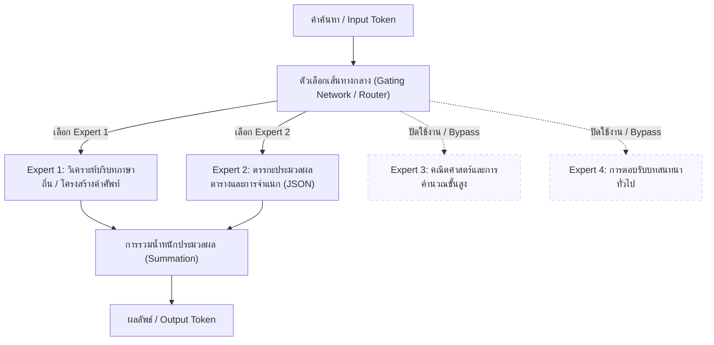

# การวิจัย: การวิเคราะห์เปรียบเทียบสถาปัตยกรรมการสั่งการแบบ Zero-Shot และ Ensemble บนโมเดลภาษาขนาดใหญ่ประเภท Mixture-of-Experts เพื่อคัดแยกประเภทข้อมูลภัยพิบัติ
(A Comparative Study on Zero-Shot Prompting Architectures and Ensemble Mechanisms using MoE LLMs for Social Media Crisis Classification)

---

## 1. บทนำและวัตถุประสงค์ (Introduction & Research Objectives)

ในสถานการณ์ภัยพิบัติทางธรรมชาติ ข้อมูลบนสื่อสังคมออนไลน์ (Social Media) เช่น ทวิตเตอร์ (X) เป็นแหล่งข้อมูลเรียลไทม์ที่มีคุณค่าสูงสำหรับทีมกู้ภัยและหน่วยงานบรรเทาสาธารณภัย อย่างไรก็ตาม ปริมาณข้อมูลที่มหาศาลและความกำกวมของภาษามนุษย์ทำให้การประมวลผลด้วยมนุษย์เป็นไปได้ยาก โครงการวิจัยนี้จึงมุ่งศึกษาการประยุกต์ใช้โมเดลภาษาขนาดใหญ่ (Large Language Models: LLMs) บนสถาปัตยกรรม **Mixture-of-Experts (MoE)** ในการประมวลผลภาษาธรรมชาติ (NLP) เพื่อจำแนกความเกี่ยวข้องของข้อความภัยพิบัติ (**Informativeness Detection**) และจัดหมวดหมู่ความต้องการช่วยเหลือทางมนุษยธรรม (**Humanitarian Category Classification**) ตามมาตรฐานสากล

วัตถุประสงค์หลักของการศึกษานี้ประกอบด้วย:
1. **การวิเคราะห์เปรียบเทียบสถาปัตยกรรมการสั่งการ 3 รูปแบบ (Prompting Architectures)**:
   * **Single-Layer Flat Classification (Exp 01)**: การตัดสินใจจำแนกประเภทในขั้นตอนเดียว (Flat Classification) โดยจำแนกทั้งความเกี่ยวข้องและหมวดหมู่ช่วยเหลือพร้อมกัน
   * **Two-Layer Joint Classification (Exp 02)**: การจำแนกแบบสองมิติควบคู่กัน (Joint) ผ่าน API Call เดียว และส่งผลลัพธ์กลับมาในรูปแบบโครงสร้างข้อมูล (JSON Schema)
   * **Two-Stage Sequential Classification (Exp 03)**: การจำแนกแบบลำดับขั้นโดยใช้เอเจนต์คู่ (Two-Agent Pipeline) เอเจนต์ตัวแรกทำหน้าที่คัดกรองข่าวสาร (Informativeness Gate) หากผ่านเกณฑ์จึงส่งต่อให้เอเจนต์ตัวที่สองทำการจัดหมวดหมู่ช่วยเหลือ (Category Extractor)
2. **การศึกษาและการลดอคติจากการจำกัดคำสั่งเชิงลบ (Strictness Bias Mitigation)**:
   * วิเคราะห์ผลกระทบของคำสั่งห้ามเชิงลบ (Negative Constraints) หรือเกณฑ์ที่เข้มงวดเกินไป (Strictness Bias) ที่ทำให้เกิดคอขวดสะสมในความสามารถในการจำแนกของโมเดล (ลดประสิทธิภาพ F1-score) และหาแนวทางแก้ไขผ่านการปรับแต่งคำสั่งเชิงบวก (Optimized Prompts)
3. **การทดสอบความสามารถในการรวมกลุ่มโหวตเสียงส่วนใหญ่ (Ensemble Voting Analysis)**:
   * ศึกษาความเป็นไปได้ ประสิทธิภาพ และความคุ้มค่าของการทำ Ensemble Voting (โหวตเสียงส่วนใหญ่ 2 ใน 3) ระหว่างโมเดล MoE ต่างค่าย เพื่อเพิ่มความเสถียรและลดความผันแปรของระบบ
4. **การประยุกต์ใช้เพื่อสร้างระบบสกัดข้อมูลภัยพิบัติภาษาไทยที่ใช้งานได้จริง (Experiment 04)**:
   * พัฒนาระบบสกัดข้อมูลระดับความรุนแรง (Severity level) และระบุหน่วยงาน/บุคคลที่เกี่ยวข้อง (Named Entity Recognition: NER) บนภาษาไทยท้องถิ่น

---

## 2. โครงสร้างสถาปัตยกรรมการทดลอง (Experiment Matrix)

การวิจัยแบ่งโครงสร้างการเปรียบเทียบออกเป็นแมทริกซ์การทดลองดังต่อไปนี้:

| การทดลอง (Experiment) | รูปแบบสถาปัตยกรรม (Architecture) | รูปแบบคำสั่ง (Prompt Version) | รายละเอียดทางเทคนิค / วัตถุประสงค์ |
| :--- | :--- | :--- | :--- |
| **Exp 1 (Original)** | Single-Layer Flat | V1 (Original Biased) | รัน Zero-shot ขั้นตอนเดียว (ใช้คำสั่งดั้งเดิมดัดแปลงมาจากเปเปอร์ต้นแบบ [1]) |
| **Exp 1E (Optimized)** | Single-Layer Flat | V2 (Optimized) | ถอดคำสั่งเชิงลบและ Negative constraints ออก (ลด Bias) |
| **Exp 1F (Few-Shot)** | Single-Layer Flat | V2-1 (Few-Shot) | ใช้ Prompt แบบ 1E ร่วมกับการใส่ตัวอย่าง Few-shot (6 เหตุการณ์) |
| **Exp 2 (Original)** | Two-Layer Joint | V1 (Original Biased) | เรียกใช้ API ดึง JSON 2 คีย์ควบคู่กัน (ใช้เกณฑ์ข้อจำกัดจากเปเปอร์ต้นแบบ [1]) |
| **Exp 2E (Optimized)** | Two-Layer Joint | V2 (Optimized) | ปรับปรุงคำสั่ง แยกแยะขอบเขตหมวดหมู่ด้วยเกณฑ์เชิงบวก |
| **Exp 2F (Few-Shot)** | Two-Layer Joint | V2-1 (Few-Shot) | เพิ่มการจัดโครงสร้างคู่อธิบายระดับความเกี่ยวข้องและหมวดหมู่ย่อยเป็นตัวอย่าง |
| **Exp 3 (Original)** | Two-Agent Sequential | V1 (Original Biased) | เอเจนต์กรอง ➡️ เอเจนต์แยกหมวดหมู่ (สถาปัตยกรรมดั้งเดิมตามเปเปอร์ต้นแบบ [1]) |
| **Exp 3E (Optimized)** | Two-Agent Sequential | V2 (Optimized) | ผ่อนปรนคำสั่งกรองข่าวสารของ Agent 1 ให้มีความครอบคลุมขึ้น |
| **Exp 3F (Few-Shot)** | Two-Agent Sequential | V2-1 (Few-Shot) | เพิ่มตัวอย่างสำหรับสอนการตัดสินใจของทั้งสองเอเจนต์แยกกัน |
| **Exp 1TH - 3TH** | Thai Localization | Thai Translated Prompt | การเทียบเคียงประสิทธิภาพบนข้อความภาษาไทยที่แปลตามบริบทท้องถิ่น |
| **Exp 4 (NER & Severity)** | Thai NER & Severity | Structured JSON extraction | ระบบปลายทางประมวลผลข้อมูลกู้ภัยภาษาไทย สกัด Entity และระดับความรุนแรง |

---

## 3. โมเดลและสถาปัตยกรรม Mixture-of-Experts (Tested MoE Models)

การประเมินเน้นทดสอบกับโมเดลภาษาขนาดใหญ่ที่ใช้สถาปัตยกรรม **Mixture-of-Experts (MoE)** ซึ่งช่วยลดการคำนวณลงโดยเปิดใช้งานพารามิเตอร์เฉพาะส่วน (Sparse Activation) ในระดับ Token:

1. **deepseek-v4-flash** (เข้าถึงผ่าน API ทางการของ DeepSeek)
   * เด่นเรื่องการใช้เหตุผลเชิงตรรกะและการตอบกลับข้อมูลตามโครงสร้าง JSON Schema ได้ถูกต้องแม่นยำสูง
2. **typhoon-v2.5** (`typhoon-v2.5-30b-a3b-instruct` เข้าถึงผ่าน Opn-Typhoon API)
   * โมเดลที่ได้รับการจูนโครงสร้างภาษาและการจัดเรียงโทเค็นให้รองรับภาษาไทยควบคู่กับภาษาอังกฤษในระดับสูง
3. **gemma-4** (`gemma-4-26b-a4b-it` เข้าถึงผ่าน OpenRouter API)
   * โมเดลสถาปัตยกรรม MoE ขนาดกลางรุ่นล่าสุดจาก Google ที่โดดเด่นด้านความเข้าใจงานทั่วไปและการปฏิบัติตามคำสั่งที่ซับซ้อน

### 💡 พลวัตการจัดสรรทรัพยากรระดับ Token (Sparse Activation)

การเลือกใช้ MoE ช่วยตัดปัจจัยแทรกซ้อน (Confounding Variables) ด้านสถาปัตยกรรมของโครงสร้างโมเดล ในระดับการประมวลผล ข้อมูลอินพุตจะผ่านตัวจัดเส้นทาง (Gating Network) เพื่อส่งโทเค็นไปยังผู้เชี่ยวชาญเฉพาะทาง (Experts) เช่น ด้านการวิเคราะห์ตารางคำนวณ หรือความรู้ด้านโครงสร้างภาษาท้องถิ่น ทำให้การตอบกลับรวดเร็วและคุ้มค่าราคาโทเค็นมากกว่าโมเดลแบบหนาแน่น (Dense Models) ขนาดเท่ากัน



---

## 4. แหล่งข้อมูลและการเตรียมข้อมูล (Dataset)

* **ชุดข้อมูลทดสอบ**: สุ่มตัวอย่างแบบกระจายสม่ำเสมอ (Stratified Random Sampling) จำนวน 500 รายการจาก **CrisisMMD** (ชุดข้อมูลภัยพิบัติสากลปี 2017 ครอบคลุมพายุเฮอริเคน แผ่นดินไหว และไฟป่า) เพื่อรักษาขอบเขตการเปรียบเทียบให้เป็นแบบ Apple-to-Apple
* **กลยุทธ์การแปล (Translation Strategy)**:
  * **English Dataset (`CrisisMMD_English_500.csv`)**: ทวีตภาษาอังกฤษดั้งเดิม
  * **Thai Dataset (`CrisisMMD_Thai_500.csv`)**: แปลงความหมายของข้อความเป็นภาษาไทยโดยรักษาความหมายและอารมณ์ดั้งเดิม เพื่อทดสอบประสิทธิภาพการทำงานข้ามภาษา (Cross-Lingual Capability) และความสอดคล้องเชิงความหมาย (Semantic Preservation)

---

## 5. ผลการทดลองเชิงลึกและการวิเคราะห์ทางวิชาการ (Research Findings)

ผ่านกระบวนการวิจัยและพัฒนา Prompt Engineering ทำให้ค้นพบวิวัฒนาการที่ส่งผลกระทบต่อประสิทธิภาพการจำแนกดังนี้:

### 1️⃣ วิกฤตการณ์ข้อจำกัดเชิงลบในเวอร์ชัน V1 (Strictness Bias Bottleneck)
* **ข้อพบหลัก**: ใน Prompt เวอร์ชัน V1 ผู้วิจัยได้นำโครงสร้างคำสั่งดั้งเดิมที่มาจากเปเปอร์งานวิจัยต้นแบบ Zero-Shot (Schwarz et al., 2026) [1] ซึ่งมีการใส่เงื่อนไขเชิงห้าม (Negative Constraints) อย่างหนักแน่น (เช่นคำว่า "MUST NOT", "NEVER") เพื่อป้องกันไม่ให้ข้อมูลขยะผ่านเข้าไปในหมวดหมู่กู้ภัย
* **ผลกระทบเชิงระบบ**: การศึกษาอิทธิพลของ Negative Constraints ใน Prompt ในแง่การทำงานของ Attention Mechanism ของ Transformer [8, 9] ชี้ให้เห็นว่าคำปฏิเสธมักดึงดูดความสนใจของโมเดลให้มุ่งประมวลผลโทเค็นข้อห้ามนั้นมากขึ้น (Attention Capturing) ส่งผลลัพธ์เป็นอคติเชิงตึงตัวเชิงลบ (Strictness Bias) ที่รบกวน Attention weights ในสถาปัตยกรรม **Two-Layer Joint (Exp 2)** ทำให้ความแม่นยำ F1 Category ของทุกโมเดลดิ่งลงอย่างน่าตกใจอยู่ที่ระดับ **`0.39 - 0.47`** โดยเฉพาะ Typhoon-v2.5 ที่มีผลการตัดสินใจอ่อนไหวสูงเมื่อพบกฎเชิงซ้อน

### 2️⃣ การปรับปรุงในเวอร์ชัน V2: การกำหนดนิยามเชิงบวก (Optimized Prompts)
* **ข้อพบหลัก**: ผู้วิจัยแก้ปัญหาโดยถอดข้อจำกัดปฏิเสธที่ก้ำกวมออกทั้งหมด (Cognitive Release) และหันมาใช้นิยามเกณฑ์พิจารณาเชิงบวก (Positive Attributes) พร้อมตัวอย่างขอบเขตที่ชัดเจนแทน
* **ผลกระทบเชิงระบบ**: การออกแบบที่อิงเกณฑ์เชิงบวกนี้สอดคล้องกับระเบียบวิธี Prompt Engineering ที่มีประสิทธิภาพ [7] ช่วยให้โมเดลสามารถ Focus ไปที่ความสัมพันธ์ของคำศัพท์ได้อย่างอิสระ ส่งผลให้ประสิทธิภาพของทุกสถาปัตยกรรมกระโดดขึ้นอย่างมีนัยสำคัญ โดยเฉพาะในระบบ **Two-Layer Joint (Exp 2E)** ที่ส่งผลให้ Typhoon-v2.5 ปลดล็อกประสิทธิภาพขึ้นมาเพิ่มขึ้นกว่า **+23%** ขยับขึ้นไปแตะค่าสูงสุดที่ **`0.6493`** ซึ่งเป็น F1 Category ที่ดีที่สุดในการรันโมเดลเดี่ยว

### 3️⃣ สถาปัตยกรรม V2-1 (V3 Hierarchy): การแก้ไขคอขวดสะสมความผิดพลาด (Error Propagation)
* **ข้อพบหลัก**: ในสถาปัตยกรรมแบบสองขั้นตอน (Sequential Agent - Exp 3) หาก Agent 1 (Informativeness) กรองผิดพลาด จะส่งผลให้ข้อขัดข้องตกทอดไปยัง Agent 2 ทันที (Error Propagation)
* **การแก้ไข**: การทำงานแบบเป็นสายพานนี้มีความเสี่ยงต่อความผิดพลาดสะสมสะท้อนปัญหาที่พบในโครงสร้างแบบ Sequential Prompting [7] ผู้วิจัยจึงได้นำกฎ **Critical Decision Hierarchy** (จัดลำดับสิทธิ์ในการเลือกคลาสกรณีข้อมูลคลุมเครือ) และ **Aggressive Bias Rule** ใน Agent 1 (ให้ปล่อยผ่านข้อมูลภัยพิบัติไปก่อนแม้จะเป็นแค่การแจ้งข่าวทั่วไป หรือส่งกำลังใจ) เข้ามาควบคุมการทำงาน
* **ผลกระทบเชิงระบบ**: ส่งผลดีให้โมเดล **gemma-4** ในระบบ Sequential (Exp 3E) ขยับขีดความแม่นยำขึ้นจาก `0.5854` (V2) ไปเป็น **`0.6430` (V2-1) (+5.76%)** ซึ่งแสดงให้เห็นว่าการจัดการลำดับขั้นทางตรรกะ [4] สามารถลดผลกระทบของการส่งผ่านความผิดพลาดสะสมได้อย่างมีนัยสำคัญ

### 4️⃣ รายงานการวิเคราะห์การทำกลุ่มโหวตในเวอร์ชัน V3 (Ensemble Voting 2/3)
ผู้วิจัยทำการรวมกลุ่มทำนายผ่านการโหวตเอาเสียงส่วนใหญ่ 2 ใน 3 (Majority Vote) จากทั้ง 3 โมเดล สอดคล้องกับหลักการ Self-Consistency [5] และได้รับข้อสรุปเชิงประจักษ์ดังนี้:
* **ข้อดี (Synergy & Stability)**: การทำ Ensemble เหมาะมากในการกรองความเกี่ยวข้องภัยพิบัติ (Informativeness) โดยรักษาความเสถียรของคะแนนให้อยู่ในระดับสูงนิ่งที่ **`0.895 - 0.904`** เสมอ นอกจากนี้ในกลุ่ม **Exp 3E (Sequential)** โหวตกลุ่มช่วยเพิ่มคะแนน Category F1 ของ Ensemble แซงหน้าโมเดลเดี่ยวที่ดีที่สุดได้ (ขึ้นมาอยู่ที่ **`0.5930`** จากที่ gemma-4 ได้เดี่ยวที่ `0.5870` ที่อุณหภูมิ 0.3)
* **ข้อจำกัดเชิงเทคนิค**:
  1. **Expert Drag-down Effect**: ในการทดลองที่ความสามารถของโมเดลมีความแตกต่างกันมาก เช่น ใน **Exp 2E (Joint)** ที่ Typhoon-v2.5 ทำคะแนนโดดเด่นเดี่ยวสูงถึง `0.6493` การทำ Ensemble Voting กลับไปดึงคะแนนของระบบร่วงลงเหลือเพียง **`0.6282` (-2.11%)** เนื่องจากโมเดลที่อ่อนกว่าอีก 2 ตัว (DeepSeek และ Gemma) ชนะการโหวตแบบเสียงข้างมาก ทำให้ตอบผิด
  2. **Prompt Correlation Bias**: เนื่องจากการรัน Ensemble ทั้งสามโมเดลใช้ตัว Prompt เดียวกัน ตรรกะและกระบวนการรับรู้จึงถูกตีกรอบเหมือนกัน ส่งผลให้มีรูปแบบข้อผิดพลาดที่เหมือนกัน (Correlated Errors) ทำให้ผลโหวตข้างมากสุดท้ายก็ตอบผิดอยู่ดี
  3. **Extremely Severe Token Overheads**: ค่าธรรมเนียมโทเค็นพุ่งสูงขึ้นเป็น 3 เท่าตัว (เนื่องจากต้องยิง API ไปยัง 3 โมเดลพร้อมกัน) ส่งผลให้การใช้งานจริงไม่คุ้มค่าทางเศรษฐศาสตร์เมื่อเทียบกับประสิทธิภาพ F1 ที่เพิ่มขึ้นเพียงเล็กน้อย (<1%)

### 5️⃣ การทดสอบเปรียบเทียบกับโมเดลการเรียนรู้แบบมีผู้สอน (Supervised Baseline Comparison)
เพื่อศึกษาความแตกต่างเชิงโครงสร้างอย่างถ่องแท้ ผู้วิจัยได้นำผลลัพธ์จากวิธีการประเมินแบบ Zero-Shot/Few-Shot ของระบบ MoE LLMs ของเรา ไปทำการทดสอบเปรียบเทียบกับโมเดลจำแนกประเภทข้อความภัยพิบัติที่ผ่านการฝึกฝนด้วยมนุษย์แบบมีผู้สอน (Fully Supervised Fine-tuning) บนข้อความล้วน (Text-only) จากรายงานวิจัยของ Ofli et al. (2020) [10] ซึ่งใช้โมเดล BERT-base และ CNN บนชุดข้อมูล CrisisMMD [2]:

* **ตารางเปรียบเทียบประสิทธิภาพ (Supervised vs. Zero-Shot MoE LLM):**

| รูปแบบโมเดล / การทดลอง (Model / Experiment) | รูปแบบการเรียนรู้ (Learning Style) | Informativeness F1 | Category F1 (Humanitarian) |
| :--- | :--- | :---: | :---: |
| **BERT-base (Text-only)** [10] | Supervised (Fine-tuned) | 0.8120 - 0.8420 | **0.7686 - 0.7830** |
| **CNN Baseline (Text-only)** [10] | Supervised (Fine-tuned) | 0.7910 | 0.6900 - 0.7240 |
| **Typhoon-v2.5 (Exp 2E - V2)** *(งานวิจัยนี้)* | **Zero-Shot** Joint | **0.9070** 🚀 | 0.6493 |
| **Gemma-4 (Exp 3E - V2-1)** *(งานวิจัยนี้)* | **Few-Shot** Sequential Agent | 0.8199 | 0.6430 |
| **Ensemble Vote 2/3 (Exp 1E)** *(งานวิจัยนี้)* | **Zero-Shot** Ensemble Flat | 0.8966 | 0.6354 |

* **บทวิเคราะห์ผลลัพธ์เปรียบเทียบเชิงลึก**:
  1. **ความโดดเด่นในงานจำแนกความเกี่ยวข้อง (Informativeness F1)**: ระบบ Zero-shot MoE LLMs ของเรา (โดยเฉพาะ Typhoon-v2.5 ใน Exp 2E) ทำ F1-score สูงถึง **`0.9070`** ซึ่งเอาชนะโมเดลที่ผ่านการ Fine-tuned อย่าง BERT-base ที่ทำได้ดีที่สุด **`0.8420`** ไปถึง **+6.5%** อย่างมีนัยสำคัญ สิ่งนี้ยืนยันว่าการประมวลผลด้วยโมเดล MoE ขนาดใหญ่ที่มีฐานความรู้รอบตัวกว้างขวาง [3] สามารถคัดกรองขยะหรือสกัดว่าข่าวใดเกี่ยวข้องกับภัยพิบัติได้ดีกว่าโมเดลขนาดเล็กที่เทรนแบบเจาะจง
  2. **ความท้าทายในงานจำแนกหมวดหมู่กู้ภัยย่อย (Category F1)**: คะแนนสูงสุดของ MoE LLMs ในงานนี้อยู่ที่ **`0.6493`** ซึ่งยังคงตามหลัง BERT-base แบบ Supervised (`0.7686`) อยู่ประมาณ **-11.9%** ปรากฏการณ์นี้เกิดขึ้นเนื่องจากสัญวิทยาและเกณฑ์การจำแนกหมวดหมู่ช่วยเหลือ (เช่น Affected Individuals vs. Rescue/Volunteering) ใน CrisisMMD มีสไตล์การระบุเฉพาะตัวและมีความคิดเห็นของมนุษย์เข้ามาเกี่ยวข้องสูง (Subjective Annotation Criteria) [2, 10] ส่งผลให้โมเดลที่รันแบบ Zero-shot/Few-shot โดยไม่มีการเปลี่ยนค่าน้ำหนักพารามิเตอร์ภายใน (No Parameter Updates) พลาดโอกาสในการจำขอบเขตการตัดสินใจ (Decision Boundaries) เฉพาะตัวของชุดข้อมูลนี้ [7]
  3. **การนำไปใช้เชิงปฏิบัติ (Economic & Deployment Trade-offs)**: แม้โมเดล Supervised (BERT-base) จะมี Category F1 ที่สูงกว่า แต่การใช้งานจำเป็นต้องเก็บข้อมูลและจ้างแรงงานคนมาป้ายกำกับ (Manual Annotation) หลายพันแถวเพื่อทำความสะอาดและเทรนโมเดล [2] ในขณะที่แนวทาง Zero-shot MoE LLM ของเราสามารถเปิดใช้งานได้ทันที (Training-free) ในช่วงเกิดวิกฤตภัยพิบัติใหม่ที่ไม่เคยมีประวัติข้อมูลมาก่อน [1]

---

## 6. ตารางเปรียบเทียบผลลัพธ์ประสิทธิภาพ (Experimental Metrics)

### 🔴 คะแนนเปรียบเทียบ Category F1-Score ครบทุกเวอร์ชัน (โมเดลเดี่ยว)

| โมเดล (Model) | สถาปัตยกรรม (Architecture) | Temp | V1 (Original Biased) | V2 (Optimized) | V2-1 (V3 Hierarchy) | ผลลัพธ์พัฒนาการ (V1 ➡️ V2-1) |
| :--- | :--- | :---: | :---: | :---: | :---: | :---: |
| **deepseek-v4-flash** | Exp 1E (Flat) | 0.0 | 0.5631 | 0.6192 | 0.6109 | **+4.78%** |
| | Exp 2E (Joint) | 0.0 | 0.4714 | 0.6081 | **0.6223** | **+15.09%** 🚀 |
| | Exp 3E (Seq) | 0.0 | 0.5571 | 0.5609 | 0.6093 | **+5.22%** |
| **gemma-4** | Exp 1E (Flat) | 0.0 | 0.5379 | 0.6234 | **0.6394** | **+10.15%** 🚀 |
| | Exp 2E (Joint) | 0.0 | 0.4167 | 0.6036 | 0.6150 | **+19.83%** 🔥 |
| | Exp 3E (Seq) | 0.1 | 0.5774 | 0.5783 | **0.6430** | **+6.56%** |
| **typhoon-v2.5** | Exp 1E (Flat) | 0.1 | 0.5658 | 0.6197 | 0.5922 | **+2.64%** |
| | Exp 2E (Joint) | 0.2 | 0.4155 | **0.6493** | 0.6195 | **+20.40%** 🔥 *(V2 Peak)* |
| | Exp 3E (Seq) | 0.3 | 0.5607 | 0.5714 | 0.6063 | **+4.56%** |

---

### 🗳️ คะแนนเปรียบเทียบ โมเดลเดี่ยว vs. Ensemble Voting (2/3 Majority Vote) ในเวอร์ชันปรับปรุง

#### 📊 กลุ่ม Flat Architecture (Exp 1E)
* **Informativeness F1**: Ensemble ทำได้คงตัวที่ **0.8960** (เทียบกับดีที่สุดเดี่ยว Typhoon-v2.5 ที่ 0.8972)
* **Category F1 (อุณหภูมิเทียบเคียง)**:
  * Temp 0.1: Ensemble = **0.6274** (ชนะโมเดลเดี่ยวที่ดีที่สุด gemma-4 ที่ทำได้ 0.6228 ไป **+0.46%**)
  * Temp 0.2: Ensemble = **0.6354** (ชนะโมเดลเดี่ยวที่ดีที่สุด gemma-4 ที่ทำได้ 0.6265 ไป **+0.89%**)

#### 📊 กลุ่ม Two-Layer Joint Architecture (Exp 2E)
* **Informativeness F1**: Ensemble ทำได้เสถียรที่ **0.9017** (เทียบกับดีที่สุดเดี่ยว Typhoon-v2.5 ที่ 0.9070)
* **Category F1 (ผลกระทบจากข้อจำกัด)**:
  * Temp 0.2: Ensemble = **0.6282** (ดร็อปลงจากดีที่สุดเดี่ยว Typhoon-v2.5 ที่ทำได้ **0.6493** ไปถึง **-2.11%** ⚠️)

#### 📊 กลุ่ม Sequential 2-Agent Architecture (Exp 3E)
* **Informativeness F1**: Ensemble ทำได้สูงสุดที่ **0.8428** (ชนะดีที่สุดเดี่ยว deepseek-v4-flash ที่ 0.8405 ไป **+0.23%**)
* **Category F1 (การชดเชยค่าความแปรปรวน)**:
  * Temp 0.1: Ensemble = **0.5921** (ชนะดีที่สุดเดี่ยว gemma-4 ที่ทำได้ 0.5783 ไป **+1.37%**)
  * Temp 0.3: Ensemble = **0.5930** (ชนะดีที่สุดเดี่ยว gemma-4 ที่ทำได้ 0.5870 ไป **+0.60%**)

---

## 7. ข้อเสนอแนะเชิงกลยุทธ์ในการใช้งานจริง (System Recommendations)

จากการเปรียบเทียบผลลัพธ์ ข้อมูลเชิงประสิทธิภาพ และค่าใช้จ่ายโทเค็น ผู้วิจัยมีข้อเสนอแนะสำหรับการจัดสรรระบบใช้งานจริง (Production Deployment) ดังนี้:

1. **สำหรับการจำแนกประเภทที่ต้องการความถูกต้องสูงสุด (Best Overall Performance)**:
   * **การกำหนดค่า**: ใช้โมเดล **`typhoon-v2.5`** ตัวเดี่ยวบนสถาปัตยกรรม **Two-Layer Joint (Exp 2E)** กำหนดระดับอุณหภูมิ **`Temp = 0.2`** และใช้ Prompt เวอร์ชัน **V2 (Optimized)**
   * **เหตุผล**: ทำคะแนนสูงสุดได้ถึง **`0.6493` F1 Category** และประหยัดค่าใช้จ่ายโทเค็นลงถึง 3 เท่าตัวเมื่อเทียบกับการทำ Ensemble
2. **สำหรับสถาปัตยกรรมที่มีลำดับการทำงานซับซ้อน (Best Sequential Architecture)**:
   * **การกำหนดค่า**: ใช้โมเดล **`gemma-4`** บนสถาปัตยกรรม **Sequential (Exp 3E)** กำหนดระดับอุณหภูมิ **`Temp = 0.1`** และใช้ Prompt เวอร์ชัน **V2-1 (V3 Hierarchy)**
   * **เหตุผล**: ให้ค่า F1 Category สูงถึง **`0.6430`** จากประสิทธิภาพของโครงสร้างการสั่งการแบบลำดับความสำคัญในการตัดสินใจที่ช่วยอุดรอยรั่วของการส่งต่อข้อผิดพลาด (Error Propagation)
3. **แนวทางการทดลองในอนาคตเพื่อแตะ F1-score `0.75 - 0.85`**:
   * ควรเปลี่ยนผ่านจากการทำ Prompt Engineering ไปสู่การใช้ **Semantic Few-Shot (RAG)** โดยดึงข้อมูลตัวอย่างที่มีบริบทใกล้เคียงกับข้อความภัยพิบัติเป้าหมาย หรือการทำ **LoRA Fine-tuning (Parameter-Efficient Fine-Tuning)** เพื่อเรียนรู้สไตล์การให้หมวดหมู่เฉพาะตัวของมนุษย์ในชุดข้อมูล CrisisMMD

---

## 8. วิธีการรันและประเมินผลการทดลอง (How to Run & Evaluate)

ก่อนเริ่มประเมินผล ให้ติดตั้ง API Key ในไฟล์ระบบ `.env` ที่อยู่ในไดเรกทอรีหลักของโปรเจกต์:
```env
DEEPSEEK_API_KEY="your_api_key"
TYPHOON_API_KEY="your_api_key"
OPENROUTER_API_KEY="your_api_key"
```

### 🏃‍♂️ คำสั่งสำหรับการประเมินผลแยกตามสถาปัตยกรรม:

#### 1. การประเมินผลแบบ Flat (Exp 1E / 1F):
```powershell
# รันเวอร์ชัน Zero-Shot ปรับปรุงไร้ Bias
python e:/nlp-for-disaster/exp1E/run_all.py

# รันเวอร์ชัน Few-Shot ปรับปรุง
python e:/nlp-for-disaster/exp1F/run_all.py
```

#### 2. การประเมินผลแบบ Two-Layer Joint (Exp 2E / 2F):
```powershell
# รันเวอร์ชัน Zero-Shot ปรับปรุง
python e:/nlp-for-disaster/exp2E/run_all.py

# รันเวอร์ชัน Few-Shot ปรับปรุง
python e:/nlp-for-disaster/exp2F/run_all.py
```

#### 3. การประเมินผลแบบ Sequential Agent (Exp 3E / 3F):
```powershell
# รันเวอร์ชัน Zero-Shot ปรับปรุง
python e:/nlp-for-disaster/exp3E/run_all.py

# รันเวอร์ชัน Few-Shot ปรับปรุง
python e:/nlp-for-disaster/exp3F/run_all.py
```

#### 4. การรันและประเมิน Ensemble Voting (V3):
```powershell
# ประเมินผลการโหวตของกลุ่มสถาปัตยกรรม Flat (Exp 1)
python e:/nlp-for-disaster/reportV3/run_ensemble_voting_exp2.py

# ประเมินผลการโหวตของกลุ่มสถาปัตยกรรม Two-Layer Joint (Exp 2)
python e:/nlp-for-disaster/reportV3/run_ensemble_voting_exp3.py
```

---

## 📁 โครงสร้างโฟลเดอร์ของระบบโครงการ (Directory Structure)

```text
e:/nlp-for-disaster/
├── dataset/             <- ชุดข้อมูลตั้งต้น (CrisisMMD) และสคริปต์ทำความสะอาดคัดเลือก
├── exp1/                <- สคริปต์และผลลัพธ์วิเคราะห์เวอร์ชัน V1 Flat (มี Strictness Bias)
├── exp1E/               <- สคริปต์และผลลัพธ์เวอร์ชัน V2 Flat Zero-Shot (Optimized)
├── exp1F/               <- สคริปต์และผลลัพธ์เวอร์ชัน V2-1 Flat Few-Shot (6 เหตุการณ์)
├── exp2/                <- สคริปต์และผลลัพธ์เวอร์ชัน V1 Two-Layer Joint (มี Strictness Bias)
├── exp2E/               <- สคริปต์และผลลัพธ์เวอร์ชัน V2 Two-Layer Joint Zero-Shot (Optimized)
├── exp2F/               <- สคริปต์และผลลัพธ์เวอร์ชัน V2-1 Two-Layer Joint Few-Shot
├── exp3E/               <- สคริปต์และผลลัพธ์เวอร์ชัน V2 Sequential Agent Zero-Shot (Optimized)
├── exp3F/               <- สคริปต์และผลลัพธ์เวอร์ชัน V2-1 Sequential Agent Few-Shot
├── exp4/                <- โฟลเดอร์งานวิจัยระบบสกัดข้อมูลภัยพิบัติไทยความรุนแรงและ NER
├── reportV1/            <- เอกสารสรุปผลการทดลองและการทำงานในเวอร์ชันที่ 1 (V1)
├── reportV2/            <- รายงานเปรียบเทียบผลลัพธ์เชิงวิเคราะห์คำสั่งจูนระบบ (V2)
├── reportV2-1/          <- สรุปผลการนำลำดับขั้นความสำคัญ (Hierarchy) มาปรับใช้ (V2-1)
├── reportV3/            <- สคริปต์และรายงานวิเคราะห์ความสอดคล้องและการทำ Ensemble Voting
├── readme.md            <- เอกสารสรุปโครงการและผลลัพธ์การทดลองวิจัย (ภาษาไทย)
└── dataset_helper.py    <- สคริปต์ตัวช่วยนำเข้าและจัดการ Dataset สำหรับโมเดล
```

---

## 10. เอกสารอ้างอิงทางวิชาการ (Academic References)

งานวิจัยนี้พัฒนาขึ้นโดยอ้างอิงหลักการ ทฤษฎี และสถิติจากผลงานตีพิมพ์ทางวิชาการระดับนานาชาติ ดังต่อไปนี้:

1. **งานวิจัยต้นแบบระบบคัดแยกภัยพิบัติ Zero-Shot แบบไร้การเทรน (Base Framework Reference):**
   * Schwarz, F., Schwarz, K. D., Arias Aranda, D., Bollens, K., Shivananjappa, N., Creutzburg, R., & Dimitrova, V. (2026). *Zero-Shot Social Media Crisis Classification: A Training-Free Multimodal Approach*. **Applied Sciences**, 16(5), 2192.  
   * 👉 ลิงก์เข้าถึงเอกสาร: [https://doi.org/10.3390/app16052192](https://doi.org/10.3390/app16052192)

2. **ชุดข้อมูลมาตรฐานสำหรับการทดสอบระบบภัยพิบัติ (Benchmark Dataset Reference):**
   * Alam, F., Ofli, F., & Imran, M. (2018). *CrisisMMD: Multimodal Twitter Datasets from Natural Disasters*. **Proceedings of the International AAAI Conference on Web and Social Media (ICWSM)**, 12(1).  
   * 👉 ลิงก์เข้าถึงเอกสาร: [https://arxiv.org/abs/1805.00713](https://arxiv.org/abs/1805.00713)

3. **ทฤษฎีการลดจำนวนคำนวณและสถาปัตยกรรมตัวเลือกเส้นทาง (MoE Architecture Reference):**
   * Jiang, A. Q., Sablayrolles, A., Mensch, A., Bamford, C., Devwial, D., de las Casas, D., ... & Lample, G. (2024). *Mixtral of Experts*. **arXiv preprint arXiv:2401.04088**.  
   * 👉 ลิงก์เข้าถึงเอกสาร: [https://arxiv.org/abs/2401.04088](https://arxiv.org/abs/2401.04088)

4. **ทฤษฎีการกระตุ้นสติปัญญาเชิงคิดลำดับขั้นผ่านทาง Prompt (Chain-of-Thought Reference):**
   * Wei, J., Wang, X., Schuurmans, D., Bosma, M., Ichter, B., Xia, F., Chi, E., Le, Q. V., & Zhou, Y. (2022). *Chain-of-Thought Prompting Elicits Reasoning in Large Language Models*. **Advances in Neural Information Processing Systems (NeurIPS)**, 35, 24824-24837.  
   * 👉 ลิงก์เข้าถึงเอกสาร: [https://arxiv.org/abs/2201.11903](https://arxiv.org/abs/2201.11903)

5. **กระบวนการสอดคล้องและการทำโหวตเสียงส่วนใหญ่ของคำทำนาย (Self-Consistency & Ensemble Reference):**
   * Wang, Y., Kordi, Y., Mishra, S., Liu, A., Smith, N. A., Khashabi, D., & Hajishirzi, H. (2022). *Self-Consistency Improves Chain of Thought Reasoning in Language Models*. **arXiv preprint arXiv:2203.11171**.  
   * 👉 ลิงก์เข้าถึงเอกสาร: [https://arxiv.org/abs/2203.11171](https://arxiv.org/abs/2203.11171)

6. **ทฤษฎีและการประยุกต์ใช้งาน Few-Shot Prompting (Few-Shot Prompting Baseline):**
   * Brown, T., Mann, B., Ryder, N., Subbiah, M., Kaplan, J. D., Dhariwal, P., ... & Amodei, D. (2020). *Language Models are Few-Shot Learners*. **Advances in Neural Information Processing Systems (NeurIPS)**, 33, 1877-1901.  
   * 👉 ลิงก์เข้าถึงเอกสาร: [https://arxiv.org/abs/2005.14165](https://arxiv.org/abs/2005.14165)

7. **รายงานสำรวจเชิงระบบเกี่ยวกับระเบียบวิธี Prompt Engineering (Prompt Engineering Survey Reference):**
   * Schulhoff, A., Ilie, M., Balepur, S., Kahadze, N., Liu, H., Chen, A., ... & Shi, F. (2024). *The Prompt Report: A Systematic Survey of Prompt Engineering*. **arXiv preprint arXiv:2406.06608**.  
   * 👉 ลิงก์เข้าถึงเอกสาร: [https://arxiv.org/abs/2406.06608](https://arxiv.org/abs/2406.06608)

8. **ทฤษฎีความอสมมาตรเชิงโครงสร้างและข้อจำกัดเชิงลบในกระบวนการจัดตำแหน่งโมเดล (Negative Constraints Theory):**
   * Cheng, Y., et al. (2026). *Via Negativa for AI Alignment: Why Negative Constraints Are Structurally Superior to Positive Preferences*. **arXiv preprint arXiv:2603.16417**.  
   * 👉 ลิงก์เข้าถึงเอกสาร: [https://arxiv.org/abs/2603.16417](https://arxiv.org/abs/2603.16417)

9. **การวิจัยการจำลองผลกระทบและการประมวลผลข้อจำกัดเชิงลบ (Understanding Negative Prompts & Constraints):**
   * arXiv preprint arXiv:2406.02965. (2024). *Understanding the Impact of Negative Prompts*.  
   * 👉 ลิงก์เข้าถึงเอกสาร: [https://arxiv.org/abs/2406.02965](https://arxiv.org/abs/2406.02965)

10. **การศึกษาเปรียบเทียบประสิทธิภาพการประมวลผลโมเดลมีผู้สอนและ multimodal บนข้อมูล CrisisMMD (Supervised Benchmark Reference):**
    * Ofli, F., Alam, F., & Imran, M. (2020). *Analysis of Social Media Data using Multimodal Deep Learning for Disaster Response*. **Proceedings of the 17th International Conference on Information Systems for Crisis Response and Management (ISCRAM 2020)**.  
    * 👉 ลิงก์เข้าถึงเอกสาร: [https://arxiv.org/abs/2004.11838](https://arxiv.org/abs/2004.11838)