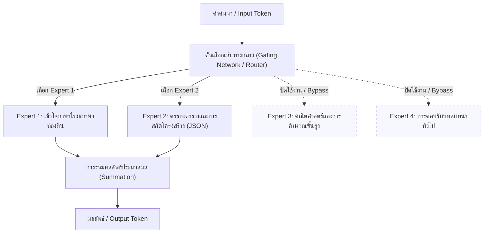

# โครงการวิจัย: การประยุกต์ใช้ LLM ในการคัดแยกและสกัดข้อมูลภัยพิบัติเพื่อสนับสนุนทีมกู้ภัย (LLM-based Disaster Triage & Information Extraction)

โครงการวิจัยนี้ศึกษาและเปรียบเทียบประสิทธิภาพของสถาปัตยกรรมโครงสร้างคำสั่ง (Prompt Architectures) และ Large Language Models (LLMs) บนสถาปัตยกรรม Mixture-of-Experts (MoE) เพื่อจำแนกความเกี่ยวข้องของข้อความภัยพิบัติ (Informativeness) และหมวดหมู่ช่วยเหลือทางมนุษยธรรม (Humanitarian Categories) โดยมีเป้าหมายสุดท้ายในการสร้างระบบสกัดข้อมูลเตือนภัยภาษาไทยระดับความรุนแรงและ Entity (Experiment 04) 

งานวิจัยนี้พัฒนาต่อยอดและเปรียบเทียบเชิงประสิทธิภาพกับเปเปอร์ระดับนานาชาติ:
> **"Zero-Shot Social Media Crisis Classification: A Training-Free Multimodal Approach"** *(MDPI Applied Sciences, 2026)*

---

## 1. วัตถุประสงค์ (Project Objectives)

1. **เปรียบเทียบ 3 สถาปัตยกรรมการประมวลผลคำสั่ง (Prompting Architectures)**:
   * **Single-Layer (Experiment 01)**: ตัดสินใจแบบขั้นตอนเดียว (Flat Classification) คัดแยกหมวดหมู่ทั้งหมดในรอบเดียว
   * **Two-Layer Joint (Experiment 02)**: วิเคราะห์ควบคู่กัน (Joint) ระหว่างตัวกรองขยะ (Informativeness) และหมวดหมู่ย่อยในคำขอ API เดียว
   * **Two-Stage Sequential (Experiment 03)**: ใช้เอเจนต์ 2 ตัวเชื่อมต่อกันแบบลำดับขั้น (Agent 1 กรองความเกี่ยวข้อง ➡️ Agent 2 แยกหมวดหมู่เมื่อเป็นประโยชน์)
2. **ขจัดอคติคำสั่งที่ส่งผลเสียต่อการจำแนก (Strictness Bias Mitigation - เวอร์ชัน E / F)**:
   * ศึกษาและทดลองปรับแต่งเกณฑ์ห้าม (Negative Constraints) ที่ทำให้โมเดลตึงตัวเกินไป จนส่งผลให้ F1-score ร่วงหล่นในเวอร์ชันแรกเริ่ม (E/F)
   * เปรียบเทียบผลของระบบแบบอ้างอิงจุดจูน (Zero-Shot) และแบบให้ตัวอย่างชี้วัด (Few-Shot)
3. **พัฒนาข้ามภาษาและการแปลผลลัพธ์ (Cross-Lingual & Thai Localization)**:
   * ค้นหาสถาปัตยกรรมที่ดีที่สุดเพื่อนำมาพอร์ตและปรับจูนความแม่นยำร่วมกับภาษาไทย (TH)
4. **สร้างระบบสกัดข้อมูลภัยพิบัติเพื่อใช้งานจริง (Experiment 04)**:
   * สร้างสตรีมการสกัด Entity (ผู้แจ้ง, ผู้ประสบภัย, สิ่งของบรรเทาทุกข์) และระดับความรุนแรง (INFO/LOW/MEDIUM/CRITICAL) ของข้อความเตือนภัยภาษาไทย

---

## 2. โครงสร้างการทดลองทั้งหมด (Experiment Matrix)

| การทดลอง (Experiment) | รูปแบบสถาปัตยกรรม (Architecture) | สถานะ / รายละเอียด |
| :--- | :--- | :--- |
| **Exp 1 (Original)** | Single-Layer (Flat) | รัน Zero-shot ขั้นตอนเดียว (เวอร์ชันมาตรฐาน) |
| **Exp 1E (Optimized)** | Single-Layer (Flat) | ยกเลิกกฎคัดกรองขยะที่ตึงตัวเกินไป (แก้ Bias) |
| **Exp 1F (Few-Shot)** | Single-Layer (Flat) | ใช้กฎแบบ 1E ร่วมกับการใส่ตัวอย่าง Few-shot 6 เหตุการณ์ |
| **Exp 2 (Original)** | Two-Layer Joint | เรียกใช้ฟังก์ชัน JSON ดึง 2 คีย์ควบคู่กัน (มี Bias เดิม) |
| **Exp 2E (Optimized)** | Two-Layer Joint | แก้ไขระบบคลาสและเปิดกว้างหมวดหมู่ข่าวสารพร้อม Consistency Rule |
| **Exp 2F (Few-Shot)** | Two-Layer Joint | ใช้ตัวอย่าง Few-shot ที่จัดโครงสร้างคู่สองเลเยอร์ |
| **Exp 3 (Original)** | Two-Agent Sequential | เอเจนต์กรองข่าว ➡️ เอเจนต์แยกหมวดหมู่ (มี Bias เดิม) |
| **Exp 3E (Optimized)** | Two-Agent Sequential | เอเจนต์คู่ ปรับจูนคำสั่งกรองข่าวสารให้ผ่อนปรนขึ้น |
| **Exp 3F (Few-Shot)** | Two-Agent Sequential | เอเจนต์คู่ ผสานตัวอย่าง Few-shot ใน Agent 1 และ Agent 2 |
| **Exp 1TH - 3TH** | Thai Language baseline | การรันเปรียบเทียบสถาปัตยกรรมข้างต้นบนข้อความภาษาไทยแปลแล้ว |
| **Exp 4 (Target System)** | Thai NER & Severity | ระบบปลายทางสกัดข้อมูลฉุกเฉินและแบ่งความรุนแรงตามมาตรฐานสากล |

---

## 3. โมเดลที่ทดสอบ (Tested MoE Models)

การประเมินประสิทธิภาพเน้นการทดสอบกับโมเดลตระกูล **Mixture-of-Experts (MoE)** ขนาดใหญ่และประหยัดทรัพยากร 3 รุ่น ผ่านทาง API Endpoint:

1. **deepseek-v4-flash** (เข้าถึงผ่าน DeepSeek API)
   * โดดเด่นด้านตรรกะเหตุผลและการทำตามคำสั่งแบบ JSON Schema
2. **typhoon-v2.5** (`typhoon-v2.5-30b-a3b-instruct` เข้าถึงผ่าน Opn-Typhoon API)
   * โมเดลสัญชาติไทยที่ได้รับการปรับจูนความเข้าใจภาษาไทยและภาษาอังกฤษขั้นสูง
3. **gemma-4** (`gemma-4-26b-a4b-it` เข้าถึงผ่าน OpenRouter)
   * โมเดลตระกูล Gemma รุ่นล่าสุดที่มีพารามิเตอร์ขยายและมีความแม่นยำสูง

### 💡 ทำไมโครงการวิจัยนี้ต้องใช้สถาปัตยกรรม MoE ล้วน?

สถาปัตยกรรม **Mixture-of-Experts (MoE)** ได้กลายมาเป็นกระดูกสันหลังของการประมวลผลโมเดลภาษาในปัจจุบัน (State-of-the-Art) ด้วยเหตุผลสำคัญในการประยุกต์ใช้เพื่อ triage ภัยพิบัติ ดังนี้:

1. **การควบคุมตัวแปรโครงสร้างสถาปัตยกรรม (Architectural Variable Control)**: การเลือกใช้แบบจำลองตระกูล Mixture-of-Experts (MoE) ทั้งหมด ช่วยกำจัดตัวแปรแทรกซ้อน (Confounding Variables) ที่เกิดจากการเปรียบเทียบโมเดลข้ามประเภทโครงสร้างสถาปัตยกรรม เช่น ความแตกต่างในพฤติกรรมการถนอมพลังงานและการคำนวณค่าน้ำหนักระหว่างสถาปัตยกรรมแบบหนาแน่น (Dense Architecture) และแบบเบาบาง (Sparse/MoE Architecture) ส่งผลให้การทดลองเปรียบเทียบเชิงสถาปัตยกรรม Prompt (Flat vs. Joint vs. Sequential) และการกำหนดสิทธิให้ LLM คิด (Temperature) ว่าส่งผลต่อการแยกแยะเพียงใด
2. **พลวัตการจัดสรรทรัพยากรและการจำลองการรับรู้ของโทเค็น (Sparse Activation & Token-level Specialization)**: การสกัดข้อมูลและ NER (ใน Exp 04) ต้องการการสลับการวิเคราะห์ตรรกะภาษาและคำสั่งโครงสร้างชุดฟังก์ชัน (Function Calling) ในระดับโทเค็น กลไกการเลือกเส้นทางโดยตัวจัดเส้นทาง (Gating Network/Router) ช่วยจัดสรรคำศัพท์ไปยังกลุ่ม Experts ที่มีความชำนาญเฉพาะด้าน (เช่น ภาษาถิ่น หรือตรรกะไวยากรณ์) ทำให้สามารถประเมินผลการตีความเชิงไวยากรณ์และความสอดคล้องเชิงความสัมพันธ์ของข้อมูลแบบจำลองได้อย่างชัดเจนภายใต้โครงสร้างการประมวลผลรูปแบบเดียวกัน

### 🎨 แผนภาพสถาปัตยกรรมทำงานของระบบ MoE (MoE Routing Flow)



---

## 4. แหล่งข้อมูลและการเตรียมข้อมูล (Dataset)

* **ชุดข้อมูลทดสอบ**: สุ่มตัวอย่าง 500 รายการแบบสม่ำเสมอ (Apple-to-Apple) จากชุดข้อมูล **CrisisMMD** (ชุดข้อมูลภัยพิบัติสากลปี 2017 ครอบคลุมพายุเฮอริเคน แผ่นดินไหวเนปาล และไฟป่าแคลิฟอร์เนีย)
* **กลยุทธ์การแปล (Translation Strategy)**:
  * **English Dataset (`CrisisMMD_English_500.csv`)**: ทวีตภาษาอังกฤษต้นฉบับ
  * **Thai Dataset (`CrisisMMD_Thai_500.csv`)**: ทวีตที่แปลเป็นภาษาไทยเพื่อใช้ทดสอบขีดความสามารถการอ่านภาษาท้องถิ่น

---

## 5. วิธีการรันและประเมินผลการทดลอง (How to Run)

ก่อนเริ่มรัน กรุณาตรวจสอบให้แน่ใจว่าติดตั้ง API Key ในไฟล์ `.env` เรียบร้อยแล้ว:
```env
DEEPSEEK_API_KEY="your_api_key"
TYPHOON_API_KEY="your_api_key"
OPENROUTER_API_KEY="your_api_key"
```

### 🏃‍♂️ คอมมานด์สำหรับรันการประเมินผลแยกตามแต่ละเฟส:

#### 1. การประเมินผลแบบ Flat (Exp 1E / 1F):
```powershell
# รันเวอร์ชัน Zero-Shot ปรับปรุงไร้ Bias
python e:/nlp-for-disaster/exp1E/run_all.py

# รันเวอร์ชัน Few-Shot ปรับปรุง
python e:/nlp-for-disaster/exp1F/run_all.py
```

#### 2. การประเมินผลแบบ Two-Layer Joint (Exp 2E / 2F):
```powershell
# รันเวอร์ชัน Zero-Shot ปรับปรุง
python e:/nlp-for-disaster/exp2E/run_all.py

# รันเวอร์ชัน Few-Shot ปรับปรุง
python e:/nlp-for-disaster/exp2F/run_all.py
```

#### 3. การประเมินผลแบบ Sequential Agent (Exp 3E / 3F):
```powershell
# รันเวอร์ชัน Zero-Shot ปรับปรุง
python e:/nlp-for-disaster/exp3E/run_all.py

# รันเวอร์ชัน Few-Shot ปรับปรุง
python e:/nlp-for-disaster/exp3F/run_all.py
```

---

## 📁 โครงสร้างโฟลเดอร์โครงการ (Directory Structure)

```text
e:/nlp-for-disaster/
├── dataset/             <- ชุดข้อมูลตั้งต้นและสคริปต์ทำความสะอาดข้อมูล (clean/merge)
├── exp1/                <- โค้ดรันและผลประเมินดั้งเดิมแบบ Flat
├── exp1E/               <- โค้ดรันแบบ Flat Zero-Shot (Optimized - Unbiased)
├── exp1F/               <- โค้ดรันแบบ Flat Few-Shot (Optimized)
├── exp2/                <- โค้ดรันและผลประเมินดั้งเดิมแบบ Two-Layer Joint
├── exp2E/               <- โค้ดรันแบบ Two-Layer Zero-Shot (Optimized - Unbiased)
├── exp2F/               <- โค้ดรันแบบ Two-Layer Few-Shot (Optimized)
├── exp3E/               <- โค้ดรันแบบ Sequential Agent Zero-Shot (Optimized)
├── exp3F/               <- โค้ดรันแบบ Sequential Agent Few-Shot (Optimized)
├── exp4/                <- พื้นที่ระบบสกัดข้อมูลเตือนภัยภาษาไทยความรุนแรงและ NER
├── reportV1/            <- เอกสารรายงานสรุปผลการวิจัยเชิงวิชาการ (v1)
├── plan_experience_*.md <- เอกสารแผนการทดลองแต่ละหมวดหมู่ย่อย
└── readme.md            <- เอกสารแนะนำโครงการนี้ (ภาษาไทย)
```